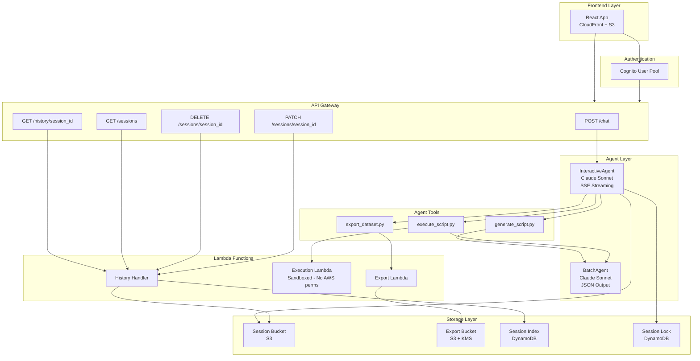

# Synthetic Dataset Generator - Architecture

## System Overview

The Synthetic Dataset Generator is an AI-powered application that enables users to create realistic synthetic datasets through natural conversation. Users describe their data requirements in plain language, and the system generates Python scripts using pandas, numpy, and faker to produce the requested datasets.

**Key Capabilities:**
- Conversational requirements gathering with Claude Sonnet
- Automated Python script generation for data synthesis
- Sandboxed script execution with security validation
- Multi-format export (CSV, JSON) with presigned download URLs
- Session persistence for conversation continuity

## Architecture Diagram



## Component Breakdown

### InteractiveAgent (Chat Agent)
- **Purpose**: Real-time conversational interface for gathering data requirements
- **Model**: Claude Sonnet via Bedrock (cross-region inference enabled)
- **Streaming**: Server-Sent Events (SSE) for token-by-token response delivery
- **Authentication**: Cognito authorizer on API Gateway
- **Session**: 7-day TTL, 20-message history limit
- **Memory**: 1024 MB, 15-minute timeout
- **Tools**: generate_script, execute_script, export_dataset

### BatchAgent (Script Generator)
- **Purpose**: Generates Python DataGenerator class scripts from requirements
- **Model**: Claude Sonnet via Bedrock
- **Output**: JSON with `script` and `summary` fields (`expectJson: true`)
- **Invocation**: Synchronous via Lambda invoke from InteractiveAgent tools
- **No streaming**: Returns complete response

### Execution Lambda (Sandboxed Runner)
- **Purpose**: Executes validated Python scripts in isolation
- **Security**: NO AWS permissions beyond CloudWatch logs
- **Memory**: 3072 MB (for pandas operations)
- **Timeout**: 5 minutes
- **Input**: Validated script + row count
- **Output**: Schema definition + preview data rows

### Export Lambda
- **Purpose**: Generates full datasets and uploads to S3
- **Memory**: 3072 MB (for large dataset operations)
- **Timeout**: 10 minutes
- **Output**: S3 keys for CSV, JSON, schema, and script files
- **Storage**: KMS-encrypted S3 bucket with 7-day lifecycle

### History Lambda
- **Purpose**: Session management API (list, delete, rename, get history)
- **Design**: Standard API Gateway proxy (NOT Lambda Web Adapter)
- **Memory**: 256 MB
- **Timeout**: 30 seconds

### Frontend
- **Framework**: React with TypeScript
- **Hosting**: CloudFront + S3
- **Layout**: Split-panel (Chat left, Schema/Preview right)
- **Auth**: Cognito integration via AWS Amplify

## Data Flow

### 1. Chat Message Flow
```
User Input --> API Gateway --> Cognito Auth --> InteractiveAgent
    --> Claude Sonnet (streaming) --> SSE Response --> Frontend
```

### 2. Script Generation Flow
```
InteractiveAgent --> generate_script tool --> Sanitize inputs
    --> BatchAgent Lambda (sync invoke) --> Claude Sonnet
    --> JSON extraction --> Return {script, summary}
```

### 3. Script Execution Flow (Preview)
```
InteractiveAgent --> execute_script tool
    --> AST Validation (whitelist check)
    --> [If invalid] Self-healing loop (up to 3 attempts via BatchAgent)
    --> Execution Lambda (sandboxed)
    --> Return {schema, preview rows}
    --> SSE events: schema, preview
    --> Persist to S3: session-metadata/{session_id}/latest_result.json
```

### 4. Export Flow
```
InteractiveAgent --> export_dataset tool
    --> Export Lambda (with user_id for isolation)
    --> Generate full dataset
    --> Upload to S3: exports/{user_id}/{session_id}/{files}
    --> Generate presigned URLs (24-hour expiry)
    --> SSE event: download URLs
    --> Persist to session metadata
```

### 5. Session Restoration Flow
```
Frontend --> GET /history/{session_id}
    --> History Lambda
    --> Read S3: /session_{id}/agents/agent_default/messages/
    --> Read S3: session-metadata/{session_id}/latest_result.json
    --> Return {messages, schema, preview, downloads}
```

## Key Design Decisions

### 1. Two-Agent Architecture (InteractiveAgent + BatchAgent)
**Why**: Separation of concerns between user interaction and script generation.
- InteractiveAgent handles streaming, tools, and conversation flow
- BatchAgent is optimized for single-shot JSON generation
- BatchAgent can be invoked multiple times (generation + self-healing)

### 2. Sandboxed Execution Lambda
**Why**: Security isolation for running user-influenced code.
- Scripts are generated by AI and validated, but defense-in-depth is critical
- Lambda has ZERO AWS permissions beyond CloudWatch logs
- Cannot read S3, access DynamoDB, call Bedrock, or reach external APIs
- Even if validation is bypassed, blast radius is minimal

### 3. AST-Based Script Validation
**Why**: Prevent unauthorized operations before execution.
- Whitelist approach: only pandas, numpy, faker, random, datetime, json, math, string, collections
- Blacklist dangerous functions: open, exec, eval, compile, __import__
- Blacklist dangerous modules: os, subprocess, socket, urllib, requests, sys
- Self-healing loop: if validation fails, BatchAgent attempts to fix (up to 3 tries)

### 4. SSE + ContextVars for Tool Results
**Why**: Strands SDK does not emit tool results in its stream.
- Strands `agent.stream_async()` only emits text deltas, not tool outputs
- Solution: Use Python `contextvars` to create an async queue
- Tools call `emit_sse_event()` to push structured data (schema, preview, downloads)
- Handler drains queue during streaming loop and yields SSE events
- Enables real-time UI updates without waiting for conversation to complete

### 5. Preview vs Full Generation Separation
**Why**: Fast feedback loop during iteration.
- Preview always generates ~100 rows regardless of user's requested count
- Validates script works, shows sample data, populates UI panels
- Full generation only happens on explicit "export" command
- Prevents wasted compute on large datasets during iteration

### 6. S3-Based Session Storage (Strands Pattern)
**Why**: Strands SDK stores conversation history in S3 by design.
- Path: `/session_{session_id}/agents/agent_default/messages/message_N.json`
- DynamoDB Session Index provides fast user-to-sessions lookup
- Session metadata (schema/preview) stored separately: `session-metadata/{session_id}/`
- History Lambda reads both locations for complete session restoration

### 7. Distributed Session Locking
**Why**: Prevent race conditions with concurrent requests.
- DynamoDB table with TTL for automatic lock cleanup
- Prevents two Lambda instances from modifying the same session simultaneously
- Especially important for SSE streaming which holds connections open

### 8. Multi-Tenant Export Isolation
**Why**: Users should only access their own exports.
- S3 path includes user_id: `exports/{user_id}/{session_id}/{files}`
- Presigned URLs are scoped to specific objects
- KMS encryption at rest, 7-day lifecycle for auto-cleanup

### 9. Separate History Lambda (Not Lambda Web Adapter)
**Why**: Lambda Web Adapter has issues with standard API Gateway proxy integration.
- InteractiveAgent uses Lambda Web Adapter for SSE streaming
- History endpoints are simple request/response, no streaming needed
- Separate Lambda avoids LWA complexity and returns proper proxy responses

## API Endpoints

| Endpoint | Method | Auth | Handler | Description |
|----------|--------|------|---------|-------------|
| `/chat` | POST | Cognito | InteractiveAgent | Send message, receive SSE stream |
| `/history/{session_id}` | GET | Cognito | History Lambda | Get chat history + metadata for session |
| `/sessions` | GET | Cognito | History Lambda | List all sessions for authenticated user |
| `/sessions/{session_id}` | DELETE | Cognito | History Lambda | Delete session and all associated data |
| `/sessions/{session_id}` | PATCH | Cognito | History Lambda | Rename session |

### Chat Request Format
```json
{
  "message": "I need customer data for fraud detection",
  "sessionId": "abc123"
}
```

### Chat Response (SSE Stream)
```
event: data
data: {"delta": "I'll help you create..."}

event: schema
data: {"data": {"customer_id": {"type": "integer", ...}}}

event: preview
data: {"rows": [...], "totalRows": 100}

event: download
data: {"data": {"csv": "https://...", "json": "https://..."}}

event: done
data: {}
```

## Session Management

### DynamoDB Session Index
- **Table**: Created by InteractiveAgent construct
- **Partition Key**: `user_id` (Cognito sub)
- **Sort Key**: `session_id`
- **Attributes**: `created_at`, `updated_at`, `last_message`, `name` (optional)
- **Access Pattern**: Query by user_id to list all sessions

### S3 Session Storage
```
{session_bucket}/
  /session_{session_id}/          # Strands conversation tree
    agents/
      agent_default/
        messages/
          message_0.json
          message_1.json
          ...
  session-metadata/               # App-specific metadata
    {session_id}/
      latest_result.json          # Schema, preview, downloads
```

### Session Lock Table
- **Partition Key**: `session_id`
- **TTL Attribute**: `ttl` (auto-cleanup stale locks)
- **Purpose**: Distributed locking across Lambda instances

## Security Considerations

1. **Script Execution**: Sandboxed Lambda with no AWS permissions
2. **Input Sanitization**: Prompt injection patterns removed from tool inputs
3. **Export Isolation**: User-scoped S3 paths with presigned URLs
4. **Encryption**: KMS at rest for export bucket, SSL in transit
5. **Authentication**: Cognito on all API endpoints
6. **Session Locking**: DynamoDB TTL prevents stale lock accumulation
7. **Download Expiry**: Presigned URLs valid for 24 hours only
