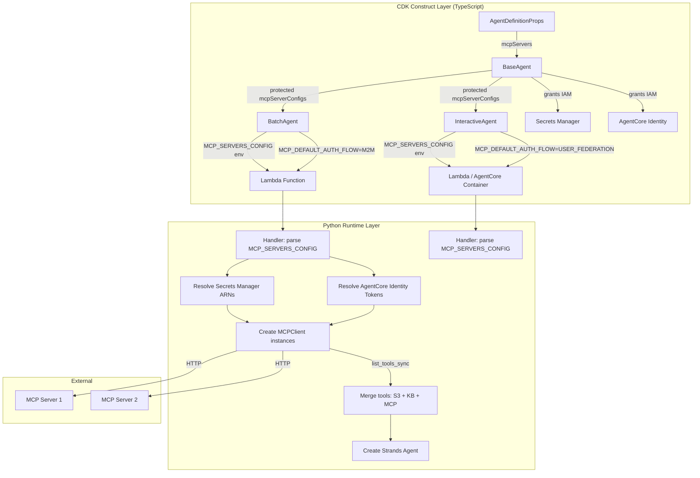
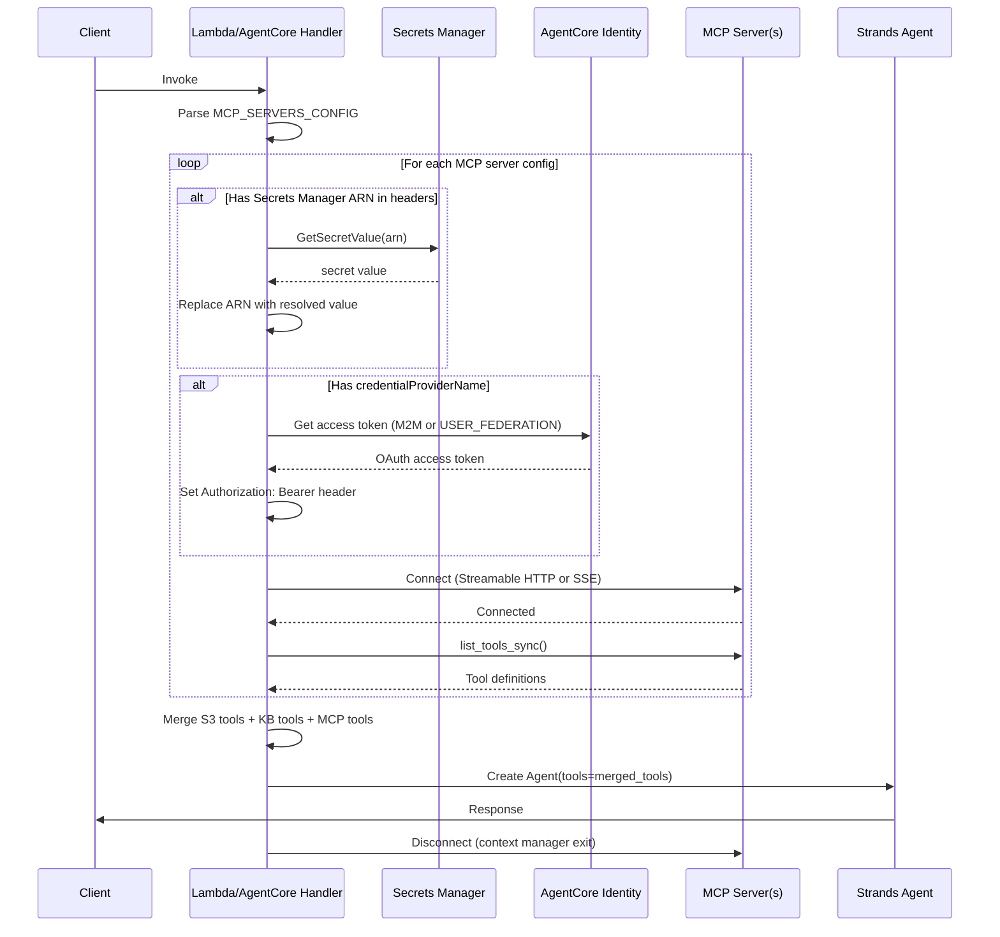

# Design Document: Agent MCP Support

## Overview

This design adds Model Context Protocol (MCP) server support to the existing agent framework constructs (`BaseAgent`, `BatchAgent`, `InteractiveAgent`). MCP is an open protocol that enables AI agents to connect to remote HTTP tool servers, expanding agent capabilities beyond locally-defined S3-based tools.

The feature follows the established patterns in the agent framework:
- **Props extension**: New optional `mcpServers` field in `AgentDefinitionProps` (like `knowledgeBases`)
- **Protected field storage**: BaseAgent stores MCP configs for subclass access (like `knowledgeBaseConfigs`)
- **Env var serialization**: Concrete agents serialize configs to `MCP_SERVERS_CONFIG` env var (like `KNOWLEDGE_BASES_CONFIG`)
- **Runtime parsing**: Python handler parses JSON config, creates clients, merges tools (like tool/KB loading)

The design supports three authentication tiers:
1. **Plain headers** — for development and testing
2. **Secrets Manager ARN references** — for production static secrets (API keys)
3. **AgentCore Identity credential providers** — for OAuth-protected MCP servers with automatic token management

### Design Rationale

MCP support is implemented as a feature addition (Type 3 construct work) rather than a new construct because:
- MCP servers are a tool source, like S3 assets and knowledge bases — they belong in `AgentDefinitionProps`
- The connection lifecycle (per-invocation) matches the existing Lambda/AgentCore execution model
- IAM permission granting follows the same pattern as knowledge base permissions
- No new abstract methods or inheritance layers are needed

## Architecture



### Sequence: Per-Invocation MCP Lifecycle



## Components and Interfaces

### CDK Layer: New Types

```typescript
/**
 * Transport types for MCP server connections.
 */
export enum McpTransportType {
  /** Modern HTTP request/response with optional streaming */
  STREAMABLE_HTTP = 'STREAMABLE_HTTP',
  /** Server-Sent Events transport (widely supported by existing MCP servers) */
  SSE = 'SSE',
}

/**
 * Authentication flow types for AgentCore Identity credential providers.
 */
export enum McpAuthFlow {
  /** Machine-to-machine OAuth 2.0 client credentials grant */
  M2M = 'M2M',
  /** User-delegated OAuth 2.0 authorization code grant */
  USER_FEDERATION = 'USER_FEDERATION',
}

/**
 * Configuration for a single MCP server connection.
 *
 * Supports three authentication tiers:
 * 1. Plain string headers (dev/testing)
 * 2. Secrets Manager ARN references in header values (production static secrets)
 * 3. AgentCore Identity credential providers (OAuth with automatic token management)
 *
 * When `credentialProviderName` is set, it takes precedence over `headers`
 * for authentication purposes.
 *
 * @example Plain headers
 * ```typescript
 * {
 *   name: 'dev-server',
 *   url: 'https://mcp.example.com/mcp',
 *   transportType: McpTransportType.STREAMABLE_HTTP,
 *   headers: { 'Authorization': 'Bearer dev-token' }
 * }
 * ```
 *
 * @example Secrets Manager reference
 * ```typescript
 * {
 *   name: 'prod-server',
 *   url: 'https://mcp.example.com/mcp',
 *   transportType: McpTransportType.SSE,
 *   headers: { 'Authorization': 'arn:aws:secretsmanager:us-east-1:123456789012:secret:my-api-key' }
 * }
 * ```
 *
 * @example AgentCore Identity
 * ```typescript
 * {
 *   name: 'oauth-server',
 *   url: 'https://mcp.example.com/mcp',
 *   transportType: McpTransportType.STREAMABLE_HTTP,
 *   credentialProviderName: 'my-credential-provider',
 *   authScopes: ['read', 'write'],
 *   authFlow: McpAuthFlow.M2M
 * }
 * ```
 */
export interface McpServerConfig {
  /** Human-readable name identifying this MCP server (used in logs and error messages) */
  readonly name: string;

  /** MCP server endpoint URL */
  readonly url: string;

  /** Transport protocol for the MCP connection */
  readonly transportType: McpTransportType;

  /**
   * Custom HTTP headers for the MCP connection.
   *
   * Header values starting with `arn:aws:secretsmanager:` are treated as
   * Secrets Manager ARN references and resolved at runtime.
   *
   * Ignored for authentication when `credentialProviderName` is set.
   *
   * @default - No custom headers
   */
  readonly headers?: Record<string, string>;

  /**
   * Name of a pre-configured AgentCore Identity credential provider.
   *
   * When set, the runtime obtains an OAuth access token from this provider
   * and injects it as an Authorization: Bearer header.
   *
   * Takes precedence over `headers` for authentication.
   *
   * @default - No credential provider (use headers for auth)
   */
  readonly credentialProviderName?: string;

  /**
   * OAuth scopes to request when using AgentCore Identity.
   *
   * Only used when `credentialProviderName` is set.
   *
   * @default - No specific scopes requested
   */
  readonly authScopes?: string[];

  /**
   * Authentication flow for AgentCore Identity.
   *
   * Only used when `credentialProviderName` is set.
   * If not specified, defaults to the agent-type default:
   * - BatchAgent: M2M (machine-to-machine)
   * - InteractiveAgent: USER_FEDERATION (user-delegated)
   *
   * @default - Agent-type default (M2M for batch, USER_FEDERATION for interactive)
   */
  readonly authFlow?: McpAuthFlow;
}
```

### CDK Layer: Modified Interfaces

```typescript
// In AgentDefinitionProps — add new optional field
export interface AgentDefinitionProps {
  // ... existing fields (bedrockModel, systemPrompt, tools, lambdaLayers, etc.)

  /**
   * MCP servers available to the agent for remote tool access.
   *
   * When configured, the agent connects to these MCP servers at invocation
   * time, discovers available tools via `list_tools_sync()`, and merges
   * them with S3-based tools and knowledge base tools.
   *
   * Each MCP server must implement the MCP protocol over HTTP
   * (Streamable HTTP or SSE transport).
   *
   * @default - No MCP servers configured
   */
  readonly mcpServers?: McpServerConfig[];
}
```

### CDK Layer: BaseAgent Changes

BaseAgent constructor additions (pseudocode):

```typescript
// In BaseAgent constructor, after knowledge base permission grants:

// Store MCP server configurations for subclass access
this.mcpServerConfigs = props.agentDefinition.mcpServers ?? [];

// Grant Secrets Manager permissions for ARN references in headers
const secretArns = this.extractSecretArns(this.mcpServerConfigs);
if (secretArns.length > 0) {
  this.agentRole.addToPrincipalPolicy(new PolicyStatement({
    actions: ['secretsmanager:GetSecretValue'],
    resources: secretArns,
  }));
}

// Grant AgentCore Identity permissions for credential providers
const hasCredentialProviders = this.mcpServerConfigs.some(s => s.credentialProviderName);
if (hasCredentialProviders) {
  this.agentRole.addToPrincipalPolicy(new PolicyStatement({
    actions: ['bedrock-agentcore:*'],
    resources: ['*'],
  }));
}
```

New protected field and helper method:

```typescript
export abstract class BaseAgent extends Construct {
  // ... existing fields

  /**
   * MCP server configurations for runtime use.
   * Subclasses use this to set the MCP_SERVERS_CONFIG environment variable.
   */
  protected readonly mcpServerConfigs: McpServerConfig[];

  /**
   * Extract Secrets Manager ARNs from MCP server header values.
   */
  private extractSecretArns(configs: McpServerConfig[]): string[] {
    const arns: string[] = [];
    for (const config of configs) {
      if (config.headers) {
        for (const value of Object.values(config.headers)) {
          if (value.startsWith('arn:aws:secretsmanager:')) {
            arns.push(value);
          }
        }
      }
    }
    return arns;
  }
}
```

### CDK Layer: BatchAgent Changes

```typescript
// In BatchAgent constructor, after knowledge base env vars:

// Add MCP server configuration if MCP servers are configured
if (this.mcpServerConfigs.length > 0) {
  env.MCP_SERVERS_CONFIG = JSON.stringify(this.mcpServerConfigs);
  env.MCP_DEFAULT_AUTH_FLOW = 'M2M';
}
```

### CDK Layer: InteractiveAgent Changes

Same pattern for both Lambda hosting and AgentCore Runtime hosting:

```typescript
// In InteractiveAgent, when building env vars:

if (this.mcpServerConfigs.length > 0) {
  env.MCP_SERVERS_CONFIG = JSON.stringify(this.mcpServerConfigs);
  env.MCP_DEFAULT_AUTH_FLOW = 'USER_FEDERATION';
}
```

### Python Layer: New Pydantic Model

```python
# In models.py — add McpServerConfig model

class McpServerConfig(BaseModel):
    """MCP server configuration parsed from MCP_SERVERS_CONFIG env var."""
    name: str
    url: str
    transportType: str  # 'STREAMABLE_HTTP' or 'SSE'
    headers: dict[str, str] | None = None
    credentialProviderName: str | None = None
    authScopes: list[str] | None = None
    authFlow: str | None = None  # 'M2M' or 'USER_FEDERATION'
```

### Python Layer: New Utility Functions

```python
# In utils.py — add MCP utility functions

def parse_mcp_servers_config(config_json: str) -> list[McpServerConfig]:
    """Parse MCP_SERVERS_CONFIG env var into list of McpServerConfig objects.
    
    Returns empty list if config is empty, missing, or invalid JSON.
    Skips individual entries missing required fields (name, url, transportType).
    """

def resolve_secrets_manager_headers(
    headers: dict[str, str],
    secrets_client: boto3.client
) -> dict[str, str]:
    """Resolve Secrets Manager ARN references in header values.
    
    Header values starting with 'arn:aws:secretsmanager:' are replaced
    with the secret value from Secrets Manager. Other values pass through.
    """

def resolve_agentcore_identity_token(
    credential_provider_name: str,
    auth_flow: str,
    auth_scopes: list[str] | None = None,
) -> str:
    """Obtain an OAuth access token from AgentCore Identity.
    
    Uses the bedrock-agentcore-identity SDK to get a token from the
    named credential provider using the specified auth flow.
    """

def create_mcp_clients(
    configs: list[McpServerConfig],
    default_auth_flow: str,
    secrets_client: boto3.client,
    logger: Logger,
) -> list[tuple[MCPClient, str]]:
    """Create MCPClient instances for each MCP server config.
    
    Returns list of (MCPClient, server_name) tuples.
    Resolves Secrets Manager ARNs and AgentCore Identity tokens before
    creating clients. Logs warnings and skips servers that fail.
    """
```

### Python Layer: Handler Integration (batch.py)

```python
# At module level (cold start) — parse config but don't connect
MCP_SERVERS_CONFIG_RAW = os.getenv('MCP_SERVERS_CONFIG', '')
MCP_DEFAULT_AUTH_FLOW = os.getenv('MCP_DEFAULT_AUTH_FLOW', 'M2M')

# In handler function — per-invocation connection
def handler(event, context):
    # ... existing setup ...
    
    mcp_tools = []
    mcp_configs = parse_mcp_servers_config(MCP_SERVERS_CONFIG_RAW)
    
    with contextlib.ExitStack() as stack:
        for config in mcp_configs:
            try:
                client = create_mcp_client_for_config(config, MCP_DEFAULT_AUTH_FLOW)
                stack.enter_context(client)
                tools = client.list_tools_sync()
                mcp_tools.extend(tools)
            except Exception as e:
                logger.warning("MCP server connection failed", extra={
                    "server_name": config.name,
                    "server_url": config.url,
                    "error_type": type(e).__name__,
                    "error": str(e),
                })
        
        # Create agent with merged tools
        all_tools = AGENT_TOOLS + [file_read] + mcp_tools
        agent = Agent(model=model_id, tools=all_tools, system_prompt=SYSTEM_PROMPT)
        response = agent(prompt)
    
    # ExitStack closes all MCP clients here
```

### Python Layer: Handler Integration (main.py — AgentCore)

Same pattern using `contextlib.ExitStack` within the `handle_invocation` async function, with MCP clients created per-invocation.

## Data Models

### MCP Server Configuration (CDK → Runtime)

The configuration flows from CDK TypeScript to Python runtime via JSON serialization in the `MCP_SERVERS_CONFIG` environment variable.

**CDK TypeScript (source of truth):**
```typescript
interface McpServerConfig {
  name: string;
  url: string;
  transportType: 'STREAMABLE_HTTP' | 'SSE';
  headers?: Record<string, string>;
  credentialProviderName?: string;
  authScopes?: string[];
  authFlow?: 'M2M' | 'USER_FEDERATION';
}
```

**JSON wire format (env var value):**
```json
[
  {
    "name": "code-tools",
    "url": "https://mcp.example.com/mcp",
    "transportType": "STREAMABLE_HTTP",
    "headers": {
      "Authorization": "arn:aws:secretsmanager:us-east-1:123456789012:secret:api-key"
    }
  },
  {
    "name": "oauth-server",
    "url": "https://oauth-mcp.example.com/sse",
    "transportType": "SSE",
    "credentialProviderName": "my-provider",
    "authScopes": ["read", "write"],
    "authFlow": "M2M"
  }
]
```

**Python Pydantic model (runtime):**
```python
class McpServerConfig(BaseModel):
    name: str
    url: str
    transportType: str
    headers: dict[str, str] | None = None
    credentialProviderName: str | None = None
    authScopes: list[str] | None = None
    authFlow: str | None = None
```

### Environment Variables

| Variable | Set By | Value | Purpose |
|---|---|---|---|
| `MCP_SERVERS_CONFIG` | BatchAgent / InteractiveAgent | JSON array of McpServerConfig | MCP server connection configs |
| `MCP_DEFAULT_AUTH_FLOW` | BatchAgent (`M2M`) / InteractiveAgent (`USER_FEDERATION`) | `M2M` or `USER_FEDERATION` | Default auth flow when `authFlow` not specified per-server |

### IAM Permissions

| Permission | Condition | Scope |
|---|---|---|
| `secretsmanager:GetSecretValue` | Header value starts with `arn:aws:secretsmanager:` | Scoped to specific secret ARNs |
| `bedrock-agentcore:*` | Any server has `credentialProviderName` set | `*` (AgentCore Identity API) |

## Correctness Properties

*A property is a characteristic or behavior that should hold true across all valid executions of a system — essentially, a formal statement about what the system should do. Properties serve as the bridge between human-readable specifications and machine-verifiable correctness guarantees.*

### Property 1: Serialization Round-Trip

*For any* valid `McpServerConfig` object with any combination of optional fields (headers, credentialProviderName, authScopes, authFlow), serializing it to JSON via `JSON.stringify` in the CDK construct and then parsing it with the Python `McpServerConfig` Pydantic model SHALL produce an object with all fields equivalent to the original.

**Validates: Requirements 2.4, 10.1, 10.2, 10.3**

### Property 2: Auth Resolution Precedence

*For any* `McpServerConfig` with headers containing a mix of plain strings and Secrets Manager ARN references, the `resolve_secrets_manager_headers` function SHALL return a header map where: (a) values starting with `arn:aws:secretsmanager:` are replaced with the resolved secret value, and (b) all other values are passed through unchanged. Furthermore, *for any* config where `credentialProviderName` is set alongside `headers`, the runtime SHALL use the credential provider token as the `Authorization` header, ignoring any `Authorization` value in `headers`.

**Validates: Requirements 3.1, 3.3, 3.6**

### Property 3: Tool Merging with Graceful Degradation

*For any* set of MCP server configurations where an arbitrary subset of servers succeed and the rest fail to connect, the agent's final tool list SHALL equal the union of: (a) S3-based tools, (b) knowledge base tools, and (c) tools from all successfully connected MCP servers. No tools from failed servers SHALL be included, and no tools from successful servers SHALL be missing.

**Validates: Requirements 6.3, 6.4, 7.2, 7.3, 8.2, 8.3**

### Property 4: Config Validation Skips Invalid Entries

*For any* JSON array of MCP server configuration objects where some entries are missing one or more required fields (`name`, `url`, `transportType`), the `parse_mcp_servers_config` function SHALL return only the entries that have all required fields present, and SHALL skip (with a logged warning) all entries missing any required field.

**Validates: Requirements 10.5**

### Property 5: Explicit Auth Flow Override

*For any* `McpServerConfig` with an explicit `authFlow` value and *for any* value of `MCP_DEFAULT_AUTH_FLOW`, the runtime SHALL use the config's explicit `authFlow` when obtaining the AgentCore Identity token, regardless of the default. Conversely, *for any* config without an explicit `authFlow`, the runtime SHALL use the `MCP_DEFAULT_AUTH_FLOW` value.

**Validates: Requirements 11.6**

## Error Handling

### CDK Construct Layer

| Scenario | Behavior |
|---|---|
| `mcpServers` is `undefined` or empty array | No MCP-related env vars or IAM permissions created. Identical to current behavior. |
| `mcpServers` contains configs with Secrets Manager ARNs | BaseAgent grants scoped `secretsmanager:GetSecretValue` for each unique ARN. |
| `mcpServers` contains configs with `credentialProviderName` | BaseAgent grants `bedrock-agentcore:*` permissions. |
| Both `headers` and `credentialProviderName` set on same config | Config is passed as-is; runtime handles precedence (credential provider wins). |

### Python Runtime Layer

| Scenario | Behavior | Log Level |
|---|---|---|
| `MCP_SERVERS_CONFIG` is empty or missing | No MCP clients created; agent uses S3/KB tools only | None |
| `MCP_SERVERS_CONFIG` contains invalid JSON | Log error, continue without MCP tools | ERROR |
| Individual config missing required fields | Log warning with field details, skip that entry | WARNING |
| Secrets Manager `GetSecretValue` fails | Log warning with ARN and error, skip that MCP server | WARNING |
| AgentCore Identity token retrieval fails | Log warning with provider name and error, skip that MCP server | WARNING |
| MCP server connection fails (network error, timeout) | Log warning with server name, URL, error type; continue with other servers | WARNING |
| MCP server `list_tools_sync()` fails | Log warning, skip that server's tools; continue with other servers | WARNING |
| All MCP servers fail | Agent continues with S3-based tools and KB tools only | WARNING |

All warning/error logs use AWS Lambda Powertools `Logger` with structured `extra` fields:
```python
logger.warning("MCP server connection failed", extra={
    "server_name": config.name,
    "server_url": config.url,
    "error_type": type(e).__name__,
    "error": str(e),
})
```

## Testing Strategy

### Unit Tests (TypeScript — CDK Constructs)

Test the CDK construct changes using `createTestApp()` for fast synthesis:

1. **BaseAgent MCP config storage**: Verify `mcpServerConfigs` protected field is populated
2. **BatchAgent env vars**: Verify `MCP_SERVERS_CONFIG` and `MCP_DEFAULT_AUTH_FLOW=M2M` in Lambda env
3. **InteractiveAgent env vars**: Verify `MCP_SERVERS_CONFIG` and `MCP_DEFAULT_AUTH_FLOW=USER_FEDERATION` in Lambda/container env
4. **Secrets Manager IAM**: Verify `secretsmanager:GetSecretValue` policy scoped to detected ARNs
5. **AgentCore Identity IAM**: Verify `bedrock-agentcore:*` policy when `credentialProviderName` is present
6. **No MCP config**: Verify no `MCP_SERVERS_CONFIG` env var when `mcpServers` is absent
7. **Backward compatibility**: Verify template output is identical when `mcpServers` is not provided
8. **JSON serialization**: Verify `MCP_SERVERS_CONFIG` contains correct JSON with all fields

### Unit Tests (Python — Runtime Logic)

Test the Python utility functions with mocked external dependencies:

1. **`parse_mcp_servers_config`**: Valid JSON, invalid JSON, missing fields, empty string
2. **`resolve_secrets_manager_headers`**: ARN values resolved, plain values passed through, resolution failures
3. **`resolve_agentcore_identity_token`**: Token retrieval with M2M, USER_FEDERATION, with scopes
4. **`create_mcp_clients`**: Multiple servers, partial failures, all failures
5. **Handler integration**: Verify MCP tools are merged with S3 tools in agent creation

### Property-Based Tests (Python — Hypothesis)

Minimum 100 iterations per property test. Each test references its design property.

**Library**: `hypothesis` (Python) — already used in the repository's testing patterns.

```python
# Feature: agent-mcp-support, Property 1: Serialization Round-Trip
@given(st.builds(McpServerConfig, ...))
def test_serialization_round_trip(config):
    """For any valid McpServerConfig, serialize then parse produces equivalent config."""

# Feature: agent-mcp-support, Property 4: Config Validation Skips Invalid Entries
@given(st.lists(st.fixed_dictionaries({...})))
def test_config_validation_skips_invalid(configs):
    """For any list of configs with randomly missing required fields, only valid ones are returned."""

# Feature: agent-mcp-support, Property 5: Explicit Auth Flow Override
@given(auth_flow=st.sampled_from(['M2M', 'USER_FEDERATION']),
       default_flow=st.sampled_from(['M2M', 'USER_FEDERATION']))
def test_explicit_auth_flow_override(auth_flow, default_flow):
    """For any explicit authFlow and any default, explicit always wins."""
```

### CDK Nag Tests

Verify security compliance with `AwsSolutionsChecks`:
- MCP-configured agents pass CDK Nag with documented suppressions
- IAM permissions follow least-privilege (scoped Secrets Manager ARNs)

### Integration Tests

Manual or CI-driven tests with real MCP servers:
- Connect to a test MCP server and discover tools
- Verify Secrets Manager resolution with a real secret
- Verify AgentCore Identity token retrieval (when available)
- End-to-end: agent invocation with MCP tools producing correct results

