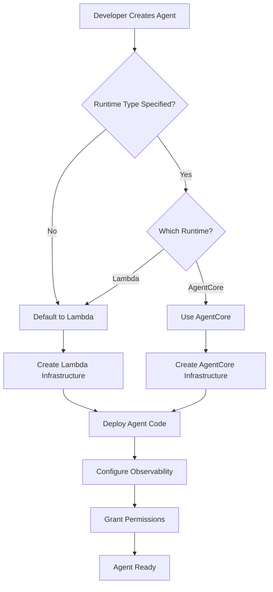

# Design Document: AgentCore Runtime Support

## Overview

This design extends the Agentic AI Framework to support AWS AgentCore Runtime as an alternative to Lambda functions for agent execution. The enhancement maintains the existing multi-layered architecture (BaseAgent → concrete implementations) while introducing a runtime abstraction layer that enables developers to choose the appropriate execution environment based on their use case requirements.

The design preserves backward compatibility by defaulting to Lambda runtime while providing a clear, type-safe mechanism for opting into AgentCore Runtime. All existing agent functionality—including tool integration, observability, encryption, and VPC networking—will work consistently across both runtime types.

### Key Design Goals

1. **Runtime Flexibility**: Enable seamless switching between Lambda and AgentCore runtimes through configuration
2. **Backward Compatibility**: Maintain existing Lambda-based deployments without breaking changes
3. **Consistent Developer Experience**: Provide uniform APIs and patterns regardless of runtime choice
4. **Infrastructure Abstraction**: Hide runtime-specific implementation details behind clean interfaces
5. **Observability Parity**: Ensure monitoring and debugging capabilities work equivalently across runtimes

## Architecture

### High-Level Architecture

```
┌─────────────────────────────────────────────────────────────┐
│                     Agent Constructs                         │
│  (BatchAgent, InteractiveAgent, CustomAgent)                │
└────────────────────┬────────────────────────────────────────┘
                     │ extends
                     ▼
┌─────────────────────────────────────────────────────────────┐
│                      BaseAgent                               │
│  - Common infrastructure (IAM, KMS, Observability)          │
│  - Runtime-agnostic configuration                           │
└────────────────────┬────────────────────────────────────────┘
                     │ uses
                     ▼
┌─────────────────────────────────────────────────────────────┐
│                  Runtime Abstraction Layer                   │
│                                                              │
│  ┌──────────────────────┐    ┌──────────────────────┐     │
│  │  LambdaRuntime       │    │  AgentCoreRuntime    │     │
│  │  - PythonFunction    │    │  - AgentCore Config  │     │
│  │  - Lambda IAM        │    │  - AgentCore IAM     │     │
│  │  - Lambda Logs       │    │  - AgentCore Logs    │     │
│  └──────────────────────┘    └──────────────────────┘     │
│                                                              │
└─────────────────────────────────────────────────────────────┘
                     │
                     ▼
┌─────────────────────────────────────────────────────────────┐
│                    AWS Services                              │
│  Lambda | AgentCore | Bedrock | S3 | CloudWatch | KMS      │
└─────────────────────────────────────────────────────────────┘
```

### Runtime Selection Flow



## Components and Interfaces

### 1. Runtime Type Enumeration

```typescript
/**
 * Supported agent runtime types
 */
export enum AgentRuntimeType {
  /**
   * AWS Lambda function runtime (default)
   * - Suitable for short-lived, stateless operations
   * - Maximum execution time: 15 minutes
   * - Event-driven invocation model
   */
  LAMBDA = 'LAMBDA',
  
  /**
   * AWS AgentCore runtime
   * - Suitable for long-running, stateful operations
   * - Extended execution time support
   * - Enhanced agent orchestration capabilities
   */
  AGENTCORE = 'AGENTCORE',
}
```

### 2. Runtime Configuration Interface

```typescript
/**
 * Common runtime configuration parameters shared across all runtime types
 */
export interface BaseRuntimeConfig {
  /**
   * Maximum execution time for the agent
   * 
   * @default Duration.minutes(10)
   */
  readonly timeout?: Duration;
  
  /**
   * Memory allocation for the agent in MB
   * 
   * @default 1024
   */
  readonly memorySize?: number;
}

/**
 * Lambda-specific runtime configuration
 */
export interface LambdaRuntimeConfig extends BaseRuntimeConfig {
  /**
   * CPU architecture for Lambda function
   * 
   * @default Architecture.X86_64
   */
  readonly architecture?: Architecture;
  
  /**
   * Ephemeral storage size for Lambda function
   * 
   * @default Size.mebibytes(512)
   */
  readonly ephemeralStorageSize?: Size;
}

/**
 * AgentCore deployment method
 */
export enum AgentCoreDeploymentMethod {
  /**
   * Container-based deployment using Docker image in ECR
   * - Suitable for complex agents with custom dependencies
   * - Requires Docker expertise
   * - Full control over runtime environment
   */
  CONTAINER = 'CONTAINER',
  
  /**
   * Direct code deployment using ZIP archive in S3
   * - Suitable for Python agents with standard dependencies
   * - No Docker required
   * - Faster iteration and prototyping
   */
  DIRECT_CODE = 'DIRECT_CODE',
}

/**
 * AgentCore-specific runtime configuration
 */
export interface AgentCoreRuntimeConfig extends BaseRuntimeConfig {
  /**
   * Deployment method for agent code
   * 
   * @default AgentCoreDeploymentMethod.DIRECT_CODE
   */
  readonly deploymentMethod?: AgentCoreDeploymentMethod;
  
  /**
   * For CONTAINER deployment: ECR image URI
   * Format: {account}.dkr.ecr.{region}.amazonaws.com/{repository}:{tag}
   */
  readonly imageUri?: string;
  
  /**
   * For DIRECT_CODE deployment: S3 bucket containing ZIP archive
   */
  readonly codeBucket?: string;
  
  /**
   * For DIRECT_CODE deployment: S3 key for ZIP archive
   */
  readonly codeKey?: string;
  
  /**
   * Instance type for AgentCore runtime
   * 
   * @default Determined by AgentCore service
   */
  readonly instanceType?: string;
  
  /**
   * Minimum capacity for auto-scaling
   * 
   * @default 1
   */
  readonly minCapacity?: number;
  
  /**
   * Maximum capacity for auto-scaling
   * 
   * @default 10
   */
  readonly maxCapacity?: number;
}

/**
 * Configuration for agent runtime environment
 */
export interface AgentRuntimeConfig {
  /**
   * The type of runtime to use for agent execution
   * 
   * @default AgentRuntimeType.LAMBDA
   */
  readonly type: AgentRuntimeType;
  
  /**
   * Runtime-specific configuration options
   * - For Lambda: timeout, memory, architecture, ephemeral storage
   * - For AgentCore: timeout, memory, instance type, scaling config
   */
  readonly config?: LambdaRuntimeConfig | AgentCoreRuntimeConfig;
}
```

### 3. Abstract Runtime Handler Interface

```typescript
/**
 * Abstract interface for runtime-specific implementations
 */
export interface IAgentRuntime {
  /**
   * The type of runtime (Lambda or AgentCore)
   * Used for runtime-specific logic without instanceof checks
   */
  readonly runtimeType: AgentRuntimeType;
  
  /**
   * The execution role for the agent
   */
  readonly executionRole: Role;
  
  /**
   * The ARN or identifier for invoking the agent
   */
  readonly invocationArn: string;
  
  /**
   * Grant permission to invoke this agent
   */
  grantInvoke(grantee: IGrantable): Grant;
  
  /**
   * Configure environment variables for the agent
   */
  addEnvironment(key: string, value: string): void;
  
  /**
   * Add IAM policy statements to the execution role
   */
  addToRolePolicy(statement: PolicyStatement): void;
  
  /**
   * Get the CloudWatch log group for this agent
   */
  readonly logGroup?: ILogGroup;
}
```

### 4. Lambda Runtime Implementation

```typescript
/**
 * Lambda-based agent runtime implementation
 */
export class LambdaAgentRuntime extends Construct implements IAgentRuntime {
  public readonly runtimeType = AgentRuntimeType.LAMBDA;
  public readonly executionRole: Role;
  public readonly invocationArn: string;
  public readonly agentFunction: PythonFunction;
  public readonly logGroup?: ILogGroup;
  
  constructor(scope: Construct, id: string, props: LambdaAgentRuntimeProps) {
    super(scope, id);
    
    // Create Python Lambda function
    this.agentFunction = new PythonFunction(this, 'Function', {
      functionName: props.functionName,
      entry: props.entry,
      index: props.index,
      runtime: props.runtime,
      role: props.role,
      timeout: props.config?.timeout,
      memorySize: props.config?.memorySize,
      architecture: props.config?.architecture,
      environment: props.environment,
      environmentEncryption: props.encryptionKey,
      vpc: props.vpc,
      vpcSubnets: props.vpcSubnets,
      layers: props.layers,
    });
    
    this.executionRole = this.agentFunction.role as Role;
    this.invocationArn = this.agentFunction.functionArn;
    this.logGroup = this.agentFunction.logGroup;
  }
  
  grantInvoke(grantee: IGrantable): Grant {
    return this.agentFunction.grantInvoke(grantee);
  }
  
  addEnvironment(key: string, value: string): void {
    this.agentFunction.addEnvironment(key, value);
  }
  
  addToRolePolicy(statement: PolicyStatement): void {
    this.executionRole.addToPrincipalPolicy(statement);
  }
}
```

### 5. AgentCore Runtime Implementation

```typescript
/**
 * AgentCore-based agent runtime implementation
 */
export class AgentCoreAgentRuntime extends Construct implements IAgentRuntime {
  public readonly runtimeType = AgentRuntimeType.AGENTCORE;
  public readonly executionRole: Role;
  public readonly invocationArn: string;
  public readonly agentCoreAgent: CfnAgentRuntime; // Placeholder for actual AgentCore construct
  public readonly agentCoreEndpoint: CfnAgentRuntimeEndpoint; // Placeholder for endpoint construct
  public readonly logGroup?: ILogGroup;
  
  constructor(scope: Construct, id: string, props: AgentCoreAgentRuntimeProps) {
    super(scope, id);
    
    // Create execution role for AgentCore
    this.executionRole = new Role(this, 'ExecutionRole', {
      assumedBy: new ServicePrincipal('agentcore.amazonaws.com'),
    });
    
    // Determine deployment configuration based on deployment method
    const deploymentMethod = props.config?.deploymentMethod || AgentCoreDeploymentMethod.DIRECT_CODE;
    let deploymentConfig: any;
    
    if (deploymentMethod === AgentCoreDeploymentMethod.CONTAINER) {
      // Container-based deployment using ECR image
      if (!props.config?.imageUri) {
        throw new Error('imageUri is required for CONTAINER deployment method');
      }
      deploymentConfig = {
        containerImage: {
          imageUri: props.config.imageUri,
        },
      };
    } else {
      // Direct code deployment using S3 ZIP archive
      if (!props.config?.codeBucket || !props.config?.codeKey) {
        throw new Error('codeBucket and codeKey are required for DIRECT_CODE deployment method');
      }
      deploymentConfig = {
        codeArchive: {
          s3Location: {
            bucket: props.config.codeBucket,
            key: props.config.codeKey,
          },
        },
      };
      
      // Grant read permissions to the code bucket
      const codeBucket = Bucket.fromBucketName(this, 'CodeBucket', props.config.codeBucket);
      codeBucket.grantRead(this.executionRole, props.config.codeKey);
    }
    
    // Configure VPC if provided
    let networkConfig: any;
    if (props.network) {
      // AgentCore requires VPC configuration with subnets and security groups
      // Reference: https://docs.aws.amazon.com/bedrock-agentcore/latest/devguide/agentcore-vpc.html
      const vpcSubnets = props.network.vpc.selectSubnets(props.network.vpcSubnets);
      
      networkConfig = {
        networkConfiguration: {
          networkMode: 'VPC',
          networkModeConfig: {
            vpcConfig: {
              subnets: vpcSubnets.subnetIds,
              securityGroups: props.network.securityGroups?.map(sg => sg.securityGroupId) || [],
            },
          },
        },
      };
      
      // Grant VPC permissions to execution role
      // AgentCore uses service-linked role AWSServiceRoleForBedrockAgentCoreNetwork
      // for creating ENIs, but execution role needs permissions for VPC resources
      this.executionRole.addToPrincipalPolicy(new PolicyStatement({
        actions: [
          'ec2:DescribeNetworkInterfaces',
          'ec2:DescribeSubnets',
          'ec2:DescribeSecurityGroups',
          'ec2:DescribeVpcs',
        ],
        resources: ['*'],
      }));
    } else {
      // Public network mode (default)
      networkConfig = {
        networkConfiguration: {
          networkMode: 'PUBLIC',
        },
      };
    }
    
    // Create AgentCore agent runtime configuration
    // Note: This is a placeholder - actual implementation depends on AgentCore CDK constructs
    this.agentCoreAgent = new CfnAgentRuntime(this, 'Runtime', {
      agentRuntimeName: props.agentName,
      agentResourceRoleArn: this.executionRole.roleArn,
      foundationModel: props.foundationModel,
      instruction: props.instruction,
      ...deploymentConfig,
      ...networkConfig,
      // Additional AgentCore-specific configuration
    });
    
    // Create AgentCore runtime endpoint
    // The endpoint is required for invoking the agent runtime
    this.agentCoreEndpoint = new CfnAgentRuntimeEndpoint(this, 'Endpoint', {
      agentRuntimeId: this.agentCoreAgent.attrAgentRuntimeId,
      endpointName: `${props.agentName}-endpoint`,
      // Additional endpoint configuration
    });
    
    this.invocationArn = this.agentCoreAgent.attrAgentRuntimeArn;
    
    // Create log group for AgentCore agent runtime logs
    // AgentCore automatically creates logs at: /aws/bedrock-agentcore/runtimes/<runtime-id>-<endpoint-name>/runtime-logs
    // This log group is for additional application logs if needed
    this.logGroup = new LogGroup(this, 'LogGroup', {
      logGroupName: `/aws/bedrock-agentcore/runtimes/${props.agentName}`,
      removalPolicy: props.removalPolicy,
      retention: RetentionDays.ONE_WEEK,
    });
    
    // Note: For observability, agent code should include ADOT dependencies:
    // - aws-opentelemetry-distro>=0.10.0
    // - boto3
    // And be executed with: opentelemetry-instrument python agent_code.py
    // See: https://docs.aws.amazon.com/bedrock-agentcore/latest/devguide/observability-configure.html
  }
  
  grantInvoke(grantee: IGrantable): Grant {
    // AgentCore Runtime requires bedrock-agentcore:InvokeAgentRuntime permission
    // Reference: https://docs.aws.amazon.com/bedrock-agentcore/latest/devguide/runtime-invoke-agent.html
    // Reference: https://docs.aws.amazon.com/service-authorization/latest/reference/list_amazonbedrockagentcore.html
    // The permission requires both runtime and runtime-endpoint ARNs
    return Grant.addToPrincipal({
      grantee,
      actions: [
        'bedrock-agentcore:InvokeAgentRuntime',
      ],
      resourceArns: [
        this.agentCoreAgent.attrAgentRuntimeArn, // Runtime ARN
        this.agentCoreEndpoint.attrAgentRuntimeEndpointArn, // Runtime endpoint ARN
      ],
    });
  }
  
  addEnvironment(key: string, value: string): void {
    // AgentCore uses different mechanism for configuration
    // Store in parameter store or environment configuration
    // Implementation depends on AgentCore capabilities
  }
  
  addToRolePolicy(statement: PolicyStatement): void {
    this.executionRole.addToPrincipalPolicy(statement);
  }
}
```

### 6. Runtime Factory

```typescript
/**
 * Factory for creating runtime implementations
 */
export class AgentRuntimeFactory {
  public static create(
    scope: Construct,
    id: string,
    runtimeConfig: AgentRuntimeConfig,
    commonProps: CommonAgentProps,
  ): IAgentRuntime {
    switch (runtimeConfig.type) {
      case AgentRuntimeType.LAMBDA:
        return new LambdaAgentRuntime(scope, `${id}Lambda`, {
          ...commonProps,
          config: runtimeConfig.config as LambdaRuntimeConfig,
        });
        
      case AgentRuntimeType.AGENTCORE:
        return new AgentCoreAgentRuntime(scope, `${id}AgentCore`, {
          ...commonProps,
          config: runtimeConfig.config as AgentCoreRuntimeConfig,
        });
        
      default:
        throw new Error(`Unsupported runtime type: ${runtimeConfig.type}`);
    }
  }
}
```

### 7. Updated BaseAgent

```typescript
export interface BaseAgentProps extends ObservableProps {
  readonly agentName: string;
  readonly agentDefinition: AgentDefinitionProps;
  
  /**
   * Runtime configuration for the agent
   * 
   * @default Lambda runtime with default configuration
   */
  readonly runtime?: AgentRuntimeConfig;
  
  readonly enableObservability?: boolean;
  readonly network?: Network;
  readonly encryptionKey?: Key;
  readonly removalPolicy?: RemovalPolicy;
}

export abstract class BaseAgent extends Construct {
  /**
   * The runtime implementation for this agent
   */
  public readonly runtime: IAgentRuntime;
  
  /**
   * @deprecated Use runtime.executionRole instead
   */
  public get agentRole(): Role {
    return this.runtime.executionRole;
  }
  
  /**
   * @deprecated Use runtime property for Lambda-specific access
   */
  public get agentFunction(): PythonFunction | undefined {
    if (this.runtime.runtimeType === AgentRuntimeType.LAMBDA) {
      return (this.runtime as LambdaAgentRuntime).agentFunction;
    }
    return undefined;
  }
  
  public readonly bedrockModel?: BedrockModelProps;
  public readonly encryptionKey: Key;
  protected readonly logGroupDataProtection: LogGroupDataProtectionProps;
  protected readonly agentToolsLocationDefinitions: AgentToolsLocationDefinition[];
  
  constructor(scope: Construct, id: string, props: BaseAgentProps) {
    super(scope, id);
    
    // Initialize common infrastructure
    this.bedrockModel = props.agentDefinition.bedrockModel;
    this.encryptionKey = props.encryptionKey || new Key(this, 'AgentEncryptionKey', {
      enableKeyRotation: true,
      removalPolicy: props.removalPolicy || RemovalPolicy.DESTROY,
    });
    
    // Prepare tool configurations
    this.agentToolsLocationDefinitions = this.prepareTools(props);
    
    // Create runtime using factory
    const runtimeConfig = props.runtime || {
      type: AgentRuntimeType.LAMBDA,
    };
    
    this.runtime = this.createRuntime(runtimeConfig, props);
    
    // Configure permissions
    this.configurePermissions(props);
    
    // Setup observability
    this.setupObservability(props);
  }
  
  protected abstract createRuntime(
    runtimeConfig: AgentRuntimeConfig,
    props: BaseAgentProps,
  ): IAgentRuntime;
  
  protected prepareTools(props: BaseAgentProps): AgentToolsLocationDefinition[] {
    const definitions: AgentToolsLocationDefinition[] = [];
    
    if (props.agentDefinition.tools) {
      for (const tool of props.agentDefinition.tools) {
        tool.grantRead(this.runtime.executionRole);
        definitions.push({
          bucketName: tool.s3BucketName,
          key: tool.s3ObjectKey,
          isFile: tool.isFile,
          isZipArchive: tool.isZipArchive,
        });
      }
    }
    
    return definitions;
  }
  
  protected configurePermissions(props: BaseAgentProps): void {
    // Bedrock permissions
    this.runtime.addToRolePolicy(
      BedrockModelUtils.generateModelIAMPermissions(this, this.bedrockModel),
    );
    
    // VPC permissions (Lambda-specific)
    if (props.network && this.runtime.runtimeType === AgentRuntimeType.LAMBDA) {
      this.runtime.addToRolePolicy(LambdaIamUtils.generateLambdaVPCPermissions());
    }
    
    // Tool permissions
    if (props.agentDefinition.additionalPolicyStatementsForTools) {
      for (const statement of props.agentDefinition.additionalPolicyStatementsForTools) {
        this.runtime.addToRolePolicy(statement);
      }
    }
  }
  
  protected setupObservability(props: BaseAgentProps): void {
    this.logGroupDataProtection = LogGroupDataProtectionUtils.handleDefault(
      this,
      props.logGroupDataProtection,
      props.removalPolicy,
    );
    
    if (props.enableObservability) {
      // Apply observability based on runtime type
      if (this.runtime.runtimeType === AgentRuntimeType.LAMBDA) {
        PropertyInjectors.of(this).add(
          new LambdaObservabilityPropertyInjector(this.logGroupDataProtection),
        );
      } else if (this.runtime.runtimeType === AgentRuntimeType.AGENTCORE) {
        // AgentCore observability configuration
        // AgentCore provides built-in observability with CloudWatch integration
        // Reference: https://docs.aws.amazon.com/bedrock-agentcore/latest/devguide/observability.html
        
        // 1. Enable CloudWatch Transaction Search (one-time account-level setup)
        //    This is a prerequisite that must be done manually or via separate setup
        //    See: https://docs.aws.amazon.com/bedrock-agentcore/latest/devguide/observability-configure.html
        
        // 2. Configure log destination for runtime logs
        //    AgentCore automatically creates log group: /aws/bedrock-agentcore/runtimes/<runtime-id>-<endpoint-name>/runtime-logs
        //    Apply data protection policy to the log group
        if (this.runtime.logGroup && this.logGroupDataProtection) {
          new LogGroupDataProtection(this, 'AgentCoreLogProtection', {
            logGroup: this.runtime.logGroup,
            ...this.logGroupDataProtection,
          });
        }
        
        // 3. Add ADOT (AWS Distro for OpenTelemetry) environment variables
        //    These enable custom metrics and traces from agent code
        const agentRuntimeArn = (this.runtime as AgentCoreAgentRuntime).agentCoreAgent.attrAgentRuntimeArn;
        const endpointName = (this.runtime as AgentCoreAgentRuntime).agentCoreEndpoint.endpointName;
        
        this.runtime.addEnvironment('AGENT_OBSERVABILITY_ENABLED', 'true');
        this.runtime.addEnvironment('OTEL_PYTHON_DISTRO', 'aws_distro');
        this.runtime.addEnvironment('OTEL_PYTHON_CONFIGURATOR', 'aws_configurator');
        this.runtime.addEnvironment('OTEL_RESOURCE_ATTRIBUTES', 
          `service.name=${props.agentName},aws.log.group.names=/aws/bedrock-agentcore/runtimes/${agentRuntimeArn},cloud.resource_id=${agentRuntimeArn}:${endpointName}`
        );
        this.runtime.addEnvironment('OTEL_EXPORTER_OTLP_LOGS_HEADERS',
          `x-aws-log-group=/aws/bedrock-agentcore/runtimes/${agentRuntimeArn},x-aws-log-stream=runtime-logs,x-aws-metric-namespace=bedrock-agentcore`
        );
        this.runtime.addEnvironment('OTEL_EXPORTER_OTLP_PROTOCOL', 'http/protobuf');
        this.runtime.addEnvironment('OTEL_TRACES_EXPORTER', 'otlp');
        
        // 4. AgentCore automatically provides:
        //    - Runtime metrics (invocations, throttles, errors, latency) at 1-minute intervals
        //    - Resource usage metrics (CPU, memory) at 1-minute resolution
        //    - Structured spans in CloudWatch Logs under aws/spans log group
        //    - Application logs in /aws/bedrock-agentcore/runtimes/<runtime-id>-<endpoint-name>/runtime-logs
        //    
        //    All data is available in CloudWatch GenAI Observability dashboard
        //    See: https://docs.aws.amazon.com/bedrock-agentcore/latest/devguide/observability-runtime-metrics.html
      }
    }
  }
  
  /**
   * Grant permission to invoke this agent
   */
  public grantInvoke(grantee: IGrantable): Grant {
    return this.runtime.grantInvoke(grantee);
  }
}
```

### 8. Updated BatchAgent

```typescript
export interface BatchAgentProps extends BaseAgentProps {
  readonly prompt: string;
  readonly expectJson?: boolean;
}

export class BatchAgent extends BaseAgent {
  constructor(scope: Construct, id: string, props: BatchAgentProps) {
    super(scope, id, props);
    
    // Configure runtime-specific environment
    this.configureEnvironment(props);
  }
  
  protected createRuntime(
    runtimeConfig: AgentRuntimeConfig,
    props: BaseAgentProps,
  ): IAgentRuntime {
    const batchProps = props as BatchAgentProps;
    const modelId = BedrockModelUtils.deriveActualModelId(this.bedrockModel);
    
    const commonEnv = {
      SYSTEM_PROMPT_S3_BUCKET_NAME: props.agentDefinition.systemPrompt.s3BucketName,
      SYSTEM_PROMPT_S3_KEY: props.agentDefinition.systemPrompt.s3ObjectKey,
      TOOLS_CONFIG: JSON.stringify(this.agentToolsLocationDefinitions),
      MODEL_ID: modelId,
      INVOKE_TYPE: 'batch',
      PROMPT: batchProps.prompt,
      EXPECT_JSON: batchProps.expectJson ? 'True' : '',
    };
    
    // Common code location for both runtimes
    const codeEntry = path.join(__dirname, 'resources/default-strands-agent');
    
    // Determine entry file based on runtime type
    // Lambda: batch.py with handler(event, context)
    // AgentCore: batch_agentcore.py with @app.entrypoint
    const indexFile = runtimeConfig.type === AgentRuntimeType.LAMBDA 
      ? 'batch.py' 
      : 'batch_agentcore.py';
    
    // Note: For AgentCore, the actual code deployment is handled by:
    // - DIRECT_CODE: codeBucket and codeKey in runtime config (ZIP archive in S3)
    // - CONTAINER: imageUri in runtime config (Docker image in ECR)
    // The entry/index here are used for reference and packaging only
    
    return AgentRuntimeFactory.create(
      this,
      'Runtime',
      runtimeConfig,
      {
        agentName: props.agentName,
        entry: codeEntry,
        index: indexFile,
        environment: commonEnv,
        encryptionKey: this.encryptionKey,
        network: props.network,
        layers: props.agentDefinition.lambdaLayers,
        systemPrompt: props.agentDefinition.systemPrompt,
        bedrockModel: this.bedrockModel,
        removalPolicy: props.removalPolicy,
      },
    );
  }
  
  protected configureEnvironment(props: BatchAgentProps): void {
    const metricNamespace = props.metricNamespace || 
      DefaultObservabilityConfig.DEFAULT_METRIC_NAMESPACE;
    const metricServiceName = props.metricServiceName || 
      DefaultAgentConfig.DEFAULT_OBSERVABILITY_METRIC_SVC_NAME;
    
    if (props.enableObservability) {
      const powertoolsConfig = PowertoolsConfig.generateDefaultLambdaConfig(
        true,
        metricNamespace,
        metricServiceName,
      );
      
      for (const [key, value] of Object.entries(powertoolsConfig)) {
        this.runtime.addEnvironment(key, value);
      }
    }
  }
}
```

## Data Models

### Agent Invocation Request

```typescript
/**
 * Standard invocation request format for agents
 * Works across both Lambda and AgentCore runtimes
 */
export interface AgentInvocationRequest {
  readonly contentType: 'file' | 'data';
  readonly content: FileContent | DataContent;
  readonly classificationResult?: {
    readonly documentClassification: string;
  };
  readonly metadata?: Record<string, any>;
}

export interface FileContent {
  readonly bucket: string;
  readonly key: string;
  readonly location: 's3';
}

export interface DataContent {
  readonly data: string;
}
```

### Agent Invocation Response

```typescript
/**
 * Standard invocation response format for agents
 * Works across both Lambda and AgentCore runtimes
 */
export interface AgentInvocationResponse {
  readonly result: any; // JSON object if expectJson=true, string otherwise
  readonly metadata?: {
    readonly executionTime?: number;
    readonly tokensUsed?: number;
    readonly modelId?: string;
  };
}
```

## AgentCore Observability Features

AgentCore provides comprehensive built-in observability capabilities that integrate seamlessly with Amazon CloudWatch. When observability is enabled for AgentCore-based agents, the following features are automatically available:

### Built-in Metrics (No Code Changes Required)

AgentCore automatically publishes the following metrics to CloudWatch at 1-minute intervals:

1. **Invocation Metrics**
   - Total number of requests to the agent runtime
   - Request count by endpoint
   - Available in CloudWatch under `bedrock-agentcore` namespace

2. **Performance Metrics**
   - Latency: Total time from request receipt to final response token
   - Duration: Execution time for agent operations
   - Token usage: Input and output tokens consumed

3. **Error Metrics**
   - System errors: Infrastructure or service issues
   - User errors: Invalid requests requiring user action
   - Throttles: Requests exceeding TPS or quota limits

4. **Resource Usage Metrics**
   - CPU consumption at runtime and endpoint levels
   - Memory consumption at runtime and endpoint levels
   - Available at account, runtime, and endpoint granularity

### Structured Logging

AgentCore provides structured logs in OpenTelemetry (OTEL) format:

1. **Runtime Logs**
   - Location: `/aws/bedrock-agentcore/runtimes/<runtime-id>-<endpoint-name>/runtime-logs/<UUID>`
   - Contains: Standard output, error logs, execution details, error tracking, performance data
   - Format: Structured OTEL logs with trace correlation

2. **Span Data**
   - Location: `/aws/spans/default` in CloudWatch Logs
   - Provides: Request execution paths, operation traces, latency breakdown
   - Accessible via: CloudWatch Transaction Search

3. **Application Logs**
   - Custom logs from agent code (when instrumented with ADOT)
   - Includes: Custom metrics, traces, and spans
   - Format: OpenTelemetry-compatible

### CloudWatch GenAI Observability Dashboard

When observability is enabled, AgentCore data appears in the CloudWatch GenAI Observability dashboard with:

1. **Trace Visualizations**
   - End-to-end request flow visualization
   - Span-level performance breakdown
   - Error identification and debugging

2. **Metrics Graphs**
   - Time-series graphs for all metrics
   - Custom span metrics from instrumented code
   - Comparative analysis across endpoints

3. **Error Breakdowns**
   - Error categorization (user, system, throttling)
   - Error rate trends
   - Root cause analysis support

### ADOT Integration for Custom Observability

For enhanced observability, agent code can be instrumented with AWS Distro for OpenTelemetry (ADOT):

1. **Requirements**
   - Add `aws-opentelemetry-distro>=0.10.0` to dependencies
   - Execute agent with: `opentelemetry-instrument python agent_code.py`

2. **Supported Frameworks**
   - Strands Agents SDK (built-in OTEL support)
   - LangChain (with `opentelemetry-instrument-langchain`)
   - CrewAI
   - Custom frameworks with OTEL instrumentation

3. **Custom Telemetry**
   - Custom metrics from agent code
   - Custom spans and traces
   - GenAI semantic conventions support

### Session Management and Tracing

AgentCore supports session-based observability:

1. **Session ID Propagation**
   - Pass `X-Amzn-Bedrock-AgentCore-Runtime-Session-Id` header
   - ADOT automatically propagates session ID to downstream calls
   - Enables conversation-level tracing

2. **Trace ID Propagation**
   - Invoke with `traceId=<traceId>` parameter
   - Correlates requests across distributed systems
   - Enables end-to-end tracing

### Prerequisites

1. **One-Time Account Setup**
   - Enable CloudWatch Transaction Search (account-level)
   - Configure X-Ray resource policy for CloudWatch Logs
   - Set trace segment destination to CloudWatch Logs

2. **Agent Code Requirements**
   - Include ADOT dependencies for custom metrics
   - Use `opentelemetry-instrument` wrapper for execution
   - Configure OTEL environment variables (handled automatically by CDK construct)

### Observability Data Retention

- **Metrics**: Retained according to CloudWatch Metrics retention policies
- **Logs**: Configurable retention (default: 1 week in CDK construct)
- **Traces**: Retained according to CloudWatch Logs retention settings

### Cost Considerations

- **Included**: Basic runtime metrics, resource usage metrics
- **Additional Costs**: CloudWatch Logs storage, CloudWatch Metrics (custom), Transaction Search queries
- **Optimization**: Configure appropriate log retention, filter sensitive data, use sampling for high-volume traces

## AgentCore Code Deployment

AgentCore Runtime supports two deployment methods for agent code, each with different use cases and requirements:

### Direct Code Deployment (Recommended for Python Agents)

Direct code deployment allows you to package Python agent code and dependencies as a ZIP archive and upload it to S3.

**Advantages:**
- No Docker expertise required
- Faster iteration and prototyping
- Simpler deployment workflow
- Automatic dependency management for Python

**Requirements:**
1. **Agent Code Structure**
   - Must have an entrypoint `.py` file with `@app.entrypoint` annotation (Strands SDK)
   - OR implement `/invocations` POST and `/ping` GET server endpoints (FastAPI/custom)
   - Python 3.10+ required

2. **Packaging**
   - Create ZIP archive with agent code and dependencies
   - Use `bedrock_agentcore_starter_toolkit` or standard `zip` utility
   - Set POSIX file permissions before creating archive
   - Include `requirements.txt` with dependencies

3. **S3 Upload**
   - Upload ZIP archive to S3 bucket
   - Ensure execution role has `s3:GetObject` permission on the archive

4. **CDK Configuration**
   ```typescript
   runtime: {
     type: AgentRuntimeType.AGENTCORE,
     config: {
       deploymentMethod: AgentCoreDeploymentMethod.DIRECT_CODE,
       codeBucket: 'my-agent-code-bucket',
       codeKey: 'agents/batch-agent-v1.zip',
     },
   }
   ```

**Example ZIP Structure:**
```
batch-agent.zip
├── main.py              # Entrypoint with @app.entrypoint
├── requirements.txt     # Dependencies (strands-agents, boto3, etc.)
├── tools/              # Custom tools
│   └── my_tool.py
└── config/             # Configuration files
    └── prompts.txt
```

### Container-Based Deployment

Container-based deployment uses Docker images stored in Amazon ECR, providing full control over the runtime environment.

**Advantages:**
- Support for any programming language
- Custom system dependencies
- Complex multi-service architectures
- Full control over runtime environment

**Requirements:**
1. **Container Requirements**
   - Must be built for ARM64 architecture
   - Expose `/invocations` POST endpoint for agent interactions
   - Expose `/ping` GET endpoint for health checks
   - Listen on port 8080 (default) or custom port
   - Container size limits apply (check AWS documentation)

2. **Dockerfile Example**
   ```dockerfile
   FROM public.ecr.aws/docker/library/python:3.11-slim-bookworm
   
   # Set working directory
   WORKDIR /app
   
   # Copy requirements and install dependencies
   COPY requirements.txt .
   RUN pip install --no-cache-dir -r requirements.txt
   
   # Copy agent code
   COPY . .
   
   # Expose port
   EXPOSE 8080
   
   # Run agent with OpenTelemetry instrumentation
   CMD ["opentelemetry-instrument", "python", "main.py"]
   ```

3. **ECR Push**
   - Build image for ARM64: `docker buildx build --platform linux/arm64 -t my-agent .`
   - Tag image: `docker tag my-agent:latest {account}.dkr.ecr.{region}.amazonaws.com/my-agent:latest`
   - Push to ECR: `docker push {account}.dkr.ecr.{region}.amazonaws.com/my-agent:latest`

4. **CDK Configuration**
   ```typescript
   runtime: {
     type: AgentRuntimeType.AGENTCORE,
     config: {
       deploymentMethod: AgentCoreDeploymentMethod.CONTAINER,
       imageUri: '123456789012.dkr.ecr.us-east-1.amazonaws.com/my-agent:latest',
     },
   }
   ```

### Code Reuse Between Lambda and AgentCore

The agent logic can be shared between Lambda and AgentCore, but the entrypoint must be adapted for each runtime:

**Lambda Deployment:**
- Uses handler function: `def handler(event, context):`
- Event-driven invocation model
- Code packaged as Lambda Layer or inline
- Example: `batch.py` with Lambda handler

**AgentCore Deployment:**
- Uses `@app.entrypoint` decorator (Strands SDK) or HTTP endpoints
- HTTP-based invocation model
- Code packaged as ZIP (direct code) or container
- Example: `batch_agentcore.py` with Strands entrypoint

**Entrypoint Adaptation Required:**

The existing `batch.py` Lambda handler needs to be adapted for AgentCore. Two approaches:

1. **Strands SDK Approach** (Recommended):
   ```python
   from strands import Agent, app
   
   @app.entrypoint
   def batch_agent(prompt: str, content: dict) -> dict:
       # Shared agent logic here
       agent = Agent(model=model_id, tools=agent_tools, system_prompt=system_prompt)
       response = agent(prompt)
       return {"result": response.message["content"][0]["text"]}
   ```

2. **HTTP Endpoints Approach** (FastAPI):
   ```python
   from fastapi import FastAPI
   
   app = FastAPI()
   
   @app.post("/invocations")
   async def invoke(request: dict):
       # Shared agent logic here
       return {"result": response_text}
   
   @app.get("/ping")
   async def ping():
       return {"status": "healthy"}
   ```

**Shared Logic Extraction:**

To maximize code reuse, extract the core agent logic into a shared module:

```python
# shared_agent_logic.py
def process_batch_request(prompt, content, model_id, tools, system_prompt):
    """Shared logic for batch processing"""
    agent = Agent(model=model_id, tools=tools, system_prompt=system_prompt)
    response = agent(prompt)
    return response.message["content"][0]["text"]

# batch.py (Lambda)
def handler(event, context):
    result = process_batch_request(...)
    return {"result": result}

# batch_agentcore.py (AgentCore)
@app.entrypoint
def batch_agent(prompt: str, content: dict) -> dict:
    result = process_batch_request(...)
    return {"result": result}
```

**Key Differences:**
1. **Entrypoint**: Lambda uses `handler(event, context)`, AgentCore uses `@app.entrypoint` or HTTP endpoints
2. **Invocation Model**: Lambda is event-driven, AgentCore is HTTP-based
3. **Packaging**: Lambda uses layers/inline, AgentCore uses ZIP/container
4. **Invocation API**: Lambda uses `lambda:InvokeFunction`, AgentCore uses `bedrock-agentcore:InvokeAgentRuntime`
5. **Session Management**: Lambda is stateless, AgentCore supports stateful sessions (up to 8 hours)
6. **Observability**: Lambda uses Powertools, AgentCore uses ADOT (both can coexist)

### Deployment Workflow

1. **Develop Agent Code**
   - Write agent logic using Strands SDK, LangChain, or custom framework
   - Test locally using `python main.py` or Docker

2. **Package for Deployment**
   - Direct Code: Create ZIP with `zip -r agent.zip .` or use starter toolkit
   - Container: Build Docker image with `docker buildx build`

3. **Upload to AWS**
   - Direct Code: Upload ZIP to S3 using AWS CLI or Console
   - Container: Push image to ECR using Docker CLI

4. **Deploy with CDK**
   - Configure runtime with deployment method and code location
   - CDK creates AgentCore Runtime with specified configuration
   - AgentCore pulls code from S3 or ECR during deployment

5. **Invoke Agent**
   - Use `bedrock-agentcore:InvokeAgentRuntime` API
   - Pass session ID for stateful conversations
   - Receive streaming or batch responses

### Best Practices

1. **Version Control**: Tag ZIP archives and container images with version numbers
2. **Dependency Management**: Pin dependency versions in `requirements.txt` or `Dockerfile`
3. **Testing**: Test agent code locally before deploying to AgentCore
4. **Observability**: Include ADOT dependencies for custom metrics and traces
5. **Security**: Use least-privilege IAM roles, encrypt sensitive data
6. **Performance**: Optimize container size, use caching for dependencies
7. **Monitoring**: Enable CloudWatch Transaction Search for observability

## Step Functions Integration

### Lambda Runtime Integration

Lambda-based agents integrate directly with Step Functions using the native Lambda integration:

```json
{
  "Type": "Task",
  "Resource": "arn:aws:states:::lambda:invoke",
  "Parameters": {
    "FunctionName": "${LambdaFunctionArn}",
    "Payload": {
      "contentType": "file",
      "content": {
        "bucket": "$.bucket",
        "key": "$.key"
      }
    }
  },
  "ResultPath": "$.processingResult",
  "Next": "NextState"
}
```

### AgentCore Runtime Integration

AgentCore Runtime is invoked via Step Functions HTTP Task, which calls the AgentCore Runtime API directly via HTTPS.

#### HTTP API Call Integration

**Prerequisites:**
1. Create an EventBridge Connection for authentication (AWS SigV4)
2. Configure the connection with appropriate IAM credentials
3. For VPC-based agents: Configure EventBridge Connection with VPC settings

**EventBridge Connection (Public Network):**
```json
{
  "Name": "AgentCoreConnection",
  "AuthorizationType": "AWS_IAM",
  "AuthParameters": {
    "InvocationHttpParameters": {
      "HeaderParameters": {
        "Content-Type": "application/json"
      }
    }
  }
}
```

**EventBridge Connection (VPC Network):**
```json
{
  "Name": "AgentCoreConnectionVPC",
  "AuthorizationType": "AWS_IAM",
  "AuthParameters": {
    "InvocationHttpParameters": {
      "HeaderParameters": {
        "Content-Type": "application/json"
      }
    },
    "VpcConfig": {
      "VpcId": "${VpcId}",
      "SubnetIds": ["${SubnetId1}", "${SubnetId2}"],
      "SecurityGroupIds": ["${SecurityGroupId}"]
    }
  }
}
```

**Step Functions HTTP Task:**
```json
{
  "Type": "Task",
  "Resource": "arn:aws:states:::http:invoke",
  "Parameters": {
    "ApiEndpoint": "https://bedrock-agentcore-runtime.${AWS::Region}.amazonaws.com/invoke",
    "Method": "POST",
    "Authentication": {
      "ConnectionArn": "${EventBridgeConnectionArn}"
    },
    "RequestBody": {
      "agentRuntimeArn": "${AgentCoreRuntimeArn}",
      "runtimeSessionId.$": "$$.Execution.Id",
      "payload.$": "$"
    }
  },
  "ResultPath": "$.processingResult",
  "Next": "NextState"
}
```

**Note**: The `payload.$": "$"` passes the entire Step Functions input to the agent, which includes:
- `documentId`: Auto-generated document ID
- `contentType`: "file" or "data"
- `content`: S3 location or inline data
- `eventTime`: Event timestamp
- `eventName`: Event name
- `source`: Event source
- `classificationResult`: (if classification step was executed)

**Note**: Using `$$.Execution.Id` as the session ID ensures:
- Unique session per Step Functions execution
- Automatic session tracking without manual ID generation
- Correlation between Step Functions execution and AgentCore session
- Simplified debugging and tracing

**Network Routing:**

1. **Public Network (No VPC)**:
   - HTTP call goes over public internet
   - AgentCore Runtime endpoint is publicly accessible
   - EventBridge Connection uses public network
   - Suitable for agents without VPC requirements

2. **Private Network (VPC Configured)**:
   - HTTP call goes through VPC private network
   - AgentCore Runtime endpoint is accessed via VPC endpoint or private API
   - EventBridge Connection configured with VPC settings
   - Traffic stays within AWS private network
   - Required when agent needs to access VPC resources

**Important Considerations:**

- **Timeout**: HTTP Task has a 60-second timeout limit
  - Suitable for most agent operations
  - For longer operations, consider async patterns or polling
  
- **Streaming Responses**: AgentCore returns streaming responses
  - HTTP Task receives the complete response after streaming completes
  - For real-time streaming, consider alternative architectures

- **Error Handling**: HTTP Task provides standard HTTP error codes
  - 4xx errors: Client errors (invalid request, auth failure)
  - 5xx errors: Server errors (AgentCore runtime issues)
  - Implement retry logic with exponential backoff

- **Session Management**: Use Step Functions execution ID as session ID
  - Automatically provides unique session per execution
  - Enables correlation between Step Functions and AgentCore sessions
  - Simplifies debugging and tracing
  - Access via `$$.Execution.Id` in Step Functions or `JsonPath.executionId` in CDK

### CDK Implementation

The BaseAgent class should provide a method to create the appropriate Step Functions task:

```typescript
export abstract class BaseAgent extends Construct {
  // ... existing code ...
  
  /**
   * EventBridge Connection for AgentCore HTTP invocation
   * Created lazily when needed
   */
  private agentCoreConnection?: Connection;
  
  /**
   * Create a Step Functions task for invoking this agent
   * 
   * @param scope The construct scope
   * @param id The construct ID
   * @param props Task configuration properties
   * @returns Step Functions task for agent invocation
   */
  public createStepFunctionsTask(
    scope: Construct,
    id: string,
    props: AgentTaskProps,
  ): IChainable {
    if (this.runtime.runtimeType === AgentRuntimeType.LAMBDA) {
      // Direct Lambda invocation
      return new LambdaInvoke(scope, id, {
        lambdaFunction: (this.runtime as LambdaAgentRuntime).agentFunction,
        payload: TaskInput.fromObject(props.payload),
        resultPath: props.resultPath,
      });
    } else {
      // AgentCore invocation via HTTP Task
      const connection = this.getOrCreateAgentCoreConnection(scope);
      
      return new CallAwsService(scope, id, {
        service: 'http',
        action: 'invoke',
        parameters: {
          ApiEndpoint: `https://bedrock-agentcore-runtime.${Stack.of(this).region}.amazonaws.com/invoke`,
          Method: 'POST',
          Authentication: {
            ConnectionArn: connection.connectionArn,
          },
          RequestBody: {
            agentRuntimeArn: this.runtime.invocationArn,
            // Use Step Functions execution ID as session ID for automatic tracking
            runtimeSessionId: JsonPath.executionId,
            // Pass entire Step Functions input as payload
            payload: JsonPath.entirePayload,
          },
        },
        resultPath: props.resultPath,
        iamResources: ['*'], // HTTP Task requires broad permissions
      });
    }
  }
  
  /**
   * Get or create EventBridge Connection for AgentCore HTTP invocation
   * (Only for AgentCore runtime type)
   */
  private getOrCreateAgentCoreConnection(scope: Construct): Connection {
    if (!this.agentCoreConnection) {
      // Determine if VPC configuration is needed
      const vpcConfig = this.network ? {
        vpcId: this.network.vpc.vpcId,
        subnetIds: this.network.vpc.selectSubnets(this.network.vpcSubnets).subnetIds,
        securityGroupIds: this.network.securityGroups?.map(sg => sg.securityGroupId) || [],
      } : undefined;
      
      this.agentCoreConnection = new Connection(scope, 'AgentCoreConnection', {
        connectionName: `${this.node.id}-AgentCoreConnection`,
        authorization: Authorization.awsIam(),
        description: `EventBridge Connection for invoking AgentCore Runtime: ${this.runtime.invocationArn}`,
        headerParameters: {
          'Content-Type': 'application/json',
        },
        ...(vpcConfig && {
          vpcConfig: {
            vpc: this.network!.vpc,
            subnets: this.network!.vpcSubnets,
            securityGroups: this.network!.securityGroups,
          },
        }),
      });
      
      // Grant permissions to invoke AgentCore Runtime
      this.grantInvoke(this.agentCoreConnection);
    }
    
    return this.agentCoreConnection;
  }
}
```

### Migration Considerations

When migrating from Lambda to AgentCore Runtime:

1. **Update Step Functions Definition**: Replace direct Lambda invocation with HTTP Task
2. **Create EventBridge Connection**: Set up connection with AWS IAM authorization
3. **Configure VPC (if needed)**: Add VPC configuration to EventBridge Connection for private network access
4. **Update IAM Permissions**: Ensure Step Functions execution role has:
   - `states:InvokeHTTPEndpoint` permission
   - `events:RetrieveConnectionCredentials` permission for the EventBridge Connection
   - `secretsmanager:GetSecretValue` permission for connection secrets
   - `bedrock-agentcore:InvokeAgentRuntime` permission for the agent runtime
5. **Handle Timeout Constraints**: HTTP Task has 60-second timeout; design workflows accordingly
6. **Session Management**: Use Step Functions execution ID (`$$.Execution.Id`) as AgentCore session ID for automatic tracking
7. **Error Handling**: Update error handling for HTTP status codes instead of Lambda errors
8. **Network Routing**: Understand that VPC configuration affects network routing (public vs private)

## Error Handling

### Runtime-Specific Error Handling

```typescript
/**
 * Base error class for agent runtime errors
 */
export class AgentRuntimeError extends Error {
  constructor(
    message: string,
    public readonly runtimeType: AgentRuntimeType,
    public readonly cause?: Error,
  ) {
    super(message);
    this.name = 'AgentRuntimeError';
  }
}

/**
 * Error thrown when runtime configuration is invalid
 */
export class InvalidRuntimeConfigError extends AgentRuntimeError {
  constructor(runtimeType: AgentRuntimeType, details: string) {
    super(
      `Invalid runtime configuration for ${runtimeType}: ${details}`,
      runtimeType,
    );
    this.name = 'InvalidRuntimeConfigError';
  }
}

/**
 * Error thrown when runtime invocation fails
 */
export class RuntimeInvocationError extends AgentRuntimeError {
  constructor(
    runtimeType: AgentRuntimeType,
    public readonly statusCode?: number,
    cause?: Error,
  ) {
    super(
      `Agent invocation failed for ${runtimeType}`,
      runtimeType,
      cause,
    );
    this.name = 'RuntimeInvocationError';
  }
}
```

### Error Handling in Runtime Implementations

1. **Lambda Runtime Errors**:
   - Function timeout → Caught and logged with context
   - Out of memory → Logged with memory usage metrics
   - Permission denied → Clear error message with required permissions

2. **AgentCore Runtime Errors**:
   - Agent not found → Validation during synthesis
   - Invocation throttling → Retry with exponential backoff
   - Configuration errors → Fail fast during deployment

3. **Common Error Handling**:
   - Tool loading failures → Graceful degradation with warning
   - Bedrock API errors → Retry with backoff, then fail
   - S3 access errors → Clear error with bucket/key information


## Correctness Properties

*A property is a characteristic or behavior that should hold true across all valid executions of a system-essentially, a formal statement about what the system should do. Properties serve as the bridge between human-readable specifications and machine-verifiable correctness guarantees.*

### Property 1: Runtime type acceptance

*For any* agent construct creation with a valid runtime type (Lambda or AgentCore), the system should accept the configuration without throwing validation errors.
**Validates: Requirements 1.1**

### Property 2: Infrastructure type consistency

*For any* agent configured with a specific runtime type, the synthesized CloudFormation stack should contain resources matching that runtime type and not contain resources from the other runtime type.
**Validates: Requirements 1.3, 1.4**

### Property 3: Runtime validation

*For any* invalid runtime type value, the system should throw an InvalidRuntimeConfigError during construct instantiation.
**Validates: Requirements 1.5**

### Property 4: IAM role service principal consistency

*For any* BaseAgent instance, the execution role's service principal should match the selected runtime type (lambda.amazonaws.com for Lambda, agentcore.amazonaws.com for AgentCore).
**Validates: Requirements 2.1, 2.2**

### Property 5: Encryption key accessibility

*For any* BaseAgent instance with either runtime type, the KMS encryption key policy should grant both encrypt and decrypt permissions to the execution role.
**Validates: Requirements 2.3**

### Property 6: Observability resource creation

*For any* agent with observability enabled, the synthesized stack should contain CloudWatch log group resources appropriate for the selected runtime type.
**Validates: Requirements 2.4**

### Property 7: Tool asset permissions

*For any* agent with tool assets, the execution role should have s3:GetObject permissions for all tool S3 bucket/key combinations.
**Validates: Requirements 2.5**

### Property 8: BatchAgent infrastructure consistency

*For any* BatchAgent instance, the synthesized stack should contain exactly one runtime resource (either Lambda function or AgentCore agent) matching the configured runtime type.
**Validates: Requirements 3.1, 3.2**

### Property 9: Environment variable propagation

*For any* agent with environment variables configured, all variables should appear in the runtime configuration (Lambda environment or AgentCore configuration).
**Validates: Requirements 3.3**

### Property 10: Resource configuration translation

*For any* agent with timeout and memory settings, these values should appear in the appropriate runtime resource configuration with correct units and formats.
**Validates: Requirements 3.4**

### Property 11: VPC configuration consistency

*For any* agent configured with VPC networking, the runtime resource should reference the VPC and subnets, and the execution role should have EC2 network interface permissions (for Lambda) or appropriate network permissions (for AgentCore).
**Validates: Requirements 3.5**

### Property 12: Environment variable access consistency

*For any* environment variable set on an agent, the runtime code should be able to read that variable using os.getenv() regardless of runtime type.
**Validates: Requirements 5.3**

### Property 13: AWS SDK authentication

*For any* agent runtime, AWS SDK clients (boto3) should successfully authenticate using the execution role's credentials without requiring explicit credential configuration.
**Validates: Requirements 5.4**

### Property 14: Tool loading mechanism consistency

*For any* agent with tools, the tool loading code should successfully download and import tools from S3 using the same Python code in both Lambda and AgentCore runtimes.
**Validates: Requirements 5.5, 6.4**

### Property 15: Additional IAM permissions attachment

*For any* agent with additionalPolicyStatementsForTools, all statements should appear in the execution role's inline policies.
**Validates: Requirements 6.2**

### Property 16: Lambda layer translation

*For any* agent configured with Lambda layers, the system should either attach the layers (for Lambda runtime) or extract and include the dependencies (for AgentCore runtime).
**Validates: Requirements 6.3**

### Property 17: Tool execution context consistency

*For any* tool executed within an agent, the tool should have access to the same AWS services and S3 buckets regardless of runtime type.
**Validates: Requirements 6.5**

### Property 18: Lambda observability configuration

*For any* Lambda-based agent with observability enabled, the synthesized stack should contain CloudWatch Logs configuration, X-Ray tracing enablement, and Powertools environment variables.
**Validates: Requirements 7.1, 7.3**

### Property 19: AgentCore observability configuration

*For any* AgentCore-based agent with observability enabled, the synthesized stack should contain CloudWatch Logs configuration, ADOT environment variables (AGENT_OBSERVABILITY_ENABLED, OTEL_PYTHON_DISTRO, OTEL_PYTHON_CONFIGURATOR, OTEL_RESOURCE_ATTRIBUTES, OTEL_EXPORTER_OTLP_LOGS_HEADERS, OTEL_EXPORTER_OTLP_PROTOCOL, OTEL_TRACES_EXPORTER), and log group data protection policies.
**Validates: Requirements 7.2, 7.4**

### Property 20: Log group data protection consistency

*For any* agent with log group data protection configured, the log group should have the same data protection policy regardless of runtime type.
**Validates: Requirements 7.5**

### Property 21: Invocation permission correctness

*For any* agent, calling grantInvoke(grantee) should add IAM permissions to the grantee that match the runtime type (lambda:InvokeFunction for Lambda, bedrock-agentcore:InvokeAgentRuntime for AgentCore).
**Validates: Requirements 8.1, 8.2, 8.3**

### Property 22: Workflow integration permissions

*For any* document processing workflow that invokes an agent, the workflow's execution role should automatically receive the correct invocation permissions for the agent's runtime type (lambda:InvokeFunction for Lambda, bedrock-agentcore:InvokeAgentRuntime for AgentCore).
**Validates: Requirements 8.4**

**Note**: Step Functions integration differs between runtime types:
- **Lambda**: Direct Step Functions integration using `arn:aws:states:::lambda:invoke` task
- **AgentCore**: Requires Lambda wrapper or custom state to call `bedrock-agentcore:InvokeAgentRuntime` API

### Property 23: Cross-account trust relationships

*For any* agent invoked cross-account, the execution role's trust policy should allow the appropriate service principal for the runtime type to assume the role.
**Validates: Requirements 8.5**

## Testing Strategy

### Unit Testing Approach

Unit tests will verify specific examples and integration points:

1. **Construct Creation Tests**
   - Test creating agents with Lambda runtime configuration
   - Test creating agents with AgentCore runtime configuration
   - Test default runtime behavior (should be Lambda)
   - Test invalid runtime type rejection

2. **IAM Configuration Tests**
   - Test Lambda execution role has correct service principal
   - Test AgentCore execution role has correct service principal
   - Test Bedrock permissions are granted to execution role
   - Test tool asset permissions are granted
   - Test additional policy statements are attached

3. **Infrastructure Synthesis Tests**
   - Test Lambda runtime synthesizes PythonFunction resource
   - Test AgentCore runtime synthesizes AgentCore resources
   - Test VPC configuration appears in synthesized stack
   - Test encryption key is referenced correctly

4. **Integration Tests**
   - Test grantInvoke() with Lambda runtime
   - Test grantInvoke() with AgentCore runtime
   - Test document processing workflow integration
   - Test observability configuration

### Property-Based Testing Approach

Property-based tests will verify universal properties across all inputs using **fast-check** library for TypeScript. Each test will run a minimum of 100 iterations.

1. **Runtime Configuration Properties**
   - Generate random valid runtime configurations
   - Verify all are accepted without errors
   - Generate random invalid runtime types
   - Verify all throw appropriate errors

2. **Infrastructure Consistency Properties**
   - Generate random agent configurations with different runtime types
   - Verify synthesized stacks contain correct resource types
   - Verify no cross-contamination of runtime resources

3. **Permission Properties**
   - Generate random agent configurations
   - Verify execution roles have correct service principals
   - Verify tool permissions are granted correctly
   - Verify grantInvoke() adds correct permissions

4. **Configuration Translation Properties**
   - Generate random timeout and memory values
   - Verify they appear correctly in runtime configuration
   - Generate random environment variables
   - Verify they propagate to runtime

5. **Observability Properties**
   - Generate random agent configurations with observability enabled
   - Verify log groups are created for both runtime types
   - Verify data protection policies are applied consistently

### Testing Tools and Frameworks

- **Jest**: Primary testing framework
- **fast-check**: Property-based testing library for TypeScript
- **aws-cdk-lib/assertions**: CDK testing utilities for CloudFormation template assertions
- **CDK Nag**: Security and compliance validation

### Test Organization

Tests will be organized following the existing pattern:

```
use-cases/framework/agents/tests/
├── base-agent.test.ts              # Unit tests for BaseAgent
├── base-agent-nag.test.ts          # CDK Nag tests for BaseAgent
├── batch-agent.test.ts             # Unit tests for BatchAgent
├── batch-agent-nag.test.ts         # CDK Nag tests for BatchAgent
├── runtime-factory.test.ts         # Unit tests for runtime factory
├── lambda-runtime.test.ts          # Unit tests for Lambda runtime
├── agentcore-runtime.test.ts       # Unit tests for AgentCore runtime
├── runtime-properties.test.ts      # Property-based tests for runtime behavior
└── integration.test.ts             # Integration tests with document processing
```

### Property Test Examples

```typescript
// Example property test structure
describe('Property Tests: Runtime Configuration', () => {
  it('Property 1: Runtime type acceptance', () => {
    fc.assert(
      fc.property(
        fc.constantFrom(AgentRuntimeType.LAMBDA, AgentRuntimeType.AGENTCORE),
        (runtimeType) => {
          // Test that any valid runtime type is accepted
          const stack = new Stack();
          expect(() => {
            new BatchAgent(stack, 'TestAgent', {
              agentName: 'test',
              runtime: { type: runtimeType },
              agentDefinition: { /* ... */ },
              prompt: 'test',
            });
          }).not.toThrow();
        }
      ),
      { numRuns: 100 }
    );
  });
});
```

## Migration and Compatibility

### Backward Compatibility Strategy

1. **Default Behavior**: All existing code continues to work without changes (defaults to Lambda)
2. **Deprecation Warnings**: `agentFunction` property marked as deprecated but still functional
3. **New API**: `runtime` property provides access to runtime abstraction
4. **Gradual Migration**: Developers can migrate at their own pace

### Migration Path: Lambda to AgentCore

```typescript
// Before (Lambda - implicit)
const agent = new BatchAgent(this, 'Agent', {
  agentName: 'MyAgent',
  agentDefinition: { /* ... */ },
  prompt: 'Analyze document',
});

// After (AgentCore - explicit)
const agent = new BatchAgent(this, 'Agent', {
  agentName: 'MyAgent',
  runtime: {
    type: AgentRuntimeType.AGENTCORE,
    config: {
      timeout: Duration.hours(1),
      memorySize: 2048,
    },
  },
  agentDefinition: { /* ... */ },
  prompt: 'Analyze document',
});
```

### Breaking Changes

**None** - This is a fully backward-compatible enhancement. All existing code continues to work without modification.

### Deprecation Timeline

1. **Phase 1 (Current Release)**: Introduce runtime abstraction, mark `agentFunction` as deprecated
2. **Phase 2 (Next Major Release)**: Remove deprecated `agentFunction` property
3. **Phase 3 (Future)**: Consider making runtime configuration required instead of optional

## Performance Considerations

### Lambda Runtime Performance

- **Cold Start**: 1-3 seconds for Python Lambda with dependencies
- **Warm Execution**: 100-500ms for typical agent operations
- **Concurrent Execution**: Scales automatically up to account limits
- **Cost**: Pay per 100ms of execution time

### AgentCore Runtime Performance

- **Initialization**: Longer initial setup but persistent runtime
- **Warm Execution**: Potentially faster for repeated operations
- **Long-Running Tasks**: Better suited for tasks exceeding 15 minutes
- **Cost**: Different pricing model based on runtime hours

### Optimization Strategies

1. **Lambda Optimization**
   - Use provisioned concurrency for predictable latency
   - Optimize memory allocation for cost/performance balance
   - Implement connection pooling for AWS services

2. **AgentCore Optimization**
   - Configure appropriate instance types
   - Implement auto-scaling based on workload
   - Use caching for frequently accessed data

## Security Considerations

### IAM Security

1. **Least Privilege**: Both runtimes use minimal required permissions
2. **Service-Specific Principals**: Lambda uses lambda.amazonaws.com, AgentCore uses agentcore.amazonaws.com
3. **Resource-Based Policies**: Invocation permissions granted explicitly via grantInvoke()
4. **Cross-Account Access**: Requires explicit trust relationships

### Data Security

1. **Encryption at Rest**: KMS encryption for environment variables and data
2. **Encryption in Transit**: TLS for all AWS service communications
3. **Log Protection**: CloudWatch Logs data protection policies
4. **Secret Management**: Use AWS Secrets Manager for sensitive data

### Network Security

1. **VPC Isolation**: Optional VPC deployment for both runtimes
2. **Security Groups**: Control inbound/outbound traffic
3. **Private Subnets**: Deploy in private subnets with NAT gateway
4. **VPC Endpoints**: Use VPC endpoints for AWS service access

### Compliance

1. **CDK Nag**: Automated security and compliance validation
2. **AWS Well-Architected**: Follow security pillar best practices
3. **Audit Logging**: CloudTrail logging for all API calls
4. **Data Residency**: Control data location through region selection

## Documentation Updates

### README.md Updates

1. Add runtime selection section with comparison table (including observability differences)
2. Include code examples for both Lambda and AgentCore
3. Document use case recommendations
4. Add migration guide
5. Document observability setup for AgentCore (CloudWatch Transaction Search prerequisite)
6. Include ADOT dependency requirements for custom observability
7. Add section on viewing observability data in CloudWatch GenAI Observability dashboard

### API Documentation Updates

1. Document new `AgentRuntimeType` enum
2. Document `AgentRuntimeConfig` interface
3. Document `IAgentRuntime` interface
4. Update `BaseAgent` and `BatchAgent` documentation
5. Add deprecation notices for `agentFunction`
6. Document AgentCore observability features and requirements
7. Document ADOT integration for custom metrics and traces
8. Document CloudWatch GenAI Observability dashboard access

### Example Updates

1. Create new example: `batch-agent-agentcore-runtime`
2. Update existing examples with runtime configuration comments
3. Add comparison example showing both runtimes

## Future Enhancements

### InteractiveAgent Support

When InteractiveAgent is implemented, it will support both runtimes:

```typescript
const interactiveAgent = new InteractiveAgent(this, 'ChatAgent', {
  agentName: 'ChatAgent',
  runtime: {
    type: AgentRuntimeType.AGENTCORE, // Better for long-running conversations
  },
  agentDefinition: { /* ... */ },
});
```

### Runtime-Specific Optimizations

1. **Lambda-Specific**
   - Provisioned concurrency configuration
   - Lambda@Edge support for global distribution
   - SnapStart for faster cold starts

2. **AgentCore-Specific**
   - Advanced orchestration features
   - Multi-agent coordination
   - Stateful conversation management

### Hybrid Deployments

Support for deploying the same agent to both runtimes:

```typescript
const lambdaAgent = new BatchAgent(this, 'LambdaAgent', {
  runtime: { type: AgentRuntimeType.LAMBDA },
  // ...
});

const agentCoreAgent = new BatchAgent(this, 'AgentCoreAgent', {
  runtime: { type: AgentRuntimeType.AGENTCORE },
  // ... same configuration
});

// Route based on workload characteristics
```

## Implementation Phases

### Phase 1: Core Infrastructure (Week 1-2)

1. Implement `AgentRuntimeType` enum and `AgentCoreDeploymentMethod` enum
2. Implement `IAgentRuntime` interface with `runtimeType` property
3. Implement `LambdaAgentRuntime` class
4. Implement `AgentCoreAgentRuntime` class with deployment method support
5. Implement `AgentRuntimeFactory`
6. Create AgentCore-compatible agent code (`batch_agentcore.py`) with `@app.entrypoint`
7. Write unit tests for runtime implementations

### Phase 2: BaseAgent Integration (Week 2-3)

1. Update `BaseAgent` to use runtime abstraction
2. Implement runtime-agnostic permission configuration
3. Implement runtime-agnostic observability setup
4. Update existing tests
5. Write property-based tests for BaseAgent

### Phase 3: BatchAgent Integration (Week 3-4)

1. Update `BatchAgent` to use runtime abstraction
2. Implement runtime-specific environment configuration
3. Test Lambda runtime with existing examples
4. Test AgentCore runtime with new examples
5. Write property-based tests for BatchAgent

### Phase 4: Documentation and Examples (Week 4-5)

1. Update README.md with runtime selection guide
2. Update API documentation
3. Create AgentCore example application
4. Write migration guide
5. Update existing examples with runtime comments

### Phase 5: Testing and Validation (Week 5-6)

1. Run full test suite
2. Perform CDK Nag validation
3. Test document processing integration
4. Performance testing for both runtimes
5. Security review

## Dependencies

### External Dependencies

- **aws-cdk-lib**: Core CDK library (existing)
- **@aws-cdk/aws-lambda-python-alpha**: Python Lambda support (existing)
- **constructs**: CDK construct base classes (existing)
- **fast-check**: Property-based testing library (new)

### AWS Service Dependencies

- **AWS Lambda**: For Lambda runtime (existing)
- **AWS AgentCore**: For AgentCore runtime (new)
- **Amazon Bedrock**: For AI model inference (existing)
- **Amazon S3**: For tool and prompt storage (existing)
- **AWS KMS**: For encryption (existing)
- **Amazon CloudWatch**: For observability (existing)

### Internal Dependencies

- **BedrockModelUtils**: For Bedrock configuration (existing)
- **LambdaIamUtils**: For Lambda IAM utilities (existing)
- **ObservabilityUtils**: For monitoring configuration (existing)
- **Network**: For VPC configuration (existing)

## Risks and Mitigations

### Risk 1: AgentCore API Changes

**Risk**: AgentCore service APIs may change during development
**Mitigation**: 
- Use abstraction layer to isolate AgentCore-specific code
- Implement feature flags for AgentCore support
- Maintain comprehensive tests to catch API changes early

### Risk 2: Performance Differences

**Risk**: Performance characteristics may differ significantly between runtimes
**Mitigation**:
- Document performance expectations clearly
- Provide benchmarking tools
- Offer guidance on runtime selection based on workload

### Risk 3: Feature Parity

**Risk**: Some features may not be available in both runtimes
**Mitigation**:
- Document runtime-specific limitations
- Validate configuration at synthesis time
- Provide clear error messages for unsupported features

### Risk 4: Migration Complexity

**Risk**: Migrating between runtimes may be more complex than anticipated
**Mitigation**:
- Provide comprehensive migration guide
- Offer migration validation tools
- Support gradual migration strategies

### Risk 5: Cost Implications

**Risk**: Runtime choice may have unexpected cost implications
**Mitigation**:
- Document cost models for both runtimes
- Provide cost estimation tools
- Include cost considerations in runtime selection guide
