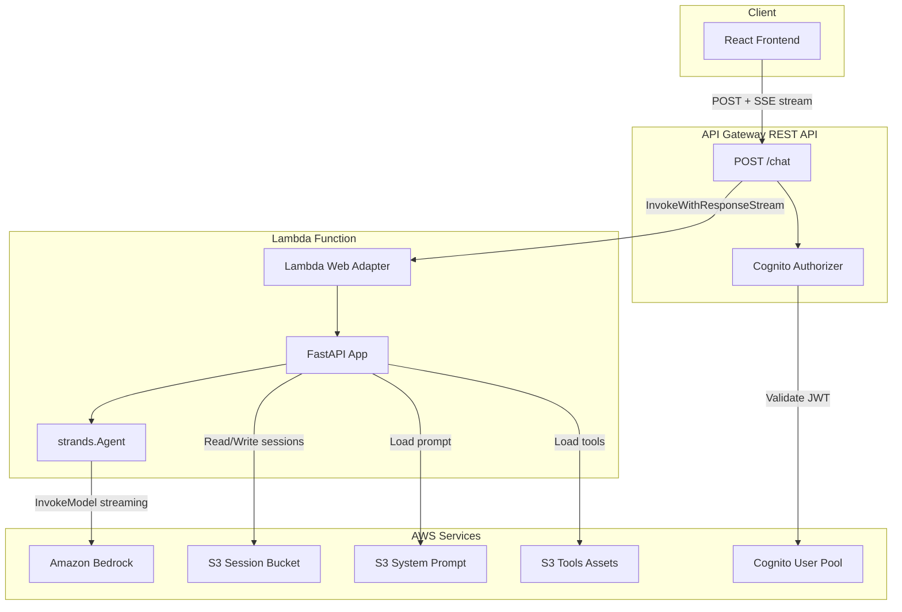

# Design Document: Interactive Agent Streaming

## Overview

This design revises the InteractiveAgent construct to replace the WebSocket + BidiAgent architecture with API Gateway REST API response streaming + Lambda Web Adapter + standard Strands Agent. The fundamental change is moving from a bidirectional WebSocket protocol to a unidirectional SSE streaming pattern over HTTP, which eliminates the BidiAgent dependency issues and the 29-second WebSocket timeout limitation.

The new architecture:
```
React Frontend (fetch + ReadableStream)
    ↓ POST /chat (Authorization: Bearer <JWT>)
API Gateway REST API (responseTransferMode: STREAM)
    ↓ InvokeWithResponseStream
Lambda (Python + Lambda Web Adapter + FastAPI)
    ↓ strands.Agent streaming
Amazon Bedrock (Claude)
```

Key design decisions:
- **Two-layer OOP pattern maintained**: BaseAgent → InteractiveAgent (same as BatchAgent)
- **Strategy interfaces preserved**: ICommunicationAdapter, ISessionStore, IContextStrategy, IAuthenticator
- **StreamingHttpAdapter replaces BidirectionalWebSocketAdapter** as the default adapter
- **API Gateway REST API** (not HTTP API) for native Cognito authorizer and response streaming support
- **Lambda Web Adapter** wraps a FastAPI app for Python response streaming
- **Standard `strands.Agent`** replaces BidiAgent, consistent with BatchAgent

## Architecture

### Component Diagram



### Request Flow

1. Frontend sends `POST /chat` with JSON body `{ "message": "...", "session_id": "..." }` and `Authorization: Bearer <JWT>`
2. API Gateway validates JWT via Cognito authorizer
3. API Gateway invokes Lambda using `InvokeWithResponseStream`
4. Lambda Web Adapter receives the HTTP request and forwards to FastAPI on `localhost:8080`
5. FastAPI `/chat` endpoint:
   a. Loads session from S3 (if session_id provided)
   b. Applies context windowing to conversation history
   c. Creates `strands.Agent` with model, system prompt, tools, and history
   d. Calls agent with user message
   e. Yields SSE events as agent streams tokens
   f. Saves updated session to S3
   g. Sends final `event: done` SSE event
6. SSE chunks stream back through Lambda Web Adapter → API Gateway → Client
7. Frontend reads `ReadableStream`, parses SSE events, renders tokens incrementally

## Components and Interfaces

### Strategy Interfaces (Preserved)

The existing strategy interfaces are preserved with minimal changes:

```typescript
// Unchanged - communication adapter strategy
export interface ICommunicationAdapter {
  attachToFunction(lambdaFunction: IFunction): string;
  grantInvoke(lambdaFunction: IFunction): void;
}

// Unchanged - session persistence strategy
export interface ISessionStore {
  readonly sessionBucket?: IBucket;
  grantReadWrite(lambdaFunction: IFunction): void;
}

// Unchanged - context management strategy
export interface IContextStrategy {
  environmentVariables(): Record<string, string>;
}

// Unchanged - authentication strategy
export interface IAuthenticator {
  grantAuthenticate(lambdaFunction: IFunction): void;
  environmentVariables(): Record<string, string>;
}
```

### StreamingHttpAdapter (New Default Adapter)

Replaces `BidirectionalWebSocketAdapter`. Creates an API Gateway REST API with response streaming.

```typescript
export interface StreamingHttpAdapterProps {
  readonly stageName?: string;        // @default 'prod'
  readonly throttle?: ThrottleSettings;
  readonly authenticator?: IAuthenticator;
}

export class StreamingHttpAdapter implements ICommunicationAdapter {
  public readonly restApi?: RestApi;
  public readonly apiEndpoint?: string;
  private scope?: Construct;
  private readonly props: StreamingHttpAdapterProps;

  constructor(props?: StreamingHttpAdapterProps);

  // Creates REST API with POST /chat, configures Lambda proxy integration
  // with responseTransferMode: STREAM, attaches Cognito authorizer if configured
  attachToFunction(lambdaFunction: IFunction): string;

  // Grants Lambda permission to be invoked by API Gateway
  grantInvoke(lambdaFunction: IFunction): void;

  // Internal: set CDK scope for resource creation
  _setScope(scope: Construct): void;
}
```

CDK resource creation in `attachToFunction`:
1. Create `RestApi` with CORS configuration
2. Add `/chat` resource with POST method
3. Configure Lambda proxy integration with `responseTransferMode: 'STREAM'` (via CfnMethod override)
4. Attach Cognito authorizer if authenticator is CognitoAuthenticator
5. Create deployment and stage
6. Return endpoint URL: `https://{api-id}.execute-api.{region}.amazonaws.com/{stage}/chat`

Implementation note: Since CDK's L2 `RestApi` doesn't natively expose `responseTransferMode`, we use `CfnMethod` escape hatch to set the integration's response transfer mode to `STREAM`. The integration URI uses the `InvokeWithResponseStream` action path (`/2021-11-15/functions/{arn}/response-streaming-invocations`).

### CognitoAuthenticator (Updated)

The existing CognitoAuthenticator is updated to work with REST API's native `COGNITO_USER_POOLS` authorizer type instead of a custom REQUEST authorizer.

```typescript
export class CognitoAuthenticator implements IAuthenticator {
  public readonly userPool?: UserPool;
  public readonly userPoolClient?: UserPoolClient;

  // Updated: creates COGNITO_USER_POOLS authorizer on REST API
  // instead of REQUEST authorizer on WebSocket API
  _setScope(scope: Construct): void;
  grantAuthenticate(lambdaFunction: IFunction): void;
  environmentVariables(): Record<string, string>;
}
```

Key change: The Cognito authorizer is now a built-in `COGNITO_USER_POOLS` type on the REST API, which validates JWT tokens natively without a custom Lambda authorizer. This simplifies the architecture and removes the authorization handler from the Lambda function.

### InteractiveAgent (Updated)

```typescript
export interface InteractiveAgentProps extends BaseAgentProps {
  readonly communicationAdapter?: ICommunicationAdapter;  // @default StreamingHttpAdapter
  readonly sessionStore?: ISessionStore;                  // @default S3SessionManager
  readonly sessionBucket?: IBucket;
  readonly sessionTTL?: Duration;
  readonly contextStrategy?: IContextStrategy;            // @default SlidingWindowConversationManager(20)
  readonly messageHistoryLimit?: number;
  readonly authenticator?: IAuthenticator;                // @default CognitoAuthenticator
  readonly memorySize?: number;                           // @default 1024
  readonly timeout?: Duration;                            // @default Duration.minutes(15)
  readonly architecture?: Architecture;                   // @default X86_64
  readonly reservedConcurrentExecutions?: number;
}

export class InteractiveAgent extends BaseAgent {
  public readonly agentFunction: PythonFunction;
  public readonly adapter?: ICommunicationAdapter;
  public readonly sessionStore?: ISessionStore;
  public readonly contextStrategy?: IContextStrategy;
  public readonly authenticator?: IAuthenticator;
  public readonly apiEndpoint: string;
  public readonly sessionBucket?: IBucket;
}
```

Key changes from current implementation:
- Default timeout increased to 15 minutes (from 5 minutes) to leverage REST API streaming's extended timeout
- Default adapter is `StreamingHttpAdapter` (was `BidirectionalWebSocketAdapter`)
- Lambda function uses Lambda Web Adapter layer instead of standard Python handler
- Environment variable `AWS_LWA_INVOKE_MODE` set to `response_stream`
- No more WebSocket-specific routes ($connect, $disconnect, $default, sendMessage)

### Lambda Function Architecture

The Lambda function uses Lambda Web Adapter to run a FastAPI application:

```
Lambda Container
├── Lambda Web Adapter (extension layer)
│   └── Listens on Lambda Runtime API
│   └── Forwards HTTP to localhost:8080
├── FastAPI Application (main.py)
│   └── POST /chat endpoint
│   └── SSE StreamingResponse
│   └── strands.Agent integration
│   └── Session management (S3)
│   └── Context windowing
└── Dependencies
    └── strands-agents
    └── fastapi
    └── uvicorn
    └── boto3
```

Environment variables:
- `AWS_LWA_INVOKE_MODE`: `response_stream` (enables Lambda Web Adapter streaming)
- `PORT`: `8080` (FastAPI listen port, Lambda Web Adapter default)
- `MODEL_ID`: Bedrock model identifier
- `SYSTEM_PROMPT_S3_BUCKET_NAME`: S3 bucket for system prompt
- `SYSTEM_PROMPT_S3_KEY`: S3 key for system prompt
- `TOOLS_CONFIG`: JSON array of tool S3 locations
- `SESSION_BUCKET`: S3 bucket for session storage
- `CONTEXT_ENABLED`: `true`/`false`
- `CONTEXT_STRATEGY`: `SlidingWindow`/`Null`
- `CONTEXT_WINDOW_SIZE`: Number of messages
- `AUTH_TYPE`: `Cognito`/`None`

### FastAPI Handler Design

```python
# Pseudocode for the FastAPI handler

app = FastAPI()

# Cold start: load system prompt from S3, load tools from S3
system_prompt = load_from_s3(SYSTEM_PROMPT_BUCKET, SYSTEM_PROMPT_KEY)
tools = load_tools_from_s3(TOOLS_CONFIG)

@app.post("/chat")
async def chat(request: ChatRequest) -> StreamingResponse:
    session_id = request.session_id or generate_session_id()
    
    # Load session
    messages = session_manager.get_session(session_id)
    
    # Apply context windowing
    context = context_manager.get_context(messages)
    
    # Add user message
    context.append({"role": "user", "content": request.message})
    
    async def generate_sse():
        # Send session_id metadata
        yield f"event: metadata\ndata: {json.dumps({'session_id': session_id})}\n\n"
        
        full_response = ""
        try:
            # Create agent with history
            model = BedrockModel(model_id=MODEL_ID, streaming=True)
            agent = Agent(model=model, system_prompt=system_prompt, tools=tools)
            
            # Stream response
            result = agent(request.message, messages=context[:-1])
            
            # Extract and yield text chunks
            for chunk in extract_text_chunks(result):
                full_response += chunk
                yield f"data: {json.dumps({'text': chunk})}\n\n"
            
            # Save session
            messages.append({"role": "user", "content": request.message})
            messages.append({"role": "assistant", "content": full_response})
            session_manager.save_session(session_id, messages)
            
            yield "event: done\ndata: {}\n\n"
        except Exception as e:
            yield f"event: error\ndata: {json.dumps({'error': str(e)})}\n\n"
    
    return StreamingResponse(
        generate_sse(),
        media_type="text/event-stream",
        headers={
            "Cache-Control": "no-cache",
            "Connection": "keep-alive",
            "X-Accel-Buffering": "no",
        }
    )
```

### Frontend SSE Client Design

The chatbot frontend replaces WebSocket client with fetch + ReadableStream:

```typescript
// Pseudocode for frontend SSE client
async function sendMessage(message: string, sessionId?: string) {
  const response = await fetch(`${API_ENDPOINT}/chat`, {
    method: 'POST',
    headers: {
      'Content-Type': 'application/json',
      'Authorization': `Bearer ${cognitoToken}`,
    },
    body: JSON.stringify({ message, session_id: sessionId }),
  });

  const reader = response.body.getReader();
  const decoder = new TextDecoder();
  let buffer = '';

  while (true) {
    const { done, value } = await reader.read();
    if (done) break;

    buffer += decoder.decode(value, { stream: true });
    const events = parseSSEEvents(buffer);
    
    for (const event of events.parsed) {
      if (event.type === 'metadata') {
        setSessionId(event.data.session_id);
      } else if (event.type === 'data') {
        appendToMessage(event.data.text);
      } else if (event.type === 'done') {
        markMessageComplete();
      } else if (event.type === 'error') {
        showError(event.data.error);
      }
    }
    buffer = events.remaining;
  }
}
```

## Data Models

### Chat Request

```json
{
  "message": "string (required)",
  "session_id": "string (optional, UUID format)"
}
```

### SSE Event Types

```
# Metadata event (first event, contains session_id)
event: metadata
data: {"session_id": "uuid-string"}

# Text chunk event (repeated for each token)
data: {"text": "chunk of text"}

# Completion event
event: done
data: {}

# Error event
event: error
data: {"error": "error message"}
```

### Session Data (S3)

```json
{
  "session_id": "uuid-string",
  "messages": [
    {"role": "user", "content": "Hello"},
    {"role": "assistant", "content": "Hi there!"}
  ],
  "created_at": "ISO-8601",
  "updated_at": "ISO-8601"
}
```


## Correctness Properties

*A property is a characteristic or behavior that should hold true across all valid executions of a system — essentially, a formal statement about what the system should do. Properties serve as the bridge between human-readable specifications and machine-verifiable correctness guarantees.*

The following properties were derived from the acceptance criteria prework analysis. After reflection, redundant properties were consolidated (e.g., SSE formatting from 2.5/3.4, error handling from 3.5/9.3, and session round-trip from 5.1/5.3).

### Property 1: SSE text chunk formatting

*For any* text string produced by the Strands Agent, when formatted as an SSE event, the output should be a valid SSE `data:` line containing a JSON object with a `text` field equal to the original string, terminated by double newlines.

**Validates: Requirements 2.5**

### Property 2: Error events are well-formed SSE

*For any* exception raised during agent processing, the handler should produce a valid SSE event with `event: error` and a `data:` line containing a JSON object with an `error` field describing the exception, followed by stream closure.

**Validates: Requirements 3.5**

### Property 3: Session persistence round-trip

*For any* session ID and sequence of user/assistant message pairs, saving the session to the store and then loading it back should produce an equivalent list of messages.

**Validates: Requirements 5.1, 5.3**

### Property 4: Sliding window limits context size

*For any* list of messages and any window size W between 1 and 1000, applying the sliding window context manager should return at most W messages, and if the input has more than W messages, the result should be the last W messages.

**Validates: Requirements 6.1**

### Property 5: Null context manager always returns empty

*For any* list of messages (including empty), applying the NullConversationManager should return an empty list.

**Validates: Requirements 6.2**

## Error Handling

### Lambda / FastAPI Level

| Error Scenario | Handling |
|---|---|
| Invalid JSON in request body | FastAPI returns 422 Unprocessable Entity (automatic validation) |
| Missing `message` field | FastAPI returns 422 with field validation error |
| S3 session load failure | Log warning, proceed with empty session (graceful degradation) |
| S3 session save failure | Log error, response already streamed to client (best-effort persistence) |
| System prompt load failure | Use fallback default prompt, log error |
| Tool loading failure | Log error, agent operates without tools |
| Bedrock model invocation error | Send SSE `event: error` with error details, close stream |
| Bedrock throttling | Send SSE `event: error` with retry suggestion, close stream |
| Lambda timeout (15 min) | Client detects incomplete stream (no `event: done`), shows timeout message |
| Strands Agent exception | Catch, send SSE `event: error`, close stream |

### API Gateway Level

| Error Scenario | Handling |
|---|---|
| Invalid/expired JWT token | API Gateway returns 401 Unauthorized (Cognito authorizer) |
| Missing Authorization header | API Gateway returns 401 Unauthorized |
| Throttling (rate/burst limit) | API Gateway returns 429 Too Many Requests |
| Lambda invocation failure | API Gateway returns 502 Bad Gateway |

### Frontend Level

| Error Scenario | Handling |
|---|---|
| Network error (fetch fails) | Display connection error, offer retry |
| SSE `event: error` received | Display error message, re-enable input |
| Stream ends without `event: done` | Detect timeout, display timeout message |
| 401 response | Redirect to login / refresh token |
| 429 response | Display rate limit message, auto-retry with backoff |

## Testing Strategy

### Unit Tests (TypeScript - Jest)

CDK construct tests using `Template.fromStack()` assertions:

1. **Resource creation tests**: Verify REST API, Lambda, S3 bucket, Cognito resources are created with correct properties
2. **Default behavior tests**: Verify defaults (StreamingHttpAdapter, S3SessionManager, SlidingWindowConversationManager, CognitoAuthenticator)
3. **Configuration tests**: Verify custom props are applied (timeout, memory, window size, session TTL)
4. **Validation tests**: Verify error thrown for invalid props (empty agentName, out-of-range memorySize)
5. **Integration configuration tests**: Verify Lambda has Web Adapter layer, correct env vars, response streaming config
6. **Authorizer tests**: Verify Cognito authorizer attached when CognitoAuthenticator used, no authorizer with NoAuthenticator
7. **Permission tests**: Verify IAM policies for S3, Bedrock, Cognito

Use `createTestApp()` from `use-cases/utilities/test-utils.ts` to skip bundling for faster tests.

### CDK Nag Tests (TypeScript - Jest)

Security compliance tests using `AwsSolutionsChecks`:

1. Verify stack passes AWS Solutions checks
2. Document necessary suppressions (e.g., IAM wildcards for dynamic S3 access, managed policies for Lambda)

### Property-Based Tests (Python - Hypothesis)

For the Python handler logic (session management, context windowing, SSE formatting):

1. **Property 1**: SSE text chunk formatting - generate random strings, verify SSE format
2. **Property 2**: Error SSE formatting - generate random exceptions, verify error event format
3. **Property 3**: Session round-trip - generate random message lists, save/load, verify equivalence
4. **Property 4**: Sliding window - generate random message lists and window sizes, verify output length and content
5. **Property 5**: Null context - generate random message lists, verify empty output

Each property test should run minimum 100 iterations. Tag format: `# Feature: interactive-agent-streaming, Property N: {property_text}`

### Testing Libraries

- **TypeScript**: Jest with `aws-cdk-lib/assertions` (unit + CDK Nag)
- **Python**: pytest with hypothesis (property-based tests for handler logic)
- **Build**: `npx projen build` before running TypeScript tests
