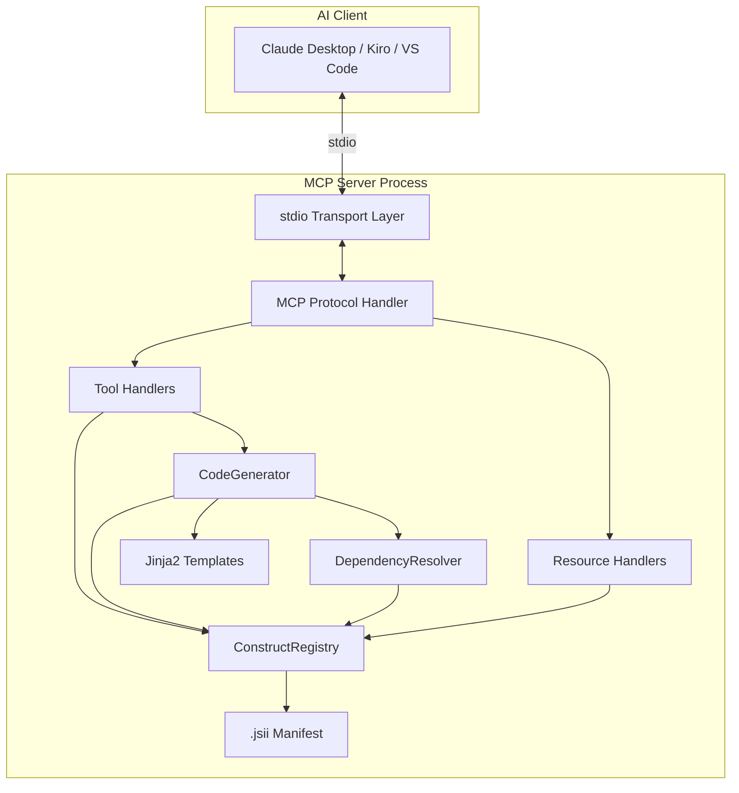
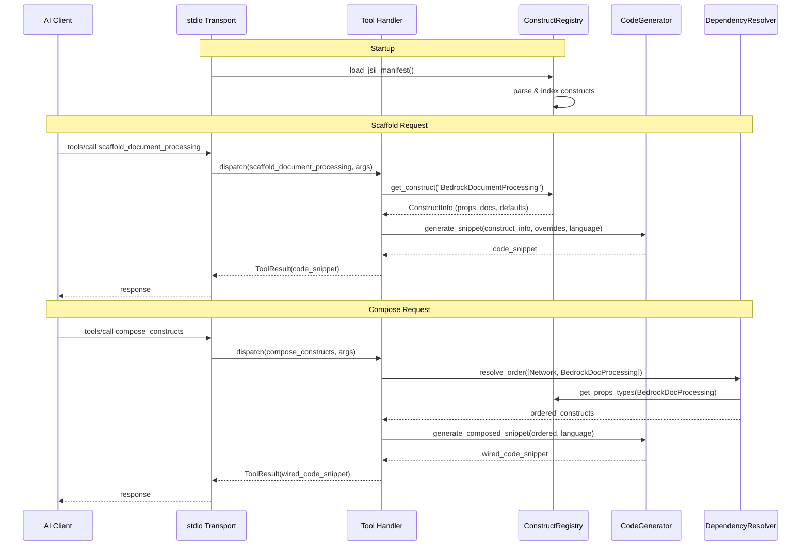
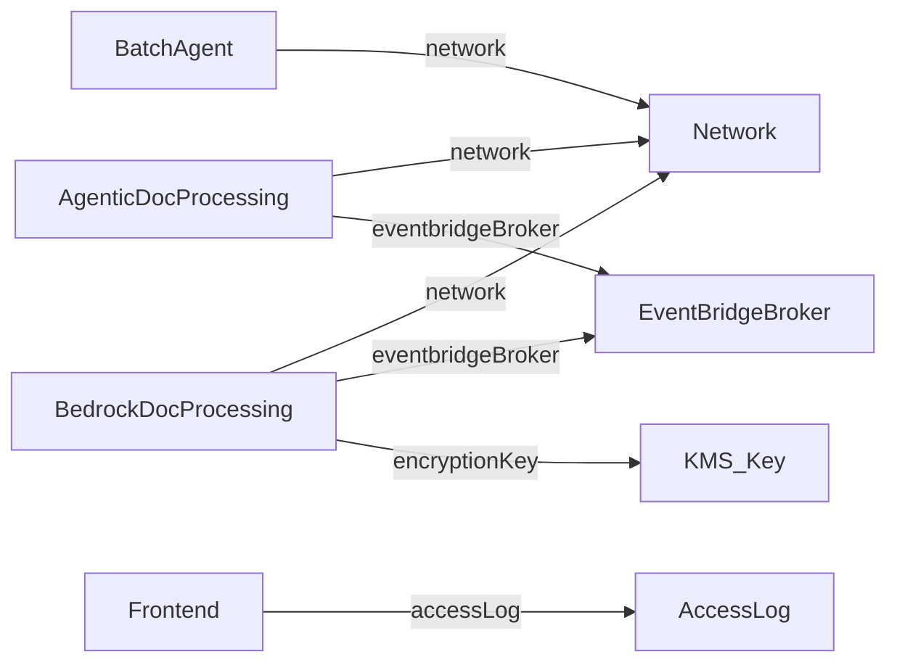

# Design Document: MCP Server for AppMod Catalog Blueprints

## Overview

This document describes the design of a Python-based MCP (Model Context Protocol) server that exposes the AppMod Catalog Blueprints library to AI-powered development tools. The server reads JSII metadata from the library's `.jsii` manifest to auto-discover construct props, types, and documentation, then exposes this information through MCP tools (for code generation) and MCP resources (for documentation browsing).

The server follows a registry-driven architecture where a central `ConstructRegistry` loads and indexes JSII metadata at startup. Tool handlers and resource handlers are thin wrappers that delegate to the registry for construct information and to a Jinja2-based code generator for snippet production. The server supports multi-language output (TypeScript, Python, Java, .NET) via a `language` parameter on scaffold and compose tools.

Distribution is via PyPI, runnable with `uvx`. Communication is stdio-only. The `.jsii` manifest is bundled as a data file in the Python package, ensuring version-lock with the library.

### Key Design Decisions

| Decision | Choice | Rationale |
|----------|--------|-----------|
| Architecture | Registry-driven | Central registry provides clean separation; tools/resources are thin wrappers |
| JSII loading | Bundle `.jsii` in package | No Node.js runtime dependency; version-locked by build process |
| Code generation | Jinja2 templates | Python-native, readable, easy to add languages |
| Multi-language | `language` parameter | Single tool set, no tool explosion; defaults to TypeScript |
| Dependency resolution | Static JSII props analysis | Deterministic DAG from props type analysis; auto-maintained |
| Degraded mode | Empty registry, error on invocation | Server starts, AI client gets helpful error messages |

## Architecture

### High-Level Architecture



### Component Interaction Flow



### Package Structure

```
mcp-appmod-catalog-blueprints/
├── pyproject.toml                  # Package config, uvx entry point
├── src/
│   └── mcp_server_constructs/
│       ├── __init__.py
│       ├── __main__.py             # Entry point: starts MCP server
│       ├── server.py               # MCP server setup, tool/resource registration
│       ├── registry.py             # ConstructRegistry: JSII loading & indexing
│       ├── generator.py            # CodeGenerator: Jinja2-based snippet generation
│       ├── resolver.py             # DependencyResolver: DAG construction & topo sort
│       ├── models.py               # Data models (ConstructInfo, PropInfo, etc.)
│       ├── defaults.py             # Smart defaults per construct
│       ├── errors.py               # Error types and degraded mode handling
│       ├── data/
│       │   └── .jsii               # Bundled JSII manifest (copied at build time)
│       └── templates/
│           ├── typescript/
│           │   ├── scaffold.ts.j2
│           │   └── compose.ts.j2
│           ├── python/
│           │   ├── scaffold.py.j2
│           │   └── compose.py.j2
│           ├── java/
│           │   ├── scaffold.java.j2
│           │   └── compose.java.j2
│           └── dotnet/
│               ├── scaffold.cs.j2
│               └── compose.cs.j2
├── tests/
│   ├── conftest.py
│   ├── test_registry.py
│   ├── test_generator.py
│   ├── test_resolver.py
│   ├── test_server.py              # Integration tests over stdio
│   └── test_properties.py          # Property-based tests (Hypothesis)
└── README.md
```

## Components and Interfaces

### 1. ConstructRegistry

The central component that loads, parses, and indexes the JSII manifest.

```python
class ConstructRegistry:
    """Loads .jsii manifest and provides indexed access to construct metadata."""

    def __init__(self, jsii_path: str | None = None):
        """Load and index the JSII manifest.

        Args:
            jsii_path: Path to .jsii file. Defaults to bundled manifest.

        Raises:
            JsiiLoadError: If manifest is missing or unparseable.
        """

    def get_construct(self, name: str) -> ConstructInfo:
        """Get full metadata for a construct by class name."""

    def get_family(self, family: str) -> list[ConstructInfo]:
        """Get all constructs in a family (e.g., 'document-processing')."""

    def list_families(self) -> list[FamilyInfo]:
        """List all construct families with their constructs."""

    def get_catalog(self) -> CatalogInfo:
        """Get the full catalog: all families and constructs."""

    def get_props(self, name: str) -> list[PropInfo]:
        """Get props for a construct, including inherited props."""

    def get_construct_types(self, family: str) -> list[str]:
        """Get valid constructType values for a family's scaffold tool."""

    @property
    def is_loaded(self) -> bool:
        """Whether the JSII manifest was successfully loaded."""
```

**JSII Parsing Strategy:**

The `.jsii` manifest is a JSON file with a `types` map keyed by fully-qualified name (FQN). Each type entry contains:
- `kind`: "class" or "interface"
- `docs`: JSDoc documentation
- `properties`: list of props with name, type, docs, optional flag
- `base`: parent class FQN (for inheritance chain traversal)
- `interfaces`: implemented interfaces

The registry:
1. Loads the JSON file
2. Filters to public construct classes (those extending `Construct`)
3. Resolves inheritance chains to collect all props (own + inherited)
4. Groups constructs into families based on namespace/module path
5. Builds an index by class name and by family name

### 2. CodeGenerator

Generates code snippets using Jinja2 templates populated with registry data.

```python
class CodeGenerator:
    """Generates code snippets from construct metadata and Jinja2 templates."""

    def __init__(self, registry: ConstructRegistry):
        """Initialize with a registry for construct lookups."""

    def scaffold(
        self,
        construct_name: str,
        language: str = "typescript",
        props_overrides: dict | None = None,
    ) -> str:
        """Generate a scaffold snippet for a single construct.

        Returns a code string with imports, instantiation, smart defaults,
        and inline comments.
        """

    def compose(
        self,
        constructs: list[str],
        language: str = "typescript",
        props_overrides: dict[str, dict] | None = None,
    ) -> str:
        """Generate a composed snippet wiring multiple constructs together.

        Resolves dependency order, creates shared dependencies once,
        and wires cross-references.
        """
```

**Language Mapping:**

Each target language has conventions the generator must apply:

| Aspect | TypeScript | Python | Java | .NET |
|--------|-----------|--------|------|------|
| Prop names | camelCase | snake_case | camelCase | PascalCase |
| Class instantiation | `new Foo(scope, 'Id', {...})` | `Foo(scope, "Id", ...)` | `Foo.Builder.create(scope, "Id")...build()` | `new Foo(scope, "Id", new FooProps {...})` |
| Imports | `import { Foo } from '...'` | `from ... import Foo` | `import ...Foo;` | `using ...;` |
| String quotes | Single `'` | Double `"` | Double `"` | Double `"` |
| Indentation | 2 spaces | 4 spaces | 4 spaces | 4 spaces |

### 3. DependencyResolver

Analyzes construct props to build a dependency DAG and determine instantiation order.

```python
class DependencyResolver:
    """Resolves construct dependencies from JSII props type analysis."""

    def __init__(self, registry: ConstructRegistry):
        """Initialize with registry for props type lookups."""

    def resolve_order(self, construct_names: list[str]) -> list[str]:
        """Return constructs in dependency order (dependencies first).

        Performs topological sort on the dependency DAG.

        Raises:
            CircularDependencyError: If constructs have circular dependencies.
            IncompatibleConstructsError: If constructs cannot be composed.
        """

    def get_dependencies(self, construct_name: str) -> list[str]:
        """Get direct dependencies of a construct (other constructs in its props)."""

    def get_shared_dependencies(self, construct_names: list[str]) -> list[str]:
        """Identify dependencies shared by multiple constructs."""

    def build_wiring(self, ordered: list[str]) -> dict[str, dict[str, str]]:
        """Build a wiring map: {construct: {prop_name: dependency_variable_name}}.

        Used by CodeGenerator to wire cross-references in composed snippets.
        """
```

**Dependency Detection Algorithm:**

1. For each construct in the composition request, get its props from the registry
2. For each prop, check if the prop's type is another construct class in the library
3. If yes, that's a dependency edge: `dependent → dependency`
4. Build a directed acyclic graph (DAG) from all edges
5. Topological sort the DAG to get instantiation order
6. Identify shared dependencies (nodes with in-degree > 1 within the request set)

Example: composing `[BedrockDocumentProcessing, Network, Observability]`
- `BedrockDocumentProcessing` props include `network?: Network` → edge to `Network`
- `BedrockDocumentProcessing` props include `enableObservability?: boolean` → no edge (primitive)
- Result order: `Network` → `Observability` → `BedrockDocumentProcessing`

### 4. MCP Server (server.py)

Wires everything together and registers tools/resources with the MCP protocol.

```python
def create_server() -> Server:
    """Create and configure the MCP server with all tools and resources."""
```

**Registered Tools:**

| Tool Name | Family | Description |
|-----------|--------|-------------|
| `scaffold_document_processing` | Document Processing | Scaffold BedrockDocumentProcessing, AgenticDocumentProcessing, QueuedS3Adapter |
| `scaffold_agents` | Agents | Scaffold BatchAgent, InteractiveAgent, knowledge base constructs |
| `scaffold_webapp` | Webapp | Scaffold Frontend construct |
| `scaffold_foundation` | Foundation | Scaffold Network, AccessLog, EventBridgeBroker |
| `scaffold_utilities` | Utilities | Scaffold Observability, DataMasking, DataLoader |
| `compose_constructs` | Cross-family | Compose multiple constructs with dependency wiring |

Each scaffold tool accepts:
```json
{
  "constructType": "BedrockDocumentProcessing",
  "language": "typescript",
  "props": {
    "classificationPrompt": "Classify as invoice or receipt"
  }
}
```

**Registered Resources:**

| URI Pattern | Description |
|-------------|-------------|
| `constructs://catalog` | Full catalog listing all families and constructs |
| `constructs://{family}/{construct}` | Construct documentation, props, defaults |

Examples:
- `constructs://catalog`
- `constructs://document-processing/bedrock-document-processing`
- `constructs://agents/batch-agent`
- `constructs://foundation/network`
- `constructs://webapp/frontend`

### 5. Error Handling (errors.py)

```python
class JsiiLoadError(Exception):
    """Raised when the .jsii manifest cannot be loaded."""

class UnknownConstructError(Exception):
    """Raised when a requested construct name is not in the registry."""

class UnknownFamilyError(Exception):
    """Raised when a requested family name is not in the registry."""

class CircularDependencyError(Exception):
    """Raised when compose detects circular dependencies."""

class IncompatibleConstructsError(Exception):
    """Raised when composed constructs have conflicting props."""

class DegradedModeError(Exception):
    """Raised on tool invocation when registry failed to load."""
```

**Degraded Mode Behavior:**

When the `.jsii` manifest is missing or corrupt:
1. Server starts normally and completes MCP handshake
2. `ConstructRegistry.is_loaded` returns `False`
3. Tool invocations return a structured error:
   ```json
   {
     "isError": true,
     "content": [{
       "type": "text",
       "text": "JSII metadata unavailable. The .jsii manifest could not be loaded. Ensure the package was installed correctly. Try reinstalling: uvx --reinstall mcp-appmod-catalog-blueprints"
     }]
   }
   ```
4. Resource reads return similar structured errors
5. The catalog resource returns an empty listing with the error message


## Data Models

### Core Data Models (models.py)

```python
from dataclasses import dataclass, field
from enum import Enum


class Language(str, Enum):
    """Supported target languages for code generation."""
    TYPESCRIPT = "typescript"
    PYTHON = "python"
    JAVA = "java"
    DOTNET = "dotnet"


@dataclass(frozen=True)
class PropInfo:
    """Metadata for a single construct prop."""
    name: str
    type_name: str                    # e.g., "string", "number", "Network", "Duration"
    description: str
    required: bool
    default_value: str | None         # From @default JSDoc tag
    is_construct_ref: bool            # True if type is another library construct
    construct_ref_name: str | None    # e.g., "Network" if is_construct_ref


@dataclass(frozen=True)
class ConstructInfo:
    """Full metadata for a single construct."""
    name: str                         # e.g., "BedrockDocumentProcessing"
    fqn: str                          # e.g., "@cdklabs/cdk-appmod-catalog-blueprints.BedrockDocumentProcessing"
    family: str                       # e.g., "document-processing"
    description: str                  # From JSDoc
    props: list[PropInfo]             # All props (own + inherited)
    parent_class: str | None          # e.g., "BaseDocumentProcessing"
    is_abstract: bool
    module_path: str                  # e.g., "use-cases/document-processing"


@dataclass(frozen=True)
class FamilyInfo:
    """Metadata for a construct family."""
    name: str                         # e.g., "document-processing"
    display_name: str                 # e.g., "Document Processing"
    constructs: list[str]             # Construct names in this family


@dataclass(frozen=True)
class CatalogInfo:
    """Full catalog of all families and constructs."""
    families: list[FamilyInfo]
    library_version: str
    library_name: str


@dataclass(frozen=True)
class SmartDefault:
    """A best-practice default value for an optional prop."""
    prop_name: str
    value: str                        # Code expression as string
    comment: str                      # Explanation of why this default
    security_relevant: bool           # True if this is a security best practice


@dataclass(frozen=True)
class WiringEntry:
    """How one construct's prop connects to another construct's output."""
    source_construct: str             # e.g., "Network"
    source_variable: str              # e.g., "network"
    target_construct: str             # e.g., "BedrockDocumentProcessing"
    target_prop: str                  # e.g., "network"
```

### Construct Family Mapping

The registry maps JSII module paths to families:

| JSII Module Path | Family Name | Display Name | Constructs |
|-------------------|-------------|--------------|------------|
| `document-processing` | `document-processing` | Document Processing | BedrockDocumentProcessing, AgenticDocumentProcessing, QueuedS3Adapter, ChunkingConfig |
| `framework/agents` | `agents` | Agents | BatchAgent, InteractiveAgent, BedrockKnowledgeBase |
| `webapp` | `webapp` | Webapp | Frontend |
| `framework/foundation` | `foundation` | Foundation | Network, AccessLog, EventBridgeBroker |
| `utilities` | `utilities` | Utilities | ServerlessObservability, DataLoader |

### Smart Defaults Map

Smart defaults are defined per construct, keyed by prop name:

```python
SMART_DEFAULTS: dict[str, list[SmartDefault]] = {
    "BedrockDocumentProcessing": [
        SmartDefault(
            prop_name="encryptionKey",
            value="new Key(this, 'EncryptionKey', { enableKeyRotation: true })",
            comment="KMS encryption with automatic key rotation for data at rest",
            security_relevant=True,
        ),
        SmartDefault(
            prop_name="removalPolicy",
            value="RemovalPolicy.DESTROY",
            comment="DESTROY for dev; change to RETAIN for production",
            security_relevant=False,
        ),
        SmartDefault(
            prop_name="enableObservability",
            value="true",
            comment="Enable Lambda Powertools logging, X-Ray tracing, and CloudWatch metrics",
            security_relevant=False,
        ),
    ],
    "Network": [
        SmartDefault(
            prop_name="maxAzs",
            value="2",
            comment="Two AZs for high availability at reasonable cost",
            security_relevant=False,
        ),
    ],
    "Frontend": [
        SmartDefault(
            prop_name="enforceSSL",
            value="true",
            comment="Enforce HTTPS for all CloudFront requests",
            security_relevant=True,
        ),
    ],
    # ... additional constructs
}
```

### Cross-Construct Dependency Map (derived from JSII)

The dependency resolver builds this automatically from props type analysis:



Dependencies are detected when a prop's JSII type resolves to another construct class in the library. Primitive types (`string`, `boolean`, `Duration`) and CDK types (`Key`, `Table`) are not treated as library-internal dependencies — they are handled via smart defaults or left as user-provided values.

## Correctness Properties

*A property is a characteristic or behavior that should hold true across all valid executions of a system — essentially, a formal statement about what the system should do. Properties serve as the bridge between human-readable specifications and machine-verifiable correctness guarantees.*

The following essential properties cover the core invariants of the MCP server: JSII metadata parsing fidelity, code snippet validity, dependency ordering, and smart defaults application.

### Property 1: JSII Parsing Round-Trip

*For any* valid JSII type entry representing a construct class, loading it into the `ConstructRegistry` and then reading back the construct's metadata should produce a `ConstructInfo` whose prop names, prop types, required flags, and descriptions match the original JSII entry.

**Validates: Requirements 4.1, 4.2, 4.3, 2.4, 8.6**

### Property 2: Scaffold Output Contains All Required Props

*For any* construct in the registry and any target language, invoking the scaffold tool with no prop overrides should produce a code snippet that contains a reference to every required prop defined in that construct's `PropInfo` list.

**Validates: Requirements 1.2**

### Property 3: Smart Defaults and Override Application

*For any* construct with optional props that have smart defaults, and *for any* subset of those props provided as overrides: the generated code snippet should contain the override value for each overridden prop, and the smart default value for each non-overridden prop. No optional prop with a defined smart default should be absent from the output.

**Validates: Requirements 1.3, 1.4**

### Property 4: Code Snippet Format Validity

*For any* generated TypeScript code snippet, the output should use 2-space indentation, single-quoted strings, semicolons at statement ends, and PascalCase construct IDs. Every prop in the snippet should have an accompanying inline comment.

**Validates: Requirements 7.1, 7.3**

### Property 5: Dependency Ordering Correctness

*For any* set of constructs passed to the compose tool, the output instantiation order should be a valid topological sort of the dependency DAG — meaning every construct appears in the output after all constructs it depends on.

**Validates: Requirements 3.2**

### Property 6: Shared Dependency Deduplication

*For any* set of constructs that share a common dependency (a construct type that appears in multiple constructs' props), the composed code snippet should contain exactly one instantiation of each shared dependency, and all dependents should reference the same variable.

**Validates: Requirements 3.3**

### Property 7: Resource Props Completeness

*For any* construct in the registry, reading its MCP resource should return a response containing every prop from the construct's `PropInfo` list, each with its type name, description, required/optional status, and default value (if any).

**Validates: Requirements 2.1, 2.2**

### Property 8: Graceful Handling of Missing and Invalid Props

*For any* construct and *for any* non-empty subset of its required props that are omitted, the scaffold tool should produce a code snippet containing placeholder markers for each missing required prop, with a comment indicating the prop must be filled in. Similarly, *for any* prop provided with a value whose type doesn't match the expected type, the snippet should include the value as-is with a warning comment stating the expected type.

**Validates: Requirements 6.1, 6.4**

## Error Handling

### Error Categories and Responses

| Error Category | Trigger | Response Strategy |
|---------------|---------|-------------------|
| **JSII Load Failure** | Missing/corrupt `.jsii` file | Start in degraded mode; return structured error on tool/resource invocation |
| **Unknown Construct** | Invalid `constructType` parameter | Return error listing valid types for the family |
| **Unknown Family** | Invalid family in resource URI | Return error listing valid families |
| **Missing Required Props** | Required props not provided | Generate snippet with `TODO` placeholders and comments |
| **Type Mismatch** | Prop value doesn't match expected type | Include value as-is with `// WARNING: expected <type>` comment |
| **Circular Dependencies** | Compose request with circular deps | Return error describing the cycle |
| **Incompatible Constructs** | Compose request with conflicting constructs | Return error identifying the conflict with resolution suggestion |

### Degraded Mode

When the `.jsii` manifest fails to load:

1. The server starts and completes the MCP handshake normally
2. `ConstructRegistry.is_loaded` is `False`
3. All tool invocations return:
   ```json
   {
     "isError": true,
     "content": [{
       "type": "text",
       "text": "JSII metadata unavailable. Ensure the package is installed correctly. Reinstall with: uvx --reinstall mcp-appmod-catalog-blueprints"
     }]
   }
   ```
4. The catalog resource returns an empty listing with the error message
5. Individual construct resources return the same error

### Scaffold Error Handling

For missing required props, the generator produces placeholder code:

```typescript
// TypeScript example with missing required props
const processing = new BedrockDocumentProcessing(this, 'Processing', {
  // TODO: Required — provide a classification prompt for document type detection
  classificationPrompt: '<REQUIRED: string>',
  // TODO: Required — provide a processing prompt for data extraction
  processingPrompt: '<REQUIRED: string>',
});
```

For type mismatches:

```typescript
const network = new Network(this, 'Network', {
  maxAzs: 'three', // WARNING: expected number, got string
});
```

### Compose Error Handling

For circular dependencies:

```
Error: Circular dependency detected: ConstructA → ConstructB → ConstructA.
These constructs cannot be composed together. Consider removing one from the composition.
```

For incompatible constructs:

```
Error: Incompatible constructs: ConstructA and ConstructB both require exclusive access to the same resource type.
Suggestion: Use ConstructA with a shared dependency, or compose them in separate stacks.
```

## Testing Strategy

### Dual Testing Approach

The MCP server uses both unit tests and property-based tests for comprehensive coverage:

- **Unit tests (pytest):** Verify specific examples, edge cases, integration points, and error conditions
- **Property-based tests (Hypothesis):** Verify universal properties across randomly generated inputs

### Unit Tests

| Test File | Scope | Key Tests |
|-----------|-------|-----------|
| `test_registry.py` | ConstructRegistry | Load real `.jsii`, verify construct count, family grouping, props inheritance resolution, degraded mode |
| `test_generator.py` | CodeGenerator | Scaffold each construct type, verify imports/instantiation per language, smart defaults, override application |
| `test_resolver.py` | DependencyResolver | Known dependency pairs, topological sort correctness, shared dependency detection, cycle detection |
| `test_server.py` | MCP integration | Start server over stdio, call tools, read resources, verify MCP protocol compliance |

### Property-Based Tests (Hypothesis)

Library: **Hypothesis** (Python PBT standard)
Configuration: Minimum **100 iterations** per property test
File: `tests/test_properties.py`

Each property test references its design document property:

```python
from hypothesis import given, strategies as st, settings

# Feature: mcp-appmod-catalog-blueprints, Property 1: JSII Parsing Round-Trip
@settings(max_examples=100)
@given(jsii_type_entry=jsii_type_strategy())
def test_jsii_parsing_round_trip(jsii_type_entry):
    """For any valid JSII type entry, loading into registry and reading back
    should produce matching prop names, types, required flags, and descriptions."""
    registry = ConstructRegistry.from_dict({"types": {jsii_type_entry.fqn: jsii_type_entry.to_dict()}})
    info = registry.get_construct(jsii_type_entry.name)
    for prop in jsii_type_entry.properties:
        matched = next(p for p in info.props if p.name == prop.name)
        assert matched.type_name == prop.type_name
        assert matched.required == prop.required


# Feature: mcp-appmod-catalog-blueprints, Property 5: Dependency Ordering Correctness
@settings(max_examples=100)
@given(construct_set=st.lists(st.sampled_from(KNOWN_CONSTRUCTS), min_size=2, max_size=6, unique=True))
def test_dependency_ordering(construct_set):
    """For any set of constructs, the compose output order should be a valid
    topological sort — every construct appears after its dependencies."""
    resolver = DependencyResolver(registry)
    try:
        ordered = resolver.resolve_order(construct_set)
    except CircularDependencyError:
        return  # Valid rejection
    seen = set()
    for name in ordered:
        deps = resolver.get_dependencies(name)
        for dep in deps:
            if dep in construct_set:
                assert dep in seen, f"{dep} should appear before {name}"
        seen.add(name)
```

### Custom Hypothesis Strategies

```python
# Strategy for generating valid JSII type entries
def jsii_type_strategy():
    """Generate synthetic JSII type entries for property testing."""
    return st.builds(
        SyntheticJsiiType,
        name=st.from_regex(r'[A-Z][a-zA-Z]{3,20}', fullmatch=True),
        properties=st.lists(jsii_prop_strategy(), min_size=1, max_size=10),
    )

def jsii_prop_strategy():
    """Generate synthetic JSII prop entries."""
    return st.builds(
        SyntheticJsiiProp,
        name=st.from_regex(r'[a-z][a-zA-Z]{2,15}', fullmatch=True),
        type_name=st.sampled_from(["string", "number", "boolean", "Duration", "Network"]),
        required=st.booleans(),
        description=st.text(min_size=5, max_size=100),
    )
```

### Test Execution

```bash
# Create virtual environment
python3 -m venv venv
source venv/bin/activate

# Install dependencies
pip install -e ".[dev]"

# Run all tests
pytest

# Run property-based tests only
pytest tests/test_properties.py -v

# Run with more examples for thorough testing
pytest tests/test_properties.py --hypothesis-seed=0 -v

# Run with coverage
pytest --cov=mcp_server_constructs --cov-report=html
```
