# Design Document: PDF Chunking Support

## Overview

This design implements document chunking capabilities for the document processing system to handle large PDFs that exceed Amazon Bedrock model limits. The solution introduces a chunking layer that transparently splits large documents into manageable segments, processes each segment through the existing classification and extraction pipeline, and intelligently aggregates results.

The design maintains backward compatibility with existing workflows while adding new capabilities for large document processing. Documents below the configured threshold continue through the existing workflow unchanged, while large documents are automatically chunked, processed in parallel or sequentially, and aggregated.

### Key Design Principles

1. **Transparency**: Chunking is automatic and transparent to end users
2. **Backward Compatibility**: Existing workflows continue unchanged for small documents
3. **Flexibility**: Configurable chunking strategies, processing modes, and aggregation rules
4. **Observability**: Comprehensive logging and metrics for chunked document processing
5. **Cost Optimization**: Chunking only when necessary, with configurable parallelism limits

## Architecture

### High-Level Flow

```mermaid
graph TD
    A[S3: raw/ prefix] --> B[SQS Queue]
    B --> C["🔷 Lambda: SQS Consumer<br/><br/>NO CHANGES"]
    C --> D["⚙️ Step Functions:<br/>Start Execution"]
    D --> F["🔷 Lambda: PDF Analysis & Chunking<br/><br/>Single Lambda that:<br/>1. Analyzes PDF<br/>2. Chunks if needed<br/>3. Returns decision + chunks"]
    F --> E["⚙️ Init Metadata<br/>(DynamoDB)<br/><br/>Stores chunking analysis"]
    E --> G{Choice State:<br/>Requires<br/>Chunking?}
    G -->|No| H["🔷 Lambda: Classification<br/>(Existing)"]
    G -->|Yes| J["⚙️ Map State:<br/>Process Chunks"]
    J --> K["🔷 Lambda: Classification<br/>(per chunk)"]
    K --> L["🔷 Lambda: Processing<br/>(per chunk)"]
    L --> M["🔷 Lambda: Aggregation<br/><br/>Combines chunk results"]
    H --> N["🔷 Lambda: Processing<br/>(Existing)"]
    M --> O[DynamoDB:<br/>Update Results]
    N --> O
    O --> P{Was<br/>Chunked?}
    P -->|Yes| Q["🔷 Lambda: Cleanup<br/>(Delete chunks from S3)"]
    P -->|No| R[S3: processed/]
    Q --> R
    
    style C fill:#e1f5ff
    style F fill:#e1f5ff
    style H fill:#e1f5ff
    style N fill:#e1f5ff
    style K fill:#e1f5ff
    style L fill:#e1f5ff
    style M fill:#e1f5ff
    style Q fill:#e1f5ff
    style D fill:#fff4e6
    style E fill:#fff4e6
    style G fill:#fff4e6
    style J fill:#fff4e6
    style P fill:#fff4e6
```



**Legend**:
- 🔷 **Blue boxes**: Lambda Functions (CDK-managed resources)
- ⚙️ **Orange boxes**: Step Functions components (CDK-managed)
- **White boxes**: S3, SQS, DynamoDB (CDK-managed)

**Key Architectural Points**:
1. **SQS Consumer has NO changes** - it simply triggers Step Functions as before
2. **PDF Analysis & Chunking Lambda** is the FIRST step in the Step Functions workflow (before Init Metadata)
3. **Single Lambda** does both analysis and chunking (downloads PDF only once)
4. **Init Metadata step** stores the chunking analysis results in DynamoDB
5. **Chunking happens INSIDE the Step Functions workflow**, not before it
6. **Proper separation of concerns**: SQS Consumer only handles ingestion, Step Functions orchestrates everything

**CDK Resources to Manage**:
1. **Lambda Functions** (5 total):
   - SQS Consumer (existing, **NO CHANGES**)
   - **PDF Analysis & Chunking Lambda (new)** - Single function that analyzes and chunks PDFs
   - Classification Lambda (existing, enhanced for chunks)
   - Processing Lambda (existing, enhanced for chunks)
   - Aggregation Lambda (new)
   - Cleanup Lambda (new)

2. **Step Functions**:
   - State Machine (existing, enhanced with new first step, Map state, and conditional branching)

3. **S3**:
   - Bucket with prefixes: raw/, chunks/, processed/, failed/

4. **SQS**:
   - Queue (existing)
   - Dead Letter Queue (existing)

5. **DynamoDB**:
   - Table (existing, schema extended)

### Component Interaction

The chunking system integrates with the existing document processing workflow **as an optional preprocessing step** that concrete implementations can choose to implement:

1. **Ingestion**: SQS Consumer triggers Step Functions (NO changes to SQS Consumer)
2. **Preprocessing Hook**: BaseDocumentProcessing provides an abstract `preprocessingStep()` method
3. **Concrete Implementation**: BedrockDocumentProcessing and AgenticDocumentProcessing implement preprocessing with chunking logic
4. **Conditional Processing**: Step Functions branches based on preprocessing results:
   - **No chunking**: Existing classification → processing flow
   - **Chunking**: Map State (process chunks) → Aggregation
5. **Post-Processing**: Cleanup step removes temporary chunks (if applicable)

**OOP Design Principles**:
- **BaseDocumentProcessing**: Provides abstract `preprocessingStep()` method and workflow scaffolding
- **BedrockDocumentProcessing**: Implements `preprocessingStep()` with PDF chunking logic
- **AgenticDocumentProcessing**: Inherits chunking from BedrockDocumentProcessing
- **Future Implementations**: Can implement their own preprocessing or return undefined to skip

## Components and Interfaces

### 1. BaseDocumentProcessing - Abstract Preprocessing and Workflow Hooks

**Purpose**: Provides abstract hooks for preprocessing and workflow customization using the Template Method pattern.

**New Abstract Methods**:
```typescript
/**
 * Defines the optional preprocessing step of the workflow.
 * 
 * This step runs BEFORE Init Metadata and can be used for:
 * - Document chunking for large files
 * - Document validation
 * - Format conversion
 * - Any other preprocessing needed before classification
 * 
 * @returns Step Functions task for preprocessing, or undefined to skip this step
 */
protected abstract preprocessingStep(): DocumentProcessingStepType | undefined;

/**
 * Creates the processing workflow after preprocessing.
 * 
 * Concrete implementations can customize this to handle preprocessing results.
 * For example, BedrockDocumentProcessing uses this to add conditional branching
 * for chunked vs non-chunked documents.
 * 
 * @returns Step Functions chain for processing the document
 */
protected abstract createProcessingWorkflow(): IChainable;
```

**Protected Helper Method** (for concrete classes to reuse):
```typescript
/**
 * Creates the standard processing workflow (no preprocessing).
 * 
 * This is the existing workflow: Classification → Processing → Enrichment → PostProcessing
 * Concrete classes can call this method to reuse the standard flow.
 * 
 * @returns Step Functions chain for standard processing
 */
protected createStandardProcessingWorkflow(): IChainable {
  const classificationChain = this.classificationStep()
    .addCatch(/* error handling */)
    .next(/* DynamoDB update */);
  
  const processingChain = this.processingStep()
    .addCatch(/* error handling */)
    .next(/* DynamoDB update */);
  
  classificationChain.next(processingChain);
  
  // Add optional steps
  const enrichmentStep = this.enrichmentStep();
  if (enrichmentStep) {
    processingChain.next(enrichmentStep);
  }
  
  const postProcessingStep = this.postProcessingStep();
  if (postProcessingStep) {
    // ... add to chain
  }
  
  return classificationChain;
}
```

**Workflow Integration in BaseDocumentProcessing**:
```typescript
protected handleStateMachineCreation(stateMachineId: string) {
  const preprocessingStep = this.preprocessingStep();
  
  let workflowDefinition: IChainable;
  
  if (preprocessingStep) {
    // Workflow with preprocessing
    const initMetadata = this.createInitMetadata(); // Stores preprocessing results
    
    workflowDefinition = preprocessingStep
      .next(initMetadata)
      .next(this.createProcessingWorkflow()); // ← Concrete class defines this
  } else {
    // Workflow without preprocessing (existing behavior)
    const initMetadata = this.createInitMetadata();
    
    workflowDefinition = initMetadata
      .next(this.createStandardProcessingWorkflow()); // ← Standard flow
  }
  
  // Add file movement operations
  workflowDefinition.next(this.createMoveToProcessedChain());
  
  // Create state machine
  const role = this.createStateMachineRole();
  const stateMachine = new StateMachine(this, stateMachineId, {
    definitionBody: DefinitionBody.fromChainable(workflowDefinition),
    timeout: this.props.workflowTimeout || Duration.minutes(15),
    role,
  });
  
  return stateMachine;
}
```

**Design Rationale**:
- **Template Method Pattern**: Base class defines the workflow template; concrete classes fill in the details
- **Open/Closed Principle**: Base class is open for extension but closed for modification
- **Single Responsibility**: Base class handles workflow orchestration; concrete classes handle specific processing logic
- **Reusability**: `createStandardProcessingWorkflow()` can be reused by concrete classes
- **Flexibility**: Concrete classes have full control over their processing workflow
- **No Chunking Knowledge**: Base class doesn't know about chunking, Map States, or aggregation

### 2. BedrockDocumentProcessing - PDF Chunking Implementation

**Purpose**: Implements preprocessing with PDF chunking and customizes the processing workflow to handle chunked documents.

**Implementation**:
```typescript
export class BedrockDocumentProcessing extends BaseDocumentProcessing {
  
  protected preprocessingStep(): DocumentProcessingStepType | undefined {
    // Only enable chunking if explicitly configured
    if (!this.bedrockDocumentProcessingProps.enableChunking) {
      return undefined;
    }
    
    // Create PDF Analysis & Chunking Lambda
    const chunkingLambda = new PythonFunction(this, 'PDFChunkingFunction', {
      entry: path.join(__dirname, 'resources/pdf-chunking'),
      runtime: DefaultRuntimes.PYTHON,
      memorySize: 2048,
      timeout: Duration.minutes(10),
      environment: {
        CHUNKING_STRATEGY: this.bedrockDocumentProcessingProps.chunkingConfig?.strategy || 'hybrid',
        PAGE_THRESHOLD: String(this.bedrockDocumentProcessingProps.chunkingConfig?.pageThreshold || 100),
        // ... other config
      },
    });
    
    return new LambdaInvoke(this, 'PDFAnalysisAndChunking', {
      lambdaFunction: chunkingLambda,
      resultPath: '$.chunkingResult',
    });
  }
  
  protected createProcessingWorkflow(): IChainable {
    // Check if chunking was applied
    const choiceState = new Choice(this, 'CheckIfChunked');
    
    choiceState
      .when(
        Condition.booleanEquals('$.chunkingResult.requiresChunking', true),
        this.createChunkedProcessingFlow()
      )
      .otherwise(
        this.createStandardProcessingWorkflow() // ← Reuse standard flow
      );
    
    return choiceState;
  }
  
  private createChunkedProcessingFlow(): IChainable {
    // Create Map State for processing chunks
    const mapState = new Map(this, 'ProcessChunks', {
      itemsPath: '$.chunkingResult.chunks',
      maxConcurrency: this.bedrockDocumentProcessingProps.chunkingConfig?.maxConcurrency || 10,
      parameters: {
        'documentId.$': '$.documentId',
        'chunk.$': '$$.Map.Item.Value',
        'totalChunks.$': '$.chunkingResult.chunks.length',
      },
    });
    
    // Define per-chunk processing
    const chunkClassification = this.classificationStep(); // Reuse existing step
    const chunkProcessing = this.processingStep(); // Reuse existing step
    
    mapState.iterator(
      chunkClassification.next(chunkProcessing)
    );
    
    // Create aggregation step
    const aggregationLambda = new PythonFunction(this, 'AggregationFunction', {
      entry: path.join(__dirname, 'resources/aggregation'),
      // ... config
    });
    
    const aggregationStep = new LambdaInvoke(this, 'AggregateResults', {
      lambdaFunction: aggregationLambda,
      resultPath: '$.aggregatedResult',
    });
    
    // Create cleanup step
    const cleanupLambda = new PythonFunction(this, 'CleanupFunction', {
      entry: path.join(__dirname, 'resources/cleanup'),
      // ... config
    });
    
    const cleanupStep = new LambdaInvoke(this, 'CleanupChunks', {
      lambdaFunction: cleanupLambda,
      resultPath: JsonPath.DISCARD,
    });
    
    // Chain: Map State → Aggregation → DynamoDB Update → Cleanup
    return mapState
      .next(aggregationStep)
      .next(new DynamoUpdateItem(this, 'StoreAggregatedResult', {
        table: this.documentProcessingTable,
        key: {
          DocumentId: DynamoAttributeValue.fromString(JsonPath.stringAt('$.documentId')),
        },
        updateExpression: 'SET AggregatedResult = :result, WorkflowStatus = :status',
        expressionAttributeValues: {
          ':result': DynamoAttributeValue.fromString(JsonPath.jsonToString(JsonPath.objectAt('$.aggregatedResult'))),
          ':status': DynamoAttributeValue.fromString('complete'),
        },
        resultPath: JsonPath.DISCARD,
      }))
      .next(cleanupStep);
  }
  
  // ... rest of implementation
}
```

**Configuration**:
```typescript
export interface BedrockDocumentProcessingProps extends BaseDocumentProcessingProps {
  // ... existing props
  
  /**
   * Enable PDF chunking for large documents
   * @default false
   */
  readonly enableChunking?: boolean;
  
  /**
   * Chunking configuration
   */
  readonly chunkingConfig?: {
    strategy?: 'fixed-pages' | 'token-based' | 'hybrid';
    pageThreshold?: number;
    tokenThreshold?: number;
    maxConcurrency?: number;
    // ... other config
  };
}
```

### 3. AgenticDocumentProcessing - Inherited Chunking

**Purpose**: Inherits chunking capability from BedrockDocumentProcessing without additional implementation.

**Implementation**:
```typescript
export class AgenticDocumentProcessing extends BedrockDocumentProcessing {
  // Inherits preprocessingStep() from BedrockDocumentProcessing
  // Inherits createProcessingWorkflow() from BedrockDocumentProcessing
  // No additional implementation needed for chunking
  
  // Only overrides processingStep() for agent-based processing
  protected processingStep(): DocumentProcessingStepType {
    // Agent-specific processing logic using BatchAgent
    // ... implementation
  }
}
```

### 4. PDF Analysis and Chunking Lambda (Runtime Implementation)

**Purpose**: **First step** in the Step Functions workflow (before Init Metadata) that analyzes PDFs and performs chunking if needed. This is a **single Lambda function** that does both analysis and chunking to avoid downloading the PDF twice.

**Architecture Decision**: This Lambda is created by concrete implementations (BedrockDocumentProcessing, AgenticDocumentProcessing) as part of their `preprocessingStep()` implementation. The SQS Consumer has **NO changes** - it simply triggers Step Functions as before.

**Invocation**: Called by Step Functions with the document payload. Downloads PDF once, analyzes it, and either:
- Returns analysis only (if chunking not needed)
- Chunks the PDF and returns chunk metadata (if chunking needed)

**Interface**:
```typescript
interface ChunkingRequest {
  documentId: string;
  contentType: string;
  content: {
    location: string;
    bucket: string;
    key: string;
    filename: string;
  };
  config?: {
    strategy?: 'fixed-pages' | 'token-based' | 'hybrid';
    pageThreshold?: number;
    tokenThreshold?: number;
    // Strategy-specific config
    chunkSize?: number;
    overlapPages?: number;
    maxTokensPerChunk?: number;
    overlapTokens?: number;
    targetTokensPerChunk?: number;
    maxPagesPerChunk?: number;
  };
}

// Response when chunking is NOT needed
interface NoChunkingResponse {
  documentId: string;
  requiresChunking: false;
  tokenAnalysis: {
    totalTokens: number;
    totalPages: number;
    avgTokensPerPage: number;
  };
  reason: string;  // e.g., "Document has 50 pages, below threshold of 100"
}

// Response when chunking IS needed
interface ChunkingResponse {
  documentId: string;
  requiresChunking: true;
  tokenAnalysis: {
    totalTokens: number;
    totalPages: number;
    avgTokensPerPage: number;
    tokensPerPage: number[];  // Detailed per-page analysis
  };
  strategy: string;
  chunks: ChunkMetadata[];
  config: {
    strategy: string;
    totalPages: number;
    totalTokens: number;
    // Strategy-specific config used
  };
}

interface ChunkMetadata {
  chunkId: string;
  chunkIndex: number;
  totalChunks: number;
  startPage: number;
  endPage: number;
  pageCount: number;
  estimatedTokens: number;
  bucket: string;
  key: string;
}
```

**Implementation Flow**:
1. **Download PDF** from S3 (streaming to avoid memory issues)
2. **Analyze PDF**: Extract page count and estimate tokens per page
3. **Decision**: Based on strategy and thresholds, determine if chunking is needed
4. **If chunking NOT needed**:
   - Return analysis metadata only
   - PDF remains in raw/ prefix
5. **If chunking IS needed**:
   - Split PDF into chunks based on strategy
   - Store chunks in S3 under chunks/ prefix
   - Return chunk metadata

**Step Functions Integration**:
```json
// Step Functions calls this Lambda FIRST (before Init Metadata)
{
  "Type": "Task",
  "Resource": "arn:aws:lambda:...:function:PDFChunkingFunction",
  "ResultPath": "$.chunkingResult",
  "Next": "InitMetadataEntry"
}

// Then Init Metadata stores the chunking analysis in DynamoDB
{
  "Type": "Task",
  "Resource": "arn:aws:states:::dynamodb:putItem",
  "Parameters": {
    "TableName": "DocumentProcessingTable",
    "Item": {
      "DocumentId": {"S.$": "$.documentId"},
      "ContentType": {"S.$": "$.contentType"},
      "Content": {"S.$": "States.JsonToString($.content)"},
      "WorkflowStatus": {"S": "pending"},
      "ChunkingEnabled": {"BOOL.$": "$.chunkingResult.requiresChunking"},
      "TokenAnalysis": {"S.$": "States.JsonToString($.chunkingResult.tokenAnalysis)"},
      "ChunkingStrategy": {"S.$": "$.chunkingResult.strategy"},
      "ChunkMetadata": {"S.$": "States.JsonToString($.chunkingResult.chunks)"}
    }
  },
  "ResultPath": "$.dynamoResult",
  "Next": "CheckIfChunkingRequired"
}

// Then a Choice State branches based on the result
{
  "Type": "Choice",
  "Choices": [
    {
      "Variable": "$.chunkingResult.requiresChunking",
      "BooleanEquals": true,
      "Next": "ProcessChunksMapState"
    }
  ],
  "Default": "ExistingClassificationStep"
}
```

**Rationale for Template Method Pattern**:
- **Separation of Concerns**: Base class handles workflow template; concrete classes handle specific processing logic
- **Open/Closed Principle**: Base class is open for extension but closed for modification
- **No Chunking Knowledge**: Base class doesn't know about chunking, Map States, aggregation, or cleanup
- **Flexibility**: Different implementations can have completely different processing workflows
- **Reusability**: `createStandardProcessingWorkflow()` can be reused by concrete classes
- **Opt-in Design**: Chunking is opt-in via configuration, not forced on all implementations
- **Efficiency**: Downloads PDF only once (analysis + chunking in single pass)
- **Atomic Operation**: Analysis and chunking happen together, no intermediate state
- **No SQS Consumer Changes**: All logic stays within Step Functions workflow
- **Chunking Analysis Stored**: Init Metadata step stores all preprocessing results in DynamoDB for observability

**Token Estimation Approach**:
```python
def estimate_tokens_fast(text: str) -> int:
    """
    Fast token estimation using word count heuristic.
    More accurate than character-based estimation.
    
    Approach:
    - Count words (alphanumeric sequences)
    - Apply multiplier: 1.3 tokens per word (conservative)
    - Accuracy: ~85-90% for English text
    - Speed: ~0.2 seconds per 100 pages
    """
    import re
    
    # Count words (sequences of alphanumeric characters)
    words = re.findall(r'\b\w+\b', text)
    word_count = len(words)
    
    # Conservative estimate: 1.3 tokens per word
    # This accounts for:
    # - Multi-token words (compound words, technical terms)
    # - Punctuation and special characters
    # - Whitespace tokens
    estimated_tokens = int(word_count * 1.3)
    
    return estimated_tokens

def analyze_pdf_tokens(bucket: str, key: str, config: dict) -> dict:
    """
    Analyze PDF token distribution using efficient S3 streaming.
    """
    import PyPDF2
    import boto3
    
    s3 = boto3.client('s3')
    
    # Stream PDF from S3 (don't load entire file into memory)
    pdf_obj = s3.get_object(Bucket=bucket, Key=key)
    pdf_reader = PyPDF2.PdfReader(pdf_obj['Body'])
    
    tokens_per_page = []
    total_tokens = 0
    
    for page in pdf_reader.pages:
        text = page.extract_text()
        page_tokens = estimate_tokens_fast(text)
        tokens_per_page.append(page_tokens)
        total_tokens += page_tokens
    
    total_pages = len(pdf_reader.pages)
    strategy = config.get('chunkingStrategy', 'hybrid')
    
    # Determine if chunking is required based on strategy
    if strategy == 'fixed-pages':
        requires_chunking = total_pages > config.get('pageThreshold', 100)
    elif strategy == 'token-based':
        requires_chunking = total_tokens > config.get('tokenThreshold', 150000)
    else:  # hybrid
        requires_chunking = (
            total_pages > config.get('pageThreshold', 100) or
            total_tokens > config.get('tokenThreshold', 150000)
        )
    
    return {
        'total_tokens': total_tokens,
        'total_pages': total_pages,
        'tokens_per_page': tokens_per_page,
        'avg_tokens_per_page': total_tokens / total_pages if total_pages > 0 else 0,
        'requires_chunking': requires_chunking,
        'strategy': strategy,
        'estimation_method': 'word-based'
    }
```

**Performance**:
- Typical analysis time: 2-5 seconds for 100-page PDF
- Memory efficient: Streams from S3, processes page by page
- Estimation accuracy: ~85-90% (word-based heuristic)
- No external tokenizer required (fast regex-based counting)

**Error Handling**:
- Invalid PDF format → Return error, document moved to failed/ by Step Functions
- S3 access denied → Return error with specific message
- Timeout → Return error, document moved to failed/
- Corrupted pages → Skip page, log warning, continue with remaining pages
- Chunking failure → Return error, preserve original document in raw/

### 5. Modified Step Functions Workflow

**Purpose**: Orchestrates chunked document processing with conditional logic.

**Important**: This is an **expansion of the existing Step Functions workflow** in `BaseDocumentProcessing.handleStateMachineCreation()`. The base class will be enhanced to:
1. **Check for preprocessing step**: Call `this.preprocessingStep()` to see if concrete class implements it
2. **Conditional workflow structure**: 
   - If preprocessing exists: `PreprocessingStep → InitMetadata → createProcessingWorkflow()`
   - If no preprocessing: `InitMetadata → createStandardProcessingWorkflow()`
3. **Template Method**: Base class calls `createProcessingWorkflow()` which concrete classes implement
4. **Standard Flow Helper**: Base class provides `createStandardProcessingWorkflow()` for reuse

**Workflow Structure (with preprocessing - BedrockDocumentProcessing)**:
```
PreprocessingStep (Lambda - PDF Analysis & Chunking)
  → InitMetadata (DynamoDB - stores preprocessing results)
  → createProcessingWorkflow() [implemented by BedrockDocumentProcessing]
    → CheckIfChunked (Choice State)
      → [No Chunking] → createStandardProcessingWorkflow()
        → Classification → Processing → [Enrichment] → [PostProcessing]
      → [Chunked] → createChunkedProcessingFlow()
        → ProcessChunks (Map State)
          → Classification (per chunk)
          → Processing (per chunk)
        → AggregateResults (Lambda)
        → UpdateResults (DynamoDB)
        → CleanupChunks (Lambda)
  → MoveToProcessed
```

**Workflow Structure (without preprocessing - custom implementation)**:
```
InitMetadata (DynamoDB)
  → createStandardProcessingWorkflow() [called by concrete class]
    → Classification
    → Processing
    → [Optional] Enrichment
    → [Optional] PostProcessing
  → UpdateResults (DynamoDB)
  → MoveToProcessed
```

**Key Abstraction Points**:
- `preprocessingStep()`: Concrete class returns Lambda or undefined
- `createProcessingWorkflow()`: Concrete class returns complete processing chain
- `createStandardProcessingWorkflow()`: Helper method for standard flow (reusable)
- Base class doesn't know about: Choice States, Map States, Aggregation, Cleanup

**Integration Approach**:
- The **first step** after InitMetadata is the PDF Analysis and Chunking Lambda
- This Lambda returns either:
  - `{ requiresChunking: false, tokenAnalysis: {...} }` - no chunking
  - `{ requiresChunking: true, chunks: [...], tokenAnalysis: {...} }` - chunked
- The Step Functions workflow checks `$.chunkingResult.requiresChunking`
- If `false`, use the existing workflow path (classification → processing)
- If `true`, use the Map state to process chunks, then aggregate
- Both paths converge at the final DynamoDB update and S3 file movement steps

**Map State Configuration**:
- **Inline Mode** (Sequential Processing): MaxConcurrency = 1, suitable for cost optimization
- **Distributed Mode** (Parallel Processing): MaxConcurrency = configurable (default 10), suitable for speed

**State Machine Input Format** (from SQS Consumer - unchanged):
```json
{
  "documentId": "doc-123",
  "contentType": "file",
  "content": {
    "location": "s3",
    "bucket": "document-bucket",
    "key": "raw/document.pdf",
    "filename": "document.pdf"
  }
}
```

**After PDF Analysis and Chunking Lambda** (chunking needed):
```json
{
  "documentId": "doc-123",
  "contentType": "file",
  "content": {
    "location": "s3",
    "bucket": "document-bucket",
    "key": "raw/document.pdf",
    "filename": "document.pdf"
  },
  "chunkingResult": {
    "requiresChunking": true,
    "tokenAnalysis": {
      "totalTokens": 245000,
      "totalPages": 150,
      "avgTokensPerPage": 1633,
      "tokensPerPage": [...]
    },
    "strategy": "hybrid",
    "chunks": [
      {
        "chunkId": "doc-123_chunk_0",
        "chunkIndex": 0,
        "totalChunks": 3,
        "startPage": 0,
        "endPage": 65,
        "pageCount": 66,
        "estimatedTokens": 98000,
        "bucket": "document-bucket",
        "key": "chunks/doc-123_chunk_0.pdf"
      }
    ],
    "config": {
      "strategy": "hybrid",
      "targetTokensPerChunk": 80000,
      "maxPagesPerChunk": 100
    }
  }
}
```

**After PDF Analysis and Chunking Lambda** (no chunking):
```json
{
  "documentId": "doc-456",
  "contentType": "file",
  "content": {
    "location": "s3",
    "bucket": "document-bucket",
    "key": "raw/small-document.pdf",
    "filename": "small-document.pdf"
  },
  "chunkingResult": {
    "requiresChunking": false,
    "tokenAnalysis": {
      "totalTokens": 45000,
      "totalPages": 30,
      "avgTokensPerPage": 1500
    },
    "reason": "Document has 30 pages, below threshold of 100"
  }
}
```

**Chunking Algorithms**:

**1. Fixed-Pages Strategy** (Legacy):
```python
def calculate_chunks_fixed_pages(total_pages, chunk_size, overlap_pages):
    """
    Simple fixed-page chunking (existing approach).
    """
    chunks = []
    current_page = 0
    chunk_index = 0
    
    while current_page < total_pages:
        start_page = max(0, current_page - overlap_pages) if chunk_index > 0 else 0
        end_page = min(current_page + chunk_size, total_pages)
        
        chunks.append({
            'chunk_index': chunk_index,
            'start_page': start_page,
            'end_page': end_page,
            'page_count': end_page - start_page
        })
        
        current_page = end_page
        chunk_index += 1
    
    return chunks
```

**2. Token-Based Strategy** (Recommended):
```python
def calculate_chunks_token_based(
    tokens_per_page: list[int],
    max_tokens_per_chunk: int,
    overlap_tokens: int
) -> list[dict]:
    """
    Create chunks based on token count instead of fixed pages.
    Ensures no chunk exceeds the token limit.
    """
    chunks = []
    current_chunk_start = 0
    current_chunk_tokens = 0
    chunk_index = 0
    
    for page_num, page_tokens in enumerate(tokens_per_page):
        # Check if adding this page would exceed the limit
        if current_chunk_tokens + page_tokens > max_tokens_per_chunk and current_chunk_tokens > 0:
            # Finalize current chunk
            chunks.append({
                'chunk_index': chunk_index,
                'start_page': current_chunk_start,
                'end_page': page_num - 1,
                'token_count': current_chunk_tokens,
                'page_count': page_num - current_chunk_start
            })
            
            # Calculate overlap: go back to find pages that sum to overlap_tokens
            overlap_start_page = page_num - 1
            overlap_accumulated = 0
            
            while overlap_start_page >= current_chunk_start and overlap_accumulated < overlap_tokens:
                overlap_accumulated += tokens_per_page[overlap_start_page]
                overlap_start_page -= 1
            
            # Start new chunk with overlap
            current_chunk_start = max(0, overlap_start_page + 1)
            current_chunk_tokens = overlap_accumulated + page_tokens
            chunk_index += 1
        else:
            # Add page to current chunk
            current_chunk_tokens += page_tokens
    
    # Add final chunk
    if current_chunk_tokens > 0:
        chunks.append({
            'chunk_index': chunk_index,
            'start_page': current_chunk_start,
            'end_page': len(tokens_per_page) - 1,
            'token_count': current_chunk_tokens,
            'page_count': len(tokens_per_page) - current_chunk_start
        })
    
    return chunks
```

**3. Hybrid Strategy** (Best of Both Worlds):
```python
def calculate_chunks_hybrid(
    tokens_per_page: list[int],
    target_tokens: int = 80000,
    max_pages: int = 100,
    overlap_tokens: int = 5000
) -> list[dict]:
    """
    Hybrid chunking: target token count but respect page limits.
    
    Strategy:
    - Try to reach target_tokens per chunk
    - But never exceed max_pages (hard limit)
    - Maintain overlap_tokens between chunks
    """
    chunks = []
    current_chunk_start = 0
    current_chunk_tokens = 0
    current_chunk_pages = 0
    chunk_index = 0
    
    for page_num, page_tokens in enumerate(tokens_per_page):
        # Check if we should finalize this chunk
        should_finalize = (
            # Reached target tokens
            (current_chunk_tokens + page_tokens > target_tokens and current_chunk_tokens > 0) or
            # Reached max pages (hard limit)
            (current_chunk_pages >= max_pages)
        )
        
        if should_finalize:
            # Finalize current chunk
            chunks.append({
                'chunk_index': chunk_index,
                'start_page': current_chunk_start,
                'end_page': page_num - 1,
                'token_count': current_chunk_tokens,
                'page_count': current_chunk_pages,
                'finalize_reason': 'token_limit' if current_chunk_tokens > target_tokens else 'page_limit'
            })
            
            # Calculate overlap
            overlap_start_page = page_num - 1
            overlap_accumulated = 0
            overlap_pages = 0
            
            while (overlap_start_page >= current_chunk_start and 
                   overlap_accumulated < overlap_tokens and
                   overlap_pages < 10):  # Max 10 pages overlap
                overlap_accumulated += tokens_per_page[overlap_start_page]
                overlap_pages += 1
                overlap_start_page -= 1
            
            # Start new chunk
            current_chunk_start = max(0, overlap_start_page + 1)
            current_chunk_tokens = overlap_accumulated + page_tokens
            current_chunk_pages = overlap_pages + 1
            chunk_index += 1
        else:
            # Add page to current chunk
            current_chunk_tokens += page_tokens
            current_chunk_pages += 1
    
    # Add final chunk
    if current_chunk_tokens > 0:
        chunks.append({
            'chunk_index': chunk_index,
            'start_page': current_chunk_start,
            'end_page': len(tokens_per_page) - 1,
            'token_count': current_chunk_tokens,
            'page_count': current_chunk_pages,
            'finalize_reason': 'final_chunk'
        })
    
    return chunks
```

**Error Handling**:
- PDF extraction failure → Log error, move source document to failed/
- S3 write failure → Retry with exponential backoff, then fail
- Invalid chunk configuration → Validate before processing, reject invalid configs
- Single page exceeds token limit → Log warning, create single-page chunk, mark as oversized

### 6. Modified Classification and Processing Lambdas

**Purpose**: Enhanced to handle chunk metadata in prompts for better context.

**Changes**:
- Accept optional `chunkMetadata` in event payload
- Modify prompts to include chunk context when present
- Pass chunk information to Bedrock for context-aware processing

**Enhanced Prompt Template**:
```
[For chunked documents]
You are analyzing chunk {chunkIndex + 1} of {totalChunks} from a larger document.
This chunk contains pages {startPage} to {endPage}.
{overlapPages > 0 ? `Note: This chunk includes ${overlapPages} overlapping pages from the previous chunk for context.` : ''}

[Original prompt continues...]
```

### 7. Result Aggregation Lambda

**Purpose**: Combines results from multiple chunks into a coherent final result.

**Interface**:
```typescript
interface AggregationRequest {
  documentId: string;
  chunkResults: ChunkResult[];
  aggregationStrategy: 'majority-vote' | 'first-chunk' | 'custom';
}

interface ChunkResult {
  chunkId: string;
  chunkIndex: number;
  classificationResult?: {
    documentClassification: string;
    confidence?: number;
  };
  processingResult?: {
    entities: Entity[];
  };
  error?: string;
}

interface Entity {
  type: string;
  value: string;
  page?: number;
  chunkIndex?: number;
}

interface AggregatedResult {
  documentId: string;
  classification: string;
  classificationConfidence: number;
  entities: Entity[];
  chunksSummary: {
    totalChunks: number;
    successfulChunks: number;
    failedChunks: number;
  };
  partialResult: boolean;
}
```

**Aggregation Strategies**:

1. **Classification Aggregation** (Majority Vote):
   - Count classification results from all chunks
   - Select the classification that appears most frequently
   - Calculate confidence as (count of majority / total chunks)
   - If tie, select first classification alphabetically

2. **Entity Deduplication**:
   - Combine entities from all chunks
   - Remove exact duplicates (same type and value)
   - For entities with page numbers, keep all instances (may appear on multiple pages)
   - Sort entities by chunk index and page number

3. **Error Handling**:
   - If any chunks failed, mark result as partial
   - Include list of failed chunk indices in metadata
   - Proceed with aggregation using successful chunks only
   - Minimum threshold: At least 50% of chunks must succeed

**Implementation**:
```python
def aggregate_classifications(chunk_results):
    classifications = {}
    
    for result in chunk_results:
        if result.get('classificationResult'):
            classification = result['classificationResult']['documentClassification']
            classifications[classification] = classifications.get(classification, 0) + 1
    
    if not classifications:
        return None, 0.0
    
    majority_classification = max(classifications, key=classifications.get)
    confidence = classifications[majority_classification] / len(chunk_results)
    
    return majority_classification, confidence

def deduplicate_entities(chunk_results):
    entities = []
    seen = set()
    
    for result in chunk_results:
        if result.get('processingResult'):
            for entity in result['processingResult'].get('entities', []):
                # Create unique key for deduplication
                key = (entity['type'], entity['value'])
                
                # For entities without page numbers, deduplicate
                if 'page' not in entity:
                    if key not in seen:
                        entities.append(entity)
                        seen.add(key)
                else:
                    # Keep all instances with page numbers
                    entities.append(entity)
    
    return entities
```

### 8. Chunk Cleanup Lambda

**Purpose**: Removes temporary chunk files from S3 after successful aggregation.

**Interface**:
```typescript
interface CleanupRequest {
  documentId: string;
  chunks: ChunkMetadata[];
}

interface CleanupResponse {
  documentId: string;
  deletedChunks: number;
  errors: string[];
}
```

**Implementation Details**:
- Deletes all chunk files from S3 `chunks/` prefix
- Runs after successful aggregation only
- Logs any deletion failures but doesn't fail the workflow
- Uses batch delete for efficiency (up to 1000 objects per request)

### 9. Configuration Management

**Purpose**: Centralized configuration for chunking behavior with support for multiple chunking strategies.

**Configuration Structure**:
```typescript
interface ChunkingConfig {
  enabled: boolean;
  
  // Strategy selection (HYBRID IS RECOMMENDED AND DEFAULT)
  chunkingStrategy: 'fixed-pages' | 'token-based' | 'hybrid';  // Default: 'hybrid'
  
  // Fixed-pages strategy (legacy approach, not recommended)
  pageThreshold?: number;          // Default: 100
  chunkSize?: number;               // Default: 50 pages
  overlapPages?: number;            // Default: 5 pages
  
  // Token-based strategy (good for variable density documents)
  tokenThreshold?: number;          // Default: 150,000 tokens
  maxTokensPerChunk?: number;       // Default: 100,000 tokens
  overlapTokens?: number;           // Default: 5,000 tokens
  
  // Hybrid strategy (RECOMMENDED - best of both worlds)
  maxPagesPerChunk?: number;        // Hard limit: 100 pages (prevents very large chunks)
  targetTokensPerChunk?: number;    // Soft target: 80,000 tokens (optimal for Bedrock)
  
  // Common settings
  processingMode: 'sequential' | 'parallel';  // Default: 'parallel'
  maxConcurrency: number;          // Default: 10 (for parallel mode)
  aggregationStrategy: 'majority-vote' | 'weighted-vote' | 'first-chunk';  // Default: 'weighted-vote'
  minSuccessThreshold: number;     // Default: 0.5 (50% of chunks must succeed)
}
```

**Configuration Sources** (in order of precedence):
1. Per-document configuration (passed in SQS message)
2. Environment variables on Lambda functions
3. Default values in code

**Strategy Comparison**:

| Strategy | Best For | Pros | Cons | Recommendation |
|----------|----------|------|------|----------------|
| **hybrid** | **Production use (DEFAULT)** | **Balanced, respects both limits** | **Slightly more complex** | **✅ RECOMMENDED** |
| **token-based** | Variable density documents | Respects model limits | Slower analysis | Good alternative |
| **fixed-pages** | Simple uniform documents | Fast, predictable | Can exceed token limits | Legacy only |

## Data Models

### DynamoDB Schema Extensions

**Existing Schema**:
```
DocumentId (PK): string
ContentType: string
Content: string (JSON)
WorkflowStatus: string
StateMachineExecId: string
ClassificationResult: string (JSON)
ProcessingResult: string (JSON)
EnrichmentResult: string (JSON, optional)
PostProcessingResult: string (JSON, optional)
```

**New Fields for Chunked Documents**:
```
ChunkingEnabled: boolean
ChunkingStrategy: string  // 'fixed-pages' | 'token-based' | 'hybrid'
TokenAnalysis: string (JSON) {
  totalTokens: number
  totalPages: number
  avgTokensPerPage: number
  tokensPerPage: number[]  // Optional: for detailed analysis
}
ChunkingConfig: string (JSON) {
  strategy: string
  totalPages: number
  totalTokens: number
  // Strategy-specific config
  chunkSize?: number
  overlapPages?: number
  maxTokensPerChunk?: number
  overlapTokens?: number
  targetTokensPerChunk?: number
  maxPagesPerChunk?: number
  processingMode: string
}
ChunkMetadata: string (JSON) [
  {
    chunkId: string
    chunkIndex: number
    startPage: number
    endPage: number
    pageCount: number
    estimatedTokens: number
    s3Location: string
    status: 'pending' | 'processing' | 'complete' | 'failed'
    error?: string
  }
]
AggregatedResult: string (JSON) {
  classification: string
  classificationConfidence: number
  entities: Entity[]
  chunksSummary: {
    totalChunks: number
    successfulChunks: number
    failedChunks: number
    totalTokensProcessed: number
  }
  partialResult: boolean
}
```

### S3 Structure

**Existing Structure**:
```
bucket/
  raw/              # Uploaded documents
  processed/        # Successfully processed documents
  failed/           # Failed documents
```

**New Structure**:
```
bucket/
  raw/              # Uploaded documents
  chunks/           # Temporary chunk storage
    {documentId}_chunk_{index}.pdf
  processed/        # Successfully processed documents
  failed/           # Failed documents
```

## Correctness Properties

This section defines key properties that must hold true across all valid executions. Properties are categorized by testing approach: mathematical properties use property-based testing with randomized inputs, while behavioral properties use targeted unit tests.

### Mathematical Properties (Property-Based Testing)

These properties involve calculations and algorithms that should be verified across randomized inputs (minimum 100 iterations per test).

#### Property 1: Chunk Count Calculation

**Statement**: *For any* PDF with page count P, chunk size C, and overlap O (where 0 ≤ O < C and C > 0), the number of chunks created should equal ceil((P - O) / (C - O)) when O > 0, or ceil(P / C) when O = 0.

**Preconditions**:
- P > configured threshold (document requires chunking)
- C > 0 (positive chunk size)
- 0 ≤ O < C (overlap is non-negative and less than chunk size)

**Validates**: Requirements 2.1

**Test Implementation**:
```python
@given(
    page_count=st.integers(min_value=101, max_value=1000),
    chunk_size=st.integers(min_value=10, max_value=100),
    overlap=st.integers(min_value=0, max_value=10)
)
def test_chunk_count_calculation(page_count, chunk_size, overlap):
    """Feature: pdf-chunking-support, Property 1: Chunk Count Calculation"""
    assume(overlap < chunk_size)  # Valid configuration
    
    chunks = calculate_chunks(page_count, chunk_size, overlap)
    
    if overlap > 0:
        expected_count = math.ceil((page_count - overlap) / (chunk_size - overlap))
    else:
        expected_count = math.ceil(page_count / chunk_size)
    
    assert len(chunks) == expected_count
```

#### Property 2: Overlap Consistency

**Statement**: *For any* two consecutive chunks when overlap is enabled with overlap size O, the last O pages of chunk N should overlap with the first O pages of chunk N+1.

**Preconditions**:
- O > 0 (overlap enabled)
- O < C (overlap less than chunk size)
- At least 2 chunks exist

**Validates**: Requirements 2.4

**Test Implementation**:
```python
@given(
    page_count=st.integers(min_value=101, max_value=500),
    chunk_size=st.integers(min_value=20, max_value=100),
    overlap=st.integers(min_value=1, max_value=10)
)
def test_overlap_consistency(page_count, chunk_size, overlap):
    """Feature: pdf-chunking-support, Property 2: Overlap Consistency"""
    assume(overlap < chunk_size)
    
    chunks = calculate_chunks(page_count, chunk_size, overlap)
    
    for i in range(len(chunks) - 1):
        current_chunk = chunks[i]
        next_chunk = chunks[i + 1]
        
        # Last 'overlap' pages of current should equal first 'overlap' pages of next
        assert current_chunk['end_page'] - overlap == next_chunk['start_page']
```

#### Property 3: Classification Aggregation (Majority Vote)

**Statement**: *For any* set of processed chunks with classification results, the aggregated classification should be the one that appears most frequently across all chunks.

**Preconditions**:
- At least 1 chunk has a classification result
- All classifications are from a valid set of document types

**Validates**: Requirements 4.2

**Test Implementation**:
```python
@given(
    classifications=st.lists(
        st.sampled_from(['INVOICE', 'RECEIPT', 'CONTRACT', 'IDENTITY_DOCUMENT']),
        min_size=3,
        max_size=20
    )
)
def test_classification_aggregation(classifications):
    """Feature: pdf-chunking-support, Property 3: Classification Aggregation"""
    chunk_results = [
        {'classificationResult': {'documentClassification': c}}
        for c in classifications
    ]
    
    result, confidence = aggregate_classifications(chunk_results)
    
    # Result should be the most common classification
    from collections import Counter
    counts = Counter(classifications)
    expected = counts.most_common(1)[0][0]
    
    assert result == expected
    assert confidence == counts[expected] / len(classifications)
```

#### Property 4: Entity Deduplication

**Statement**: *For any* set of entities in the aggregated result, entities without page numbers should be deduplicated by (type, value) pairs, while entities with page numbers should be preserved even if duplicated across chunks.

**Preconditions**:
- At least 1 chunk has extraction results
- Entities have valid types and non-empty values

**Validates**: Requirements 4.4

**Test Implementation**:
```python
@given(
    entities=st.lists(
        st.tuples(
            st.sampled_from(['NAME', 'DATE', 'AMOUNT', 'ADDRESS']),
            st.text(min_size=1, max_size=50),
            st.one_of(st.none(), st.integers(min_value=1, max_value=100))
        ),
        min_size=5,
        max_size=50
    )
)
def test_entity_deduplication(entities):
    """Feature: pdf-chunking-support, Property 4: Entity Deduplication"""
    chunk_results = [{
        'processingResult': {
            'entities': [
                {'type': e[0], 'value': e[1]} if e[2] is None 
                else {'type': e[0], 'value': e[1], 'page': e[2]}
                for e in entities
            ]
        }
    }]
    
    deduplicated = deduplicate_entities(chunk_results)
    
    # Entities without page numbers should be unique by (type, value)
    no_page_entities = [e for e in deduplicated if 'page' not in e]
    no_page_keys = [(e['type'], e['value']) for e in no_page_entities]
    assert len(no_page_keys) == len(set(no_page_keys))
    
    # Entities with page numbers can have duplicates
    with_page_entities = [e for e in deduplicated if 'page' in e]
    input_with_pages = [e for e in entities if e[2] is not None]
    assert len(with_page_entities) == len(input_with_pages)
```

#### Property 5: Configuration Validation

**Statement**: *For any* configuration with invalid parameters (negative chunk size, overlap ≥ chunk size, negative threshold), the system should reject the configuration before processing begins.

**Preconditions**: None (testing invalid inputs)

**Validates**: Requirements 5.5

**Test Implementation**:
```python
@given(
    chunk_size=st.integers(min_value=-100, max_value=100),
    overlap=st.integers(min_value=-10, max_value=100),
    threshold=st.integers(min_value=-100, max_value=1000)
)
def test_configuration_validation(chunk_size, overlap, threshold):
    """Feature: pdf-chunking-support, Property 5: Configuration Validation"""
    config = {
        'chunkSize': chunk_size,
        'overlapPages': overlap,
        'pageThreshold': threshold
    }
    
    is_valid = validate_configuration(config)
    
    # Configuration is valid only if all constraints are met
    expected_valid = (
        chunk_size > 0 and
        overlap >= 0 and
        overlap < chunk_size and
        threshold > 0
    )
    
    assert is_valid == expected_valid
```

### Behavioral Properties (Unit Testing)

These properties involve specific behaviors and should be verified with targeted test cases rather than randomized inputs.

#### Property 6: Threshold-Based Chunking Decision

**Statement**: Documents with page count ≤ threshold should bypass chunking; documents with page count > threshold should be chunked.

**Validates**: Requirements 1.2, 1.3

**Test Approach**: Unit tests with specific page counts (e.g., 50, 100, 101, 150)

#### Property 7: Backward Compatibility

**Statement**: Documents processed without chunking should have no chunking-related fields in DynamoDB or S3.

**Validates**: Requirements 6.1, 6.2, 6.3, 6.4

**Test Approach**: Integration test comparing small document processing before and after chunking feature deployment

#### Property 8: Partial Failure Resilience

**Statement**: When some chunks fail processing, the system should continue with remaining chunks and mark the result as partial.

**Validates**: Requirements 3.4, 4.5

**Test Approach**: Integration test with simulated chunk failures

#### Property 9: Chunk Cleanup

**Statement**: After successful aggregation, all temporary chunk files should be deleted from S3.

**Validates**: Requirements 8.4

**Test Approach**: Integration test verifying S3 chunks/ prefix is empty after processing

## Error Handling

### Error Categories

1. **Pre-Processing Errors**
   - Invalid PDF format
   - Corrupted PDF files
   - S3 access denied
   - Page count detection timeout

   **Handling**: Log error, move document to failed/ prefix, update DynamoDB with error details

2. **Chunking Errors**
   - PDF extraction failure
   - S3 write failure for chunks
   - Invalid chunk configuration
   - Insufficient memory

   **Handling**: Retry with exponential backoff (3 attempts), then move source document to failed/ prefix

3. **Processing Errors**
   - Individual chunk classification failure
   - Individual chunk processing failure
   - Bedrock throttling or quota exceeded
   - Lambda timeout

   **Handling**: Record failed chunk in DynamoDB, continue with remaining chunks, mark result as partial

4. **Aggregation Errors**
   - Insufficient successful chunks (< 50% threshold)
   - Aggregation logic failure
   - DynamoDB write failure

   **Handling**: Preserve individual chunk results, log error, move document to failed/ prefix

5. **Cleanup Errors**
   - S3 delete failure for chunks

   **Handling**: Log warning, don't fail workflow (chunks will be cleaned up by S3 lifecycle policy)

### Error Recovery Strategies

1. **Retry with Exponential Backoff**: For transient errors (S3 throttling, Bedrock throttling)
2. **Partial Success**: Continue processing remaining chunks if some fail
3. **Graceful Degradation**: Return partial results with clear indication of incompleteness
4. **Dead Letter Queue**: Failed messages go to DLQ for manual investigation

### Error Monitoring

- CloudWatch alarms for high failure rates (> 5% of documents)
- CloudWatch alarms for aggregation failures
- CloudWatch alarms for DLQ message count
- Custom metrics for chunk-level failures

## Testing Strategy

### Unit Testing

Unit tests verify specific examples and edge cases for individual components:

1. **Token Analysis**
   - Fast token estimation accuracy (compare with actual tokenizer on sample texts)
   - PDFs with various content densities (text-heavy, image-heavy, mixed)
   - Edge case: Empty pages (0 tokens)
   - Edge case: Very dense pages (>10,000 tokens)
   - Corrupted pages (skip and continue)

2. **Page Count Detector**
   - Valid PDFs with known page counts (1, 50, 100, 500 pages)
   - Encrypted PDFs
   - Corrupted PDF files
   - Very large PDFs (> 1000 pages)
   - PDFs with missing trailer metadata

3. **Chunking Algorithms**
   - **Fixed-pages**: Various page counts and chunk sizes
   - **Token-based**: Documents with variable token density
   - **Hybrid**: Mixed scenarios (token limit vs page limit)
   - Edge case: Document size exactly equals chunk size
   - Edge case: Document size is 1 page
   - Edge case: Single page exceeds token limit
   - Edge case: Last chunk smaller than target
   - Invalid configurations (overlap ≥ chunk size, negative values)

4. **Strategy Comparison**
   - Same document processed with all three strategies
   - Verify token-based never exceeds token limit
   - Verify hybrid respects both token and page limits
   - Compare chunk counts across strategies

5. **Aggregation Logic**
   - Majority voting with clear majority
   - Majority voting with tie (alphabetical selection)
   - Weighted voting (early chunks weighted higher)
   - Entity deduplication with exact duplicates
   - Entity deduplication preserving page numbers
   - Partial results with 50% failure threshold
   - All chunks failed scenario

6. **Configuration Management**
   - Valid configurations for all strategies
   - Invalid configurations (negative values, overlap > chunk size)
   - Default value application per strategy
   - Per-document configuration override
   - Environment variable precedence
   - Strategy-specific validation

7. **Error Handling**
   - Invalid PDF format handling
   - S3 access denied scenarios
   - Lambda timeout simulation
   - DynamoDB write failures
   - Partial chunk processing failures
   - Single page exceeding token limit

### Property-Based Testing

Property-based tests verify mathematical properties across randomized inputs (minimum 100 iterations per test). See the "Correctness Properties" section above for detailed test implementations of:

- Property 1: Chunk Count Calculation
- Property 2: Overlap Consistency
- Property 3: Classification Aggregation
- Property 4: Entity Deduplication
- Property 5: Configuration Validation

**Test Configuration**:
- Framework: Hypothesis (Python)
- Minimum iterations: 100 per property
- Tag format: `Feature: pdf-chunking-support, Property {N}: {property_name}`

### Integration Testing

Integration tests will verify end-to-end workflows:

1. **Small Document Flow** (no chunking)
   - Upload PDF with 50 pages, 45,000 tokens
   - Verify no chunking occurs
   - Verify existing workflow completes
   - Verify no chunking fields in DynamoDB

2. **Large Document Flow - Fixed Pages**
   - Upload PDF with 150 pages
   - Configure strategy: 'fixed-pages'
   - Verify chunking occurs based on page count
   - Verify all chunks processed
   - Verify aggregation completes
   - Verify chunks cleaned up
   - Verify final result in DynamoDB

3. **Large Document Flow - Token-Based**
   - Upload PDF with 100 pages, 200,000 tokens (high density)
   - Configure strategy: 'token-based'
   - Verify chunking occurs based on token count
   - Verify no chunk exceeds token limit
   - Verify all chunks processed
   - Verify aggregation completes

4. **Large Document Flow - Hybrid**
   - Upload PDF with 200 pages, variable density
   - Configure strategy: 'hybrid'
   - Verify chunks respect both token and page limits
   - Verify optimal chunk boundaries
   - Verify all chunks processed

5. **Variable Density Document**
   - Upload PDF with mixed content (title pages, dense text, tables)
   - Compare results across all three strategies
   - Verify token-based creates more balanced chunks

6. **Partial Failure Flow**
   - Simulate chunk processing failure
   - Verify remaining chunks process
   - Verify partial result marked correctly
   - Verify failed chunks recorded in DynamoDB

7. **Configuration Override Flow**
   - Upload document with custom configuration
   - Verify custom values used instead of defaults
   - Test all three strategies with custom configs

8. **Token Limit Edge Case**
   - Upload document with single page exceeding token limit
   - Verify system handles gracefully
   - Verify warning logged
   - Verify document still processes

### Performance Testing

Performance tests will validate system behavior under load:

1. **Parallel Processing Performance**
   - Process 10 large documents simultaneously
   - Verify concurrency limits respected
   - Measure total processing time

2. **Sequential Processing Performance**
   - Process large document sequentially
   - Measure processing time per chunk
   - Verify no concurrency violations

3. **Memory Usage**
   - Monitor Lambda memory usage during chunking
   - Verify no out-of-memory errors
   - Verify efficient streaming from S3

### Test Data

Test PDFs will be generated with:
- **Various page counts**: 1, 50, 100, 101, 150, 200, 500, 1000
- **Various token densities**:
  - Low density: 500 tokens/page (mostly images, minimal text)
  - Medium density: 1,500 tokens/page (typical documents)
  - High density: 5,000 tokens/page (dense technical content)
  - Mixed density: Combination of all above
- **Various content types**: text-only, images, tables, mixed
- **Various file sizes**: small (< 1MB), medium (1-10MB), large (> 10MB)
- **Edge cases**: encrypted, corrupted, empty pages, single oversized page

**Sample Test Documents**:
1. `simple-invoice-30pages-45k-tokens.pdf` - No chunking needed
2. `technical-manual-150pages-225k-tokens.pdf` - Token-based chunking
3. `mixed-content-200pages-150k-tokens.pdf` - Hybrid chunking
4. `dense-contract-80pages-400k-tokens.pdf` - High density, token-based
5. `image-heavy-500pages-50k-tokens.pdf` - Low density, page-based

## Implementation Notes

### Technology Choices

1. **PDF Library**: PyPDF2 or pypdf for Python Lambda functions
   - Lightweight and efficient
   - Supports page extraction and metadata reading
   - Good error handling for corrupted files
   - Text extraction for token estimation

2. **Token Estimation**: Word-based heuristic (1.3 tokens per word)
   - Fast and lightweight (regex-based, no external dependencies)
   - Better accuracy than character-based estimation (~85-90%)
   - Can be upgraded to tiktoken for production if needed
   - Trade-off: Speed vs accuracy (word-based is good balance)

3. **Step Functions Map State**: Distributed Map for parallel processing
   - Supports up to 10,000 concurrent executions
   - Built-in error handling and retry logic
   - Native integration with Lambda

4. **Configuration Storage**: Environment variables + DynamoDB
   - Environment variables for defaults
   - DynamoDB for per-document overrides
   - Allows runtime configuration changes

### Performance Considerations

1. **Token Analysis**: 2-5 seconds for 100-page PDF using fast estimation
2. **Streaming**: Use S3 streaming to avoid loading entire PDFs into memory
3. **Batch Operations**: Use S3 batch delete for chunk cleanup
4. **Concurrency Limits**: Default to 10 concurrent chunks to balance speed and cost
5. **Timeout Configuration**: Set Lambda timeouts based on expected chunk processing time
6. **Strategy Selection**:
   - **fixed-pages**: Fastest analysis (page count only)
   - **token-based**: Moderate analysis time (full text extraction)
   - **hybrid**: Same as token-based (requires token analysis)

**Performance Comparison**:
| Strategy | Analysis Time | Chunk Creation | Best For |
|----------|---------------|----------------|----------|
| fixed-pages | < 1 second | Fast | Uniform content |
| token-based | 2-5 seconds | Moderate | Variable density |
| hybrid | 2-5 seconds | Moderate | Production (recommended) |

### Cost Optimization

1. **Conditional Chunking**: Only chunk when necessary (exceeds threshold)
2. **Strategy Selection**: Choose appropriate strategy for workload
   - **fixed-pages**: Lowest analysis cost (no token counting)
   - **token-based**: Higher analysis cost but prevents over-chunking
   - **hybrid**: Balanced approach (recommended for production)
3. **Cleanup**: Delete temporary chunks after aggregation
4. **Sequential Mode**: Offer sequential processing for cost-sensitive workloads
5. **Configurable Concurrency**: Allow users to tune parallelism vs cost
6. **Smart Thresholds**: Set thresholds to avoid unnecessary chunking
   - Token threshold: 150,000 (well below Bedrock limits)
   - Page threshold: 100 (reasonable for most documents)

### Security Considerations

1. **Encryption**: All S3 objects encrypted with KMS
2. **IAM Permissions**: Least privilege for Lambda functions
3. **VPC Support**: Optional VPC deployment for network isolation
4. **Audit Logging**: CloudTrail logs for all S3 and DynamoDB operations

### Monitoring and Observability

1. **CloudWatch Metrics**:
   - ChunkingOperations (count, by strategy)
   - ChunkCount (average, max, by strategy)
   - TokensPerChunk (average, p99, by strategy)
   - ChunkProcessingTime (average, p99)
   - ChunkFailureRate (percentage)
   - AggregationTime (average, p99)
   - TokenEstimationAccuracy (if using actual tokenizer for validation)
   - StrategyUsage (count by strategy type)

2. **CloudWatch Logs**:
   - Structured JSON logs with chunk context
   - Log level: INFO for normal operations, ERROR for failures
   - Include document ID, chunk index, token count, and correlation ID in all logs
   - Log strategy selection reasoning

3. **CloudWatch Alarms**:
   - High failure rate (> 5%)
   - High DLQ message count (> 10)
   - Long processing time (> 15 minutes)
   - Aggregation failures (> 1%)
   - Token limit violations (chunks exceeding limits)
   - Strategy performance degradation

### Backward Compatibility Strategy

1. **Feature Flag**: Environment variable `CHUNKING_ENABLED` (default: true)
2. **Gradual Rollout**: Enable for subset of documents first
3. **Schema Compatibility**: New DynamoDB fields are optional
4. **API Compatibility**: No changes to construct public APIs

### Future Enhancements

**Phase 2 (Token-Based Improvements)**:
1. ✅ **Token-Based Chunking**: Implemented in this design
2. ✅ **Hybrid Strategy**: Implemented in this design
3. **Accurate Token Counting**: Upgrade from estimation to tiktoken for production
4. **Token Budget Management**: Track and optimize token usage across chunks

**Phase 3 (Smart Chunking)**:
5. **Structure-Aware Chunking**: Use PDF bookmarks/headings for chunk boundaries
6. **Adaptive Chunk Sizing**: Adjust chunk size based on content density
7. **Semantic Chunking**: Break at natural boundaries (paragraphs, sections)
8. **Table-Aware Chunking**: Keep tables intact within chunks

**Phase 4 (Advanced Features)**:
9. **Caching**: Cache classification results for similar documents
10. **Multi-Format Support**: Extend to Word documents, images, etc.
11. **Custom Aggregation**: Allow users to provide custom aggregation functions
12. **Cross-Chunk Entity Resolution**: Resolve entities that span multiple chunks
13. **Streaming Processing**: For very large documents (>500 pages)
14. **Weighted Voting**: Early chunks weighted higher for classification (see Phase 1 improvements)
