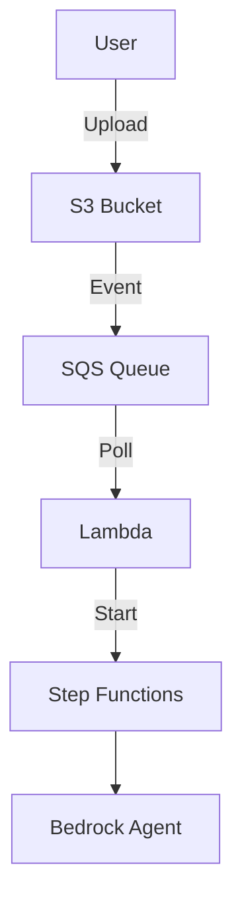

# Example Development Guide

## Overview

Examples are **deployable applications** that demonstrate how to use the library constructs in real-world scenarios. They compose existing constructs together to show specific use cases.

**See `aidlc-decisions-approval.md` for the critical distinction between Examples and Constructs.**

## Example Structure

Every example follows this standard structure:

```
examples/document-processing/my-example/
├── app.ts                          # CDK app entry point
├── my-example-stack.ts             # Stack definition (composes constructs)
├── cdk.json                        # CDK configuration
├── package.json                    # Dependencies
├── tsconfig.json                   # TypeScript config
├── README.md                       # Complete documentation
├── upload-document.sh              # Helper script (if S3-based)
├── sample-files/                   # Test documents
│   ├── legitimate_invoice_1.pdf
│   ├── fraudulent_invoice.pdf
│   └── README.md
└── resources/                      # Agent prompts & tools (if agentic)
    ├── system_prompt.txt
    ├── requirements.txt            # Python dependencies for Lambda Layer
    └── tools/
        ├── tool1.py
        ├── tool2.py
        └── data/
            └── mock_data.json
```

## Step-by-Step Example Development

### Step 1: Create the CDK App Entry Point

The `app.ts` file is minimal - it just instantiates your stack:

```typescript
#!/usr/bin/env node
import 'source-map-support/register';
import * as cdk from 'aws-cdk-lib';
import { MyExampleStack } from './my-example-stack';

const app = new cdk.App();
new MyExampleStack(app, 'MyExampleStack', {
  env: {
    account: process.env.CDK_DEFAULT_ACCOUNT,
    region: process.env.CDK_DEFAULT_REGION,
  },
});
```

**Key Points**:
- Use `#!/usr/bin/env node` shebang for direct execution
- Import `source-map-support` for better error messages
- Use environment variables for account/region (don't hardcode)
- Stack name should match your example name

### Step 2: Create the Stack (Compose Constructs)

The stack file is where you compose library constructs together:

```typescript
import * as cdk from 'aws-cdk-lib';
import { Construct } from 'constructs';
import { 
  AgenticDocumentProcessing,
  BatchAgent 
} from '@cdklabs/cdk-appmod-catalog-blueprints';
import * as path from 'path';

export class MyExampleStack extends cdk.Stack {
  constructor(scope: Construct, id: string, props?: cdk.StackProps) {
    super(scope, id, props);

    // 1. Create the document processing workflow
    const processing = new AgenticDocumentProcessing(this, 'Processing', {
      // Enable observability for production-like setup
      enableObservability: true,
      metricNamespace: 'my-example',
      metricServiceName: 'document-processing',
      
      // Configure the processing agent
      processingAgentParameters: {
        agentName: 'MyProcessingAgent',
        agentDefinition: {
          bedrockModel: {
            useCrossRegionInference: true,
          },
          systemPrompt: cdk.aws_s3_assets.Asset.fromAsset(
            this,
            'SystemPrompt',
            { path: path.join(__dirname, 'resources/system_prompt.txt') }
          ),
          tools: [
            // Add your agent tools here
            cdk.aws_s3_assets.Asset.fromAsset(
              this,
              'Tool1',
              { path: path.join(__dirname, 'resources/tools/tool1.py') }
            ),
          ],
        },
        prompt: 'Process the document and extract key information',
        expectJson: true,
      },
    });

    // 2. Output important values
    new cdk.CfnOutput(this, 'BucketName', {
      value: processing.bucket.bucketName,
      description: 'S3 bucket for document uploads',
    });

    new cdk.CfnOutput(this, 'StateMachineArn', {
      value: processing.stateMachine.stateMachineArn,
      description: 'Step Functions state machine ARN',
    });
  }
}
```

**Key Patterns**:
- **Compose, don't create**: Use existing constructs, don't build from scratch
- **Configure via props**: Pass configuration through construct props
- **Use Assets for files**: System prompts, tools, and data files
- **Add CloudFormation outputs**: Make it easy to find resource ARNs/names
- **Enable observability**: Show best practices for production

### Step 3: Create Configuration Files

**cdk.json** - CDK configuration:
```json
{
  "app": "npx ts-node --prefer-ts-exts app.ts",
  "watch": {
    "include": [
      "**"
    ],
    "exclude": [
      "README.md",
      "cdk*.json",
      "**/*.d.ts",
      "**/*.js",
      "tsconfig.json",
      "package*.json",
      "yarn.lock",
      "node_modules",
      "test"
    ]
  },
  "context": {
    "@aws-cdk/aws-lambda:recognizeLayerVersion": true,
    "@aws-cdk/core:checkSecretUsage": true,
    "@aws-cdk/core:target-partitions": [
      "aws",
      "aws-cn"
    ],
    "@aws-cdk-containers/ecs-service-extensions:enableDefaultLogDriver": true,
    "@aws-cdk/aws-ec2:uniqueImdsv2TemplateName": true,
    "@aws-cdk/aws-ecs:arnFormatIncludesClusterName": true,
    "@aws-cdk/aws-iam:minimizePolicies": true,
    "@aws-cdk/core:validateSnapshotRemovalPolicy": true,
    "@aws-cdk/aws-codepipeline:crossAccountKeyAliasStackSafeResourceName": true,
    "@aws-cdk/aws-s3:createDefaultLoggingPolicy": true,
    "@aws-cdk/aws-sns-subscriptions:restrictSqsDescryption": true,
    "@aws-cdk/aws-apigateway:disableCloudWatchRole": true,
    "@aws-cdk/core:enablePartitionLiterals": true,
    "@aws-cdk/aws-events:eventsTargetQueueSameAccount": true,
    "@aws-cdk/aws-iam:standardizedServicePrincipals": true,
    "@aws-cdk/aws-ecs:disableExplicitDeploymentControllerForCircuitBreaker": true,
    "@aws-cdk/aws-iam:importedRoleStackSafeDefaultPolicyName": true,
    "@aws-cdk/aws-s3:serverAccessLogsUseBucketPolicy": true,
    "@aws-cdk/aws-route53-patters:useCertificate": true,
    "@aws-cdk/customresources:installLatestAwsSdkDefault": false,
    "@aws-cdk/aws-rds:databaseProxyUniqueResourceName": true,
    "@aws-cdk/aws-codedeploy:removeAlarmsFromDeploymentGroup": true,
    "@aws-cdk/aws-apigateway:authorizerChangeDeploymentLogicalId": true,
    "@aws-cdk/aws-ec2:launchTemplateDefaultUserData": true,
    "@aws-cdk/aws-secretsmanager:useAttachedSecretResourcePolicyForSecretTargetAttachments": true,
    "@aws-cdk/aws-redshift:columnId": true,
    "@aws-cdk/aws-stepfunctions-tasks:enableEmrServicePolicyV2": true,
    "@aws-cdk/aws-ec2:restrictDefaultSecurityGroup": true,
    "@aws-cdk/aws-apigateway:requestValidatorUniqueId": true,
    "@aws-cdk/aws-kms:aliasNameRef": true,
    "@aws-cdk/aws-autoscaling:generateLaunchTemplateInsteadOfLaunchConfig": true,
    "@aws-cdk/core:includePrefixInUniqueNameGeneration": true,
    "@aws-cdk/aws-efs:denyAnonymousAccess": true,
    "@aws-cdk/aws-opensearchservice:enableOpensearchMultiAzWithStandby": true,
    "@aws-cdk/aws-lambda-nodejs:useLatestRuntimeVersion": true,
    "@aws-cdk/aws-efs:mountTargetOrderInsensitiveLogicalId": true,
    "@aws-cdk/aws-rds:auroraClusterChangeScopeOfInstanceParameterGroupWithEachParameters": true,
    "@aws-cdk/aws-appsync:useArnForSourceApiAssociationIdentifier": true,
    "@aws-cdk/aws-rds:preventRenderingDeprecatedCredentials": true,
    "@aws-cdk/aws-codepipeline-actions:useNewDefaultBranchForCodeCommitSource": true,
    "@aws-cdk/aws-cloudwatch-actions:changeLambdaPermissionLogicalIdForLambdaAction": true,
    "@aws-cdk/aws-codepipeline:crossAccountKeysDefaultValueToFalse": true,
    "@aws-cdk/aws-codepipeline:defaultPipelineTypeToV2": true,
    "@aws-cdk/aws-kms:reduceCrossAccountRegionPolicyScope": true,
    "@aws-cdk/aws-eks:nodegroupNameAttribute": true,
    "@aws-cdk/aws-ec2:ebsDefaultGp3Volume": true,
    "@aws-cdk/aws-ecs:removeDefaultDeploymentAlarm": true,
    "@aws-cdk/custom-resources:logApiResponseDataPropertyTrueDefault": false,
    "@aws-cdk/aws-s3:keepNotificationInImportedBucket": false
  }
}
```

**package.json** - Dependencies:
```json
{
  "name": "my-example",
  "version": "0.1.0",
  "private": true,
  "scripts": {
    "build": "tsc",
    "watch": "tsc -w",
    "cdk": "cdk",
    "deploy": "cdk deploy --require-approval never"
  },
  "devDependencies": {
    "@types/node": "^20.0.0",
    "aws-cdk": "^2.218.0",
    "ts-node": "^10.9.1",
    "typescript": "~5.7.2"
  },
  "dependencies": {
    "@cdklabs/cdk-appmod-catalog-blueprints": "^0.0.0",
    "aws-cdk-lib": "^2.218.0",
    "constructs": "^10.0.0",
    "source-map-support": "^0.5.21"
  }
}
```

**tsconfig.json** - TypeScript configuration:
```json
{
  "compilerOptions": {
    "target": "ES2022",
    "module": "commonjs",
    "lib": [
      "es2022"
    ],
    "declaration": true,
    "strict": true,
    "noImplicitAny": true,
    "strictNullChecks": true,
    "noImplicitThis": true,
    "alwaysStrict": true,
    "noUnusedLocals": false,
    "noUnusedParameters": false,
    "noImplicitReturns": true,
    "noFallthroughCasesInSwitch": false,
    "inlineSourceMap": true,
    "inlineSources": true,
    "experimentalDecorators": true,
    "strictPropertyInitialization": false,
    "typeRoots": [
      "./node_modules/@types"
    ]
  },
  "exclude": [
    "node_modules",
    "cdk.out"
  ]
}
```

### Step 4: Create Agent Resources (if using AgenticDocumentProcessing)

**System Prompt** (`resources/system_prompt.txt`):
```
You are an AI assistant specialized in analyzing financial documents for fraud detection.

Your task is to:
1. Analyze document metadata for signs of tampering
2. Check for known fraud patterns
3. Detect statistical anomalies
4. Verify vendors against databases
5. Provide a comprehensive fraud assessment

Use the available tools to gather information, then produce a structured JSON response with:
- risk_score (0-100)
- risk_level (LOW/MEDIUM/HIGH/CRITICAL)
- findings (detailed analysis from each tool)
- indicators (list of suspicious or normal indicators)
- recommended_actions (what to do next)

Be thorough but concise. Focus on actionable insights.
```

**Agent Tools** (`resources/tools/my_tool.py`):
```python
from strands import tool
from typing import Dict, Any
import json

@tool
def my_analysis_tool(document_path: str) -> Dict[str, Any]:
    """
    Analyzes a document and returns structured results.
    
    Args:
        document_path: Path to the document to analyze
        
    Returns:
        Dictionary with analysis results
    """
    try:
        # Your tool implementation here
        result = perform_analysis(document_path)
        
        return {
            'success': True,
            'result': result
        }
    except FileNotFoundError as e:
        return {
            'success': False,
            'error': str(e),
            'error_type': 'FileNotFoundError',
            'recoverable': False
        }
    except Exception as e:
        return {
            'success': False,
            'error': str(e),
            'error_type': type(e).__name__,
            'recoverable': True
        }
```

**Python Dependencies** (`resources/requirements.txt`):
```
PyPDF2==3.0.1
Pillow==11.0.0
```

**Note**: These dependencies will be bundled as a Lambda Layer automatically during deployment.

### Step 5: Create Sample Files

Include realistic sample files that demonstrate your use case:

```
sample-files/
├── README.md                       # Explains what each file demonstrates
├── legitimate_invoice_1.pdf        # Normal case
├── legitimate_receipt_1.pdf        # Normal case
├── fraudulent_tampered.pdf         # Edge case 1
├── fraudulent_duplicate.pdf        # Edge case 2
└── fraudulent_outlier.pdf          # Edge case 3
```

**sample-files/README.md**:
```markdown
# Sample Files

This directory contains test documents for the fraud detection example.

## Legitimate Documents

- `legitimate_invoice_1.pdf` - Standard office supplies invoice
- `legitimate_receipt_1.pdf` - Restaurant receipt

## Fraudulent Documents

- `fraudulent_tampered.pdf` - Invoice with modified timestamps
- `fraudulent_duplicate.pdf` - Duplicate invoice number
- `fraudulent_outlier.pdf` - Statistical outliers in amounts
```

### Step 6: Create Helper Scripts

**upload-document.sh** (for S3-triggered examples):
```bash
#!/bin/bash

# Load environment variables
if [ -f .env ]; then
  export $(cat .env | xargs)
fi

# Check required variables
if [ -z "$S3_BUCKET" ]; then
  echo "Error: S3_BUCKET not set"
  echo "Create a .env file with: S3_BUCKET=your-bucket-name"
  exit 1
fi

# Check file argument
if [ -z "$1" ]; then
  echo "Usage: ./upload-document.sh <file-path>"
  exit 1
fi

FILE_PATH=$1
FILE_NAME=$(basename "$FILE_PATH")

# Upload to S3
echo "Uploading $FILE_NAME to s3://$S3_BUCKET/raw/"
aws s3 cp "$FILE_PATH" "s3://$S3_BUCKET/raw/$FILE_NAME" ${AWS_PROFILE:+--profile $AWS_PROFILE}

if [ $? -eq 0 ]; then
  echo "✓ Upload successful"
  echo "Processing will start automatically"
else
  echo "✗ Upload failed"
  exit 1
fi
```

Make it executable:
```bash
chmod +x upload-document.sh
```

### Step 7: Write Comprehensive README

Your README.md should include ALL of these sections:

1. **Overview** - What the example demonstrates
2. **What This Example Does** - Key capabilities
3. **Architecture** - Diagram and flow explanation
4. **Key Features** - Bullet list of highlights
5. **Deployment** - Prerequisites and step-by-step deploy instructions
6. **Usage Example** - How to use the deployed example
7. **Expected Output** - Example outputs showing success
8. **Sample Files** - Description of included test files
9. **Monitoring** - How to view logs, metrics, executions
10. **Troubleshooting** - Common issues and solutions
11. **Configuration Options** - How to customize
12. **Cleanup** - How to delete resources
13. **Additional Resources** - Links to construct docs, AWS docs

**See the fraud-detection README.md for a complete example.**

## Common Example Patterns

### Pattern 1: S3-Triggered Document Processing

```typescript
const processing = new AgenticDocumentProcessing(this, 'Processing', {
  // S3 adapter is default - documents uploaded to raw/ trigger processing
  processingAgentParameters: {
    agentName: 'MyAgent',
    agentDefinition: {
      systemPrompt: Asset.fromAsset(/*...*/),
      tools: [/*...*/],
    },
    prompt: 'Process the document',
  },
});

// Output bucket name for upload script
new CfnOutput(this, 'BucketName', {
  value: processing.bucket.bucketName,
});
```

### Pattern 2: Custom Bedrock Models

```typescript
const processing = new BedrockDocumentProcessing(this, 'Processing', {
  // Use different models for classification vs processing
  classificationBedrockModel: {
    modelId: FoundationModelIdentifier.ANTHROPIC_CLAUDE_3_HAIKU_20240307_V1_0,
    useCrossRegionInference: true,
  },
  processingBedrockModel: {
    modelId: FoundationModelIdentifier.ANTHROPIC_CLAUDE_3_SONNET_20240229_V1_0,
    useCrossRegionInference: true,
  },
  
  // Custom prompts
  classificationPrompt: 'Classify this document...',
  processingPrompt: 'Extract key information...',
});
```

### Pattern 3: Observability Enabled

```typescript
const processing = new AgenticDocumentProcessing(this, 'Processing', {
  // Enable observability for production-like setup
  enableObservability: true,
  metricNamespace: 'my-example',
  metricServiceName: 'document-processing',
  
  // Other configuration...
});
```

### Pattern 4: Custom Enrichment/Post-Processing

```typescript
// Create custom Lambda functions
const enrichmentFunction = new Function(this, 'Enrichment', {
  runtime: Runtime.PYTHON_3_11,
  handler: 'index.handler',
  code: Code.fromAsset('./lambda/enrichment'),
});

const processing = new BedrockDocumentProcessing(this, 'Processing', {
  // Add custom processing steps
  enrichmentLambdaFunction: enrichmentFunction,
  postProcessingLambdaFunction: postProcessingFunction,
});
```

## Testing Examples

Examples don't need unit tests like constructs do, but you should:

1. **Manual Testing**: Deploy and test with sample files
2. **Documentation Testing**: Verify all commands in README work
3. **Cleanup Testing**: Ensure `cdk destroy` works cleanly

**Testing Checklist**:
- [ ] Deploy succeeds without errors
- [ ] Upload script works
- [ ] Sample files process successfully
- [ ] CloudFormation outputs are correct
- [ ] Monitoring commands work
- [ ] Troubleshooting steps are accurate
- [ ] Cleanup removes all resources

## Documentation Requirements

### README Badges

Include badges at the top linking to:
- Source code on GitHub
- Documentation site
- Related constructs

```markdown
[](https://github.com/...)
[](https://...)
[](https://...)
```

### Architecture Diagrams

Use Mermaid for architecture diagrams:



### Code Examples

Show complete, working code examples:

```typescript
// ✓ Good: Complete example
const processing = new AgenticDocumentProcessing(this, 'Processing', {
  enableObservability: true,
  processingAgentParameters: {
    agentName: 'MyAgent',
    agentDefinition: {
      systemPrompt: Asset.fromAsset(/*...*/),
    },
  },
});

// ✗ Bad: Incomplete snippet
const processing = new AgenticDocumentProcessing(/*...*/);
```

### Command Examples

Show complete commands with expected output:

```bash
# Upload document
./upload-document.sh sample-files/invoice.pdf

# Expected output:
# Uploading invoice.pdf to s3://my-bucket/raw/
# ✓ Upload successful
# Processing will start automatically
```

## Common Mistakes to Avoid

### ❌ Don't: Create New Constructs in Examples

```typescript
// BAD: Creating custom construct in example
export class MyCustomProcessor extends Construct {
  // This belongs in use-cases/, not examples/
}
```

```typescript
// GOOD: Use existing constructs
const processing = new AgenticDocumentProcessing(/*...*/);
```

### ❌ Don't: Hardcode Account/Region

```typescript
// BAD: Hardcoded values
new MyStack(app, 'MyStack', {
  env: {
    account: '123456789012',  // ❌
    region: 'us-east-1',      // ❌
  },
});
```

```typescript
// GOOD: Use environment variables
new MyStack(app, 'MyStack', {
  env: {
    account: process.env.CDK_DEFAULT_ACCOUNT,  // ✅
    region: process.env.CDK_DEFAULT_REGION,    // ✅
  },
});
```

### ❌ Don't: Skip CloudFormation Outputs

```typescript
// BAD: No outputs
const processing = new AgenticDocumentProcessing(/*...*/);
// How do users find the bucket name?
```

```typescript
// GOOD: Output important values
new CfnOutput(this, 'BucketName', {
  value: processing.bucket.bucketName,
  description: 'S3 bucket for uploads',
});
```

### ❌ Don't: Forget Sample Files

```
examples/my-example/
├── app.ts
├── my-example-stack.ts
└── README.md
# ❌ No sample files - how do users test?
```

```
examples/my-example/
├── app.ts
├── my-example-stack.ts
├── README.md
└── sample-files/          # ✅ Include test files
    ├── README.md
    └── sample1.pdf
```

### ❌ Don't: Write Incomplete READMEs

```markdown
# My Example

This example shows document processing.

## Deployment
Run `cdk deploy`.

# ❌ Missing: prerequisites, usage, monitoring, troubleshooting, cleanup
```

**Use the fraud-detection README as a template - it's comprehensive.**

## Checklist Before Submitting

- [ ] `app.ts` with proper shebang and env variables
- [ ] Stack file composing existing constructs
- [ ] `cdk.json`, `package.json`, `tsconfig.json` configured
- [ ] Sample files with README explaining each
- [ ] Helper scripts (upload-document.sh) if needed
- [ ] Agent resources (prompts, tools) if agentic
- [ ] Comprehensive README with all required sections
- [ ] Architecture diagram (Mermaid or image)
- [ ] All commands tested and working
- [ ] CloudFormation outputs for important resources
- [ ] Cleanup instructions verified

## Summary: Examples vs Constructs

| Aspect | Examples | Constructs |
|--------|----------|------------|
| **Purpose** | Demonstrate usage | Provide reusability |
| **Location** | `examples/` | `use-cases/` |
| **Complexity** | Simple composition | Complex OOP patterns |
| **Testing** | Manual testing | Unit + CDK Nag tests |
| **Documentation** | Comprehensive README | JSDoc + README + API docs |
| **Publishing** | Not published | Published to npm |
| **Development Time** | Hours to days | Days to weeks |
| **Target Audience** | End users | Library consumers |

**Remember**: If you're building something reusable that other developers will extend, it's a construct. If you're showing how to use constructs in a specific scenario, it's an example.
