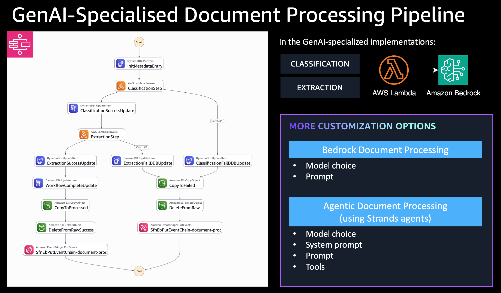

# Agentic Document Processing

[](https://github.com/cdklabs/cdk-appmod-catalog-blueprints/tree/main/examples/document-processing/agentic-document-processing)
[](https://cdklabs.github.io/cdk-appmod-catalog-blueprints/docs/examples/document-processing/agentic-document-processing/)
[](https://cdklabs.github.io/cdk-appmod-catalog-blueprints/docs/use-cases/document-processing/#agenticdocumentprocessing-construct)
[](https://cdklabs.github.io/cdk-appmod-catalog-blueprints/docs/use-cases/framework/agents/)

## Overview

This example demonstrates advanced AI-powered insurance claims processing using the [`AgenticDocumentProcessing`](https://github.com/cdklabs/cdk-appmod-catalog-blueprints/blob/main/use-cases/document-processing/agentic-document-processing.ts) construct with Amazon Bedrock and multi-agent workflow capabilities.

**Use Case**: Complex document analysis, multi-step processing, validation workflows

**Note**: This example uses insurance claims processing as a demonstration, but can be easily adapted for any document type by modifying the agent prompts and tools.

## What This Example Does

The system automatically analyzes travel insurance claims, verifies them against policies, and provides approval decisions using an AI agent with specialized tools:

- **Document Analysis**: Extracts key information from travel claims
- **Policy Verification**: Downloads and analyzes insurance policies
- **Supporting Document Review**: Validates receipts and supporting evidence
- **Cross-Reference Checking**: Ensures claim details match supporting documents
- **Decision Making**: Provides approval/denial with detailed justification

## Architecture



**Flow:**
1. Document uploaded to `raw/` folder triggers S3 event
2. S3 event sent to SQS queue
3. SQS Consumer Lambda processes event and starts Step Functions workflow
4. Step Functions orchestrates document classification and agentic processing
5. Agentic Processing Lambda uses Bedrock Claude 3.5 Sonnet with specialized tools

## Key Features

- **Agentic Processing**: AI agent with tool integration for complex reasoning
- **Dynamic Tool Loading**: S3-based tool storage with runtime loading
- **Multi-Document Analysis**: Cross-references claims with policies and supporting documents
- **Intelligent Decision Making**: Provides structured approval decisions with justification
- **Enhanced Memory**: 1024MB allocation for complex processing tasks

## Deployment

### Prerequisites
- AWS CLI configured
- CDK CLI installed (`npm install -g aws-cdk`)
- Node.js 18+
- Amazon Bedrock model access (Claude 3.5 Sonnet)

### Deploy Steps
```bash
cd examples/document-processing/agentic-document-processing
npm install
AWS_PROFILE=your-profile npx cdk deploy --require-approval never
```

## Usage Example

### Upload Documents
The system expects documents in specific S3 locations:

```bash
# 1. Upload policy document
./upload-document.sh sample-files/GTI-2024-789456.pdf policy

# 2. Upload supporting documents
./upload-document.sh sample-files/hotel_receipt.pdf supporting GTI-2024-789456
./upload-document.sh sample-files/meal_receipts.pdf supporting GTI-2024-789456
./upload-document.sh sample-files/airline_delay_notification.pdf supporting GTI-2024-789456

# 3. Upload claim to trigger processing
./upload-document.sh sample-files/travel_claim.pdf
```

### Expected S3 Structure
```
s3://bucket/
├── raw/                           # Triggers processing
│   └── travel_claim.pdf
├── policies/                      # Agent downloads from here
│   └── GTI-2024-789456.pdf
└── supporting_documents/          # Agent downloads from here
    └── GTI-2024-789456/
        ├── hotel_receipt.pdf
        ├── meal_receipts.pdf
        └── airline_delay_notification.pdf
```

### Expected Results
The agent provides structured JSON output:

```json
{
  "documentId": "travel-claim-1756401373049",
  "classificationResult": {
    "documentClassification": "INSURANCE_CLAIM"
  },
  "processingResult": {
    "result": {
      "claim_approved": false,
      "justification": "While most of the claim is valid and within policy limits, there is missing documentation for the ground transportation expenses ($25.00). The flight delay of 18 hours is covered under the policy and the hotel and meal expenses are properly documented."
    }
  }
}
```

## Agent Capabilities

The insurance claims specialist agent uses specialized tools to:
- Download insurance policies from S3
- Retrieve supporting documents  
- Perform cross-document verification
- Generate structured claim decisions with detailed reasoning

## Sample Files

The `sample-files/` directory contains a complete test dataset:
- `travel_claim.pdf` - Flight delay compensation claim
- `GTI-2024-789456.pdf` - Travel insurance policy
- `hotel_receipt.pdf` - Hotel accommodation receipt
- `meal_receipts.pdf` - Food expense receipts
- `airline_delay_notification.pdf` - Official delay notification

## Configuration Options

```typescript
new AgenticDocumentProcessing(this, 'AgenticProcessing', {
  processingAgentParameters: {
    toolsBucket: myToolsBucket,
    toolsLocation: ['s3://my-tools-bucket/validation-tools/'],
    agentSystemPrompt: 'You are a financial document processing agent...',
    lambdaLayers: [myCustomDependenciesLayer]
  },
  useCrossRegionInference: true,
  enableObservability: true
});
```

## Monitoring

### Step Functions Execution Monitoring

```bash
# List recent executions
aws stepfunctions list-executions --state-machine-arn <state-machine-arn>

# Get execution output
aws stepfunctions describe-execution --execution-arn <execution-arn>
```

### AgentCore Observability

This example has observability enabled (`enableObservability: true`), which provides comprehensive metrics for both Lambda Powertools and Amazon Bedrock AgentCore.

**What Gets Monitored:**
- **Lambda Powertools**: Function-level metrics (invocations, errors, duration)
- **AgentCore Observability**: Agent-level metrics (token usage, tool calls, latency, reasoning steps)
- **CloudWatch Transaction Search**: Cost-effective X-Ray trace collection and searchability

#### CloudWatch Transaction Search

This example enables CloudWatch Transaction Search, which provides:
- **Cost-effective trace collection**: Uses CloudWatch Logs pricing instead of X-Ray pricing
- **Full span visibility**: All X-Ray spans are collected and searchable
- **Automatic indexing**: 1% of spans indexed for trace summaries (configurable)

Transaction Search is configured automatically when the stack is deployed. No additional configuration is needed in your agent code - traces flow automatically to CloudWatch Logs when `enableObservability: true`.

**Viewing Traces in CloudWatch:**

1. **Navigate to CloudWatch → X-Ray traces → Transaction Search**
   - Or use CloudWatch Logs Insights with the X-Ray log group

2. **Query Traces by Service**
   ```
   fields @timestamp, traceId, segmentId, name, duration
   | filter service.name = "insurance-claims"
   | sort @timestamp desc
   | limit 20
   ```

3. **Query Agent-Specific Traces**
   ```
   fields @timestamp, traceId, name, duration, http.status_code
   | filter name like /AgenticProcessing/
   | stats count() by bin(5m)
   ```

4. **Find Slow Traces**
   ```
   fields @timestamp, traceId, name, duration
   | filter duration > 5000
   | sort duration desc
   | limit 10
   ```

**Viewing AgentCore Metrics in CloudWatch:**

1. **Navigate to CloudWatch Logs Insights**
   ```bash
   # Open CloudWatch Logs Insights in AWS Console
   # Select log group: /aws/lambda/AgenticDocumentProcessingStack-*-AgenticProcessing*
   ```

2. **Query Agent Invocations**
   ```
   fields @timestamp, agentId, agentName, agentVersion, invocationId
   | filter @type = "AgentInvocation"
   | sort @timestamp desc
   | limit 20
   ```

3. **Query Token Usage**
   ```
   fields @timestamp, agentId, inputTokens, outputTokens, (inputTokens + outputTokens) as totalTokens
   | filter @type = "AgentInvocation"
   | stats sum(inputTokens) as totalInput, sum(outputTokens) as totalOutput, sum(totalTokens) as total by bin(5m)
   ```

4. **Query Tool Invocations**
   ```
   fields @timestamp, toolName, toolInput, toolOutput
   | filter @type = "ToolInvocation"
   | sort @timestamp desc
   | limit 20
   ```

5. **Query Agent Latency**
   ```
   fields @timestamp, agentId, duration
   | filter @type = "AgentInvocation"
   | stats avg(duration) as avgLatency, max(duration) as maxLatency, min(duration) as minLatency by bin(5m)
   ```

6. **Query Reasoning Steps**
   ```
   fields @timestamp, agentId, reasoningStep, reasoningText
   | filter @type = "ReasoningStep"
   | sort @timestamp desc
   | limit 50
   ```

**Expected Metrics:**
- **Invocations**: Number of agent invocations per time period
- **Token Usage**: Input/output tokens consumed by the agent
- **Tool Calls**: Frequency and types of tools used (download_policy, download_supporting_documents, pdf_extractor)
- **Latency**: Agent processing time from invocation to completion
- **Reasoning Steps**: Detailed agent thought process and decision-making

**X-Ray Tracing:**

AgentCore observability also enables X-Ray tracing for distributed tracing:

```bash
# View traces in X-Ray console
# Filter by service name: insurance-claims
# Look for traces with agent invocations and tool calls
```

**CloudWatch Metrics Dashboard:**

Create a custom dashboard to visualize agent performance:
1. Go to CloudWatch → Dashboards → Create dashboard
2. Add widgets for:
   - Agent invocations (count)
   - Token usage (sum)
   - Tool invocations by type (count)
   - Agent latency (average, p50, p99)
3. Set time range and auto-refresh

**Troubleshooting with Observability:**
- **High token usage**: Check reasoning steps to see if agent is over-analyzing
- **Slow processing**: Look at tool invocation latency and agent reasoning time
- **Tool failures**: Query tool invocations with error status
- **Missing metrics**: Verify `enableObservability: true` is set and ADOT layer is attached

## Troubleshooting

**Common Issues:**
1. **Agent returns null result**: Missing policy or supporting documents - ensure all referenced documents are uploaded to correct S3 locations
2. **Step Functions not triggered**: Upload to wrong S3 prefix - upload claims to `raw/` folder only
3. **Tool loading errors**: Check tools bucket permissions and S3 paths

## Cleanup

```bash
npx cdk destroy
```

**Note**: This will delete all resources including the S3 bucket and any uploaded documents.