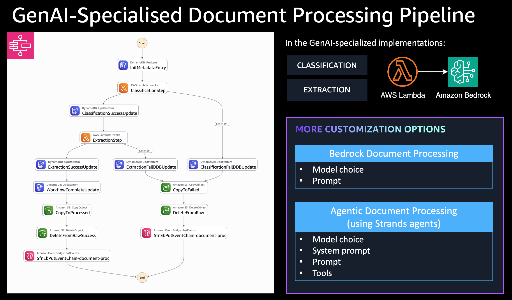

# Bedrock Document Processing

[](https://github.com/cdklabs/cdk-appmod-catalog-blueprints/tree/main/examples/document-processing/bedrock-document-processing)
[](https://cdklabs.github.io/cdk-appmod-catalog-blueprints/docs/use-cases/document-processing/#bedrockdocumentprocessing-construct)
[](https://cdklabs.github.io/cdk-appmod-catalog-blueprints/docs/use-cases/document-processing/#bedrockdocumentprocessing-construct)

## Overview

This example demonstrates AI-powered document processing using the [`BedrockDocumentProcessing`](https://github.com/cdklabs/cdk-appmod-catalog-blueprints/blob/main/use-cases/document-processing/bedrock-document-processing.ts) construct with Amazon Bedrock foundation models for intelligent document classification and data extraction.

**Use Case**: Invoice processing, document digitization, content extraction

## What This Example Does

- **Document Classification**: Automatically identifies document types (invoices, receipts, identity documents, etc.)
- **Information Extraction**: Extracts key entities and data from documents using AI
- **Workflow Orchestration**: Uses Step Functions to manage the processing pipeline
- **Metadata Storage**: Tracks processing status and results in DynamoDB

## Architecture



## Key Features

- **AI-Powered Processing**: Uses Claude 3.7 Sonnet for classification and extraction
- **Automatic Triggering**: S3 uploads automatically start processing
- **Structured Results**: JSON output with extracted entities and metadata
- **Error Handling**: Failed documents moved to `failed/` prefix with error details
- **Observability**: CloudWatch logs and Step Functions monitoring

## Deployment

### Prerequisites
- AWS CLI configured with appropriate permissions
- CDK CLI installed: `npm install -g aws-cdk`
- Node.js 18+
- Amazon Bedrock model access (Claude 3.7 Sonnet)

### Deploy Steps
```bash
# Install dependencies
npm install

# Build the project
npm run build

# Deploy the stack
npx cdk deploy --require-approval never
```

## Usage Example

### 1. Upload Documents
Upload documents to the S3 bucket's `raw/` prefix:

```bash
# Get bucket name from CDK output
aws s3 cp sample-invoice.pdf s3://YOUR-BUCKET-NAME/raw/
```

### 2. Monitor Processing
- **Step Functions Console**: View workflow execution progress
- **CloudWatch Logs**: Check Lambda function logs for detailed processing
- **DynamoDB**: Query metadata table for processing results

### 3. Processing Results
The workflow produces structured JSON output:

```json
{
  "documentId": "sample-invoice-1756401373049",
  "classificationResult": {
    "documentClassification": "INVOICE"
  },
  "processingResult": {
    "result": {
      "entities": [
        {
          "type": "INVOICE_NUMBER",
          "value": "INV-2024-001"
        },
        {
          "type": "TOTAL_AMOUNT",
          "value": "$1,250.00"
        },
        {
          "type": "DUE_DATE",
          "value": "2024-02-15"
        }
      ]
    }
  }
}
```

## Supported Document Types

- **Invoices**: Invoice number, amounts, dates, vendor information
- **Receipts**: Purchase details, merchant info, totals
- **Identity Documents**: Names, addresses, ID numbers
- **Forms**: Field extraction based on document structure

## Configuration Options

```typescript
new BedrockDocumentProcessing(this, 'DocProcessing', {
  // Custom models
  classificationModelId: FoundationModelIdentifier.ANTHROPIC_CLAUDE_3_HAIKU_20240307_V1_0,
  processingModelId: FoundationModelIdentifier.ANTHROPIC_CLAUDE_3_SONNET_20240229_V1_0,
  
  // Custom prompts
  classificationPrompt: "Your custom classification prompt...",
  processingPrompt: "Your custom extraction prompt...",
  
  // Enable observability
  enableObservability: true
});
```

## Troubleshooting

**Common Issues:**
1. **No processing triggered**: Ensure documents are uploaded to `raw/` prefix
2. **Bedrock access denied**: Verify model access in Bedrock console
3. **Processing timeout**: Check document size and complexity

**Monitoring:**
- Step Functions execution history
- CloudWatch metrics for Lambda functions
- DynamoDB items for processing status

## Cleanup

```bash
npx cdk destroy
```

**Note**: This will delete all resources including the S3 bucket and any uploaded documents.
