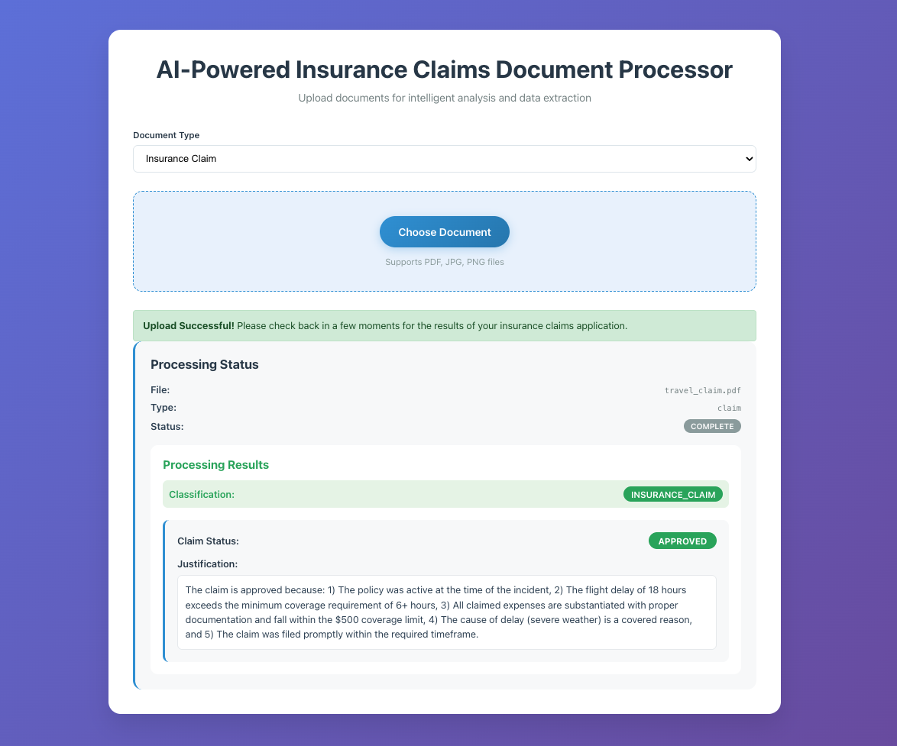
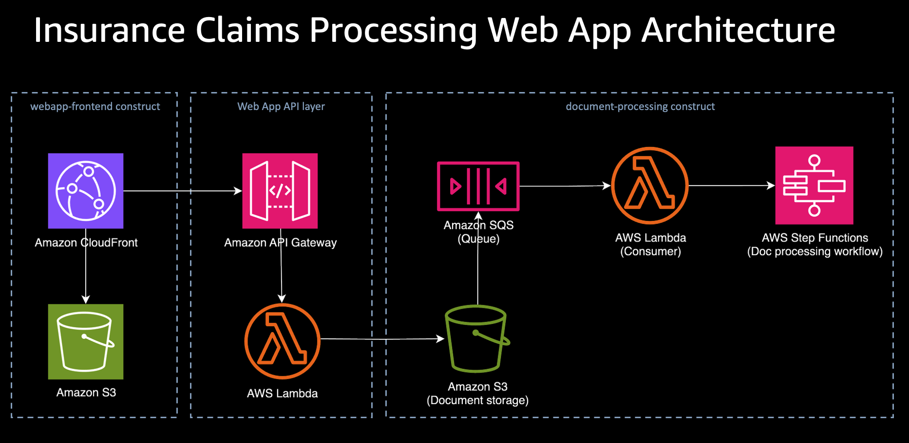

# Full-Stack Insurance Claims Processing Web Application

[](https://github.com/cdklabs/cdk-appmod-catalog-blueprints/tree/main/use-cases/webapp)
[](https://cdklabs.github.io/cdk-appmod-catalog-blueprints/docs/examples/document-processing/doc-processing-fullstack-webapp/)
[](https://cdklabs.github.io/cdk-appmod-catalog-blueprints/docs/use-cases/document-processing/#agenticdocumentprocessing-construct)
[](https://cdklabs.github.io/cdk-appmod-catalog-blueprints/docs/use-cases/webapp/)

## Overview

This example demonstrates a complete full-stack web application that provides a user-friendly interface for the [`AgenticDocumentProcessing`](https://github.com/cdklabs/cdk-appmod-catalog-blueprints/blob/main/use-cases/document-processing/agentic-document-processing.ts) workflow with React frontend, API Gateway backend, and real-time status polling.

**Use Case**: End-to-end document processing with web interface, secure uploads, real-time monitoring

**Prerequisites**: Deploy the [Agentic Document Processing](../agentic-document-processing/) example first, as this webapp integrates with its resources.



**Note**: This example uses insurance claims processing as a demonstration, but can be easily adapted for any document type by modifying the underlying agentic workflow configuration.

## What This Example Does

- **Web Interface**: React TypeScript application for document upload and monitoring
- **Secure Upload**: Direct S3 uploads using presigned URLs (no file data through API)
- **Agentic Integration**: Leverages existing agentic document processing workflow
- **Real-time Monitoring**: Live status updates with 10-second polling intervals
- **Results Display**: Structured AI analysis results in the web interface

## Architecture



**Integration Flow:**
1. Frontend requests presigned URL from API Gateway
2. Browser uploads file directly to agentic processing S3 bucket
3. Upload triggers existing agentic document processing workflow
4. Frontend polls API for real-time status updates from agentic DynamoDB table

## Key Features

- **Secure File Upload**: Presigned URLs for direct S3 uploads without API Gateway bottlenecks
- **Real-time Monitoring**: Live status updates with 10-second polling intervals
- **Agentic Processing**: Advanced AI workflow with multi-step document analysis
- **Responsive UI**: Modern React TypeScript interface with CloudFront CDN
- **Status Persistence**: DynamoDB tracking for processing history and results

## Deployment

### Prerequisites
- AWS CLI configured with appropriate permissions
- CDK CLI installed: `npm install -g aws-cdk`
- Node.js 18+
- Amazon Bedrock model access (Claude 3.5 Sonnet)

### Deploy Steps
```bash
# Install dependencies
npm install

# Build and deploy all stacks
npx cdk deploy --all --require-approval never

# Deploy individual stacks (optional)
npx cdk deploy InsuranceClaimsApiStack
npx cdk deploy InsuranceClaimsFrontendStack
```

## Usage Example

### 1. Access Web Application
After deployment, navigate to the CloudFront distribution URL provided in the CDK output.

### 2. Upload Documents
1. Select document file using the file picker
2. Choose document type from dropdown
3. Click "Upload Document" to start processing
4. Monitor real-time processing status

### 3. View Results
The application displays:
- Upload progress and confirmation
- Processing status updates (every 10 seconds)
- Final AI analysis results in structured format
- Processing history for uploaded documents

### Expected Results
The system provides structured JSON output displayed in the web interface:

```json
{
  "documentId": "travel-claim-1756614134842",
  "classificationResult": {
    "documentClassification": "INSURANCE_CLAIM"
  },
  "processingResult": {
    "result": {
      "claim_approved": true,
      "justification": "All required documentation provided and expenses within policy limits."
    }
  }
}
```

## Project Structure

```
doc-processing-fullstack-webapp/
├── frontend-app/                    # React TypeScript application
│   ├── src/
│   │   ├── App.tsx                 # Main application component
│   │   └── index.tsx               # Application entry point
│   ├── public/                     # Static assets
│   └── package.json                # Frontend dependencies
├── api/                            # Lambda function code
│   ├── index.ts                    # API Lambda handler
│   └── package.json                # API dependencies
├── api-stack.ts                    # API Gateway + Lambda stack
├── frontend-stack.ts               # CloudFront + S3 stack
├── app.ts                          # CDK application entry point
└── README.md
```

## Configuration Options

```typescript
// API Stack Configuration
new InsuranceClaimsApiStack(app, 'InsuranceClaimsApiStack', {
  agenticBucket: 'your-processing-bucket',
  tableName: 'your-dynamodb-table'
});

// Frontend Stack Configuration
new InsuranceClaimsFrontendStack(app, 'InsuranceClaimsFrontendStack', {
  apiBaseUrl: 'https://your-api-gateway-url'
});
```

## Technical Details

**DocumentId Format:**
- API generates: `filename-timestamp` (e.g., `travel-claim-1756614134842`)
- Workflow creates: `filename-timestamp-executionTimestamp` for uniqueness

**Status Polling:**
- 10-second intervals for up to 30 attempts (5 minutes total)
- Exponential backoff for failed requests
- Real-time UI updates during processing

**CORS Configuration:**
- API Gateway configured for browser requests
- S3 bucket CORS enabled for direct uploads

## Troubleshooting

**Common Issues:**
1. **Upload fails**: Check S3 bucket CORS configuration and presigned URL expiration
2. **No processing triggered**: Verify S3 event configuration and Step Functions permissions
3. **Status polling timeout**: Check DynamoDB table permissions and document processing time
4. **Frontend not loading**: Verify CloudFront distribution and S3 static hosting configuration

**Monitoring:**
- CloudFront access logs for frontend requests
- API Gateway logs for backend API calls
- Step Functions execution history for processing workflows
- DynamoDB items for document status tracking

## Local Development

For frontend development and testing:

```bash
# Navigate to frontend directory
cd frontend-app

# Install frontend dependencies
npm install

# Run development server
npm start
# Opens http://localhost:3000

# Build for production
npm run build
```

## Cleanup

```bash
npx cdk destroy --all
```

**Note**: This will delete all resources including S3 buckets, CloudFront distribution, and any uploaded documents.