# Fraud Detection Example

[](https://github.com/cdklabs/cdk-appmod-catalog-blueprints/tree/main/examples/document-processing/fraud-detection)
[](https://cdklabs.github.io/cdk-appmod-catalog-blueprints/docs/examples/document-processing/fraud-detection/)
[](https://cdklabs.github.io/cdk-appmod-catalog-blueprints/docs/use-cases/document-processing/#agenticdocumentprocessing-construct)
[](https://cdklabs.github.io/cdk-appmod-catalog-blueprints/docs/use-cases/framework/agents/)

## Overview

This example demonstrates advanced AI-powered fraud detection for financial documents using the [`AgenticDocumentProcessing`](https://github.com/cdklabs/cdk-appmod-catalog-blueprints/blob/main/use-cases/document-processing/agentic-document-processing.ts) construct with Amazon Bedrock and specialized fraud detection tools.

**Use Case**: Financial document fraud analysis, invoice verification, receipt validation, bank statement review

**Note**: This example uses financial document fraud detection as a demonstration, but can be easily adapted for other fraud detection scenarios by modifying the agent prompts and tools.

## What This Example Does

The system automatically analyzes financial documents (invoices, receipts, bank statements) to detect fraudulent activity using an AI agent with specialized fraud detection tools:

- **Metadata Analysis**: Examines document metadata (EXIF data, timestamps, software signatures) for tampering indicators
- **Pattern Matching**: Identifies known fraud patterns such as duplicate invoice numbers, rounded amounts, and suspicious formatting
- **Anomaly Detection**: Detects statistical outliers, unusual dates, and values that deviate from historical baselines
- **Database Verification**: Checks vendors against blacklists and verifies legitimacy through business registries
- **Risk Scoring**: Provides comprehensive fraud assessment with risk scores (0-100) and actionable recommendations

## Architecture

```mermaid
graph TB
    User[User] -->|Upload Document| S3[S3 Bucket<br/>raw/ prefix<br/>KMS Encrypted]
    S3 -->|S3 Event| SQS[SQS Queue]
    SQS -->|Poll| Consumer[SQS Consumer<br/>Lambda]
    Consumer -->|Start Execution| SF[Step Functions<br/>Workflow]
    
    SF --> Classifier[Classification Lambda<br/>Bedrock Claude 3.5 Sonnet]
    Classifier -->|Document Type| Agent[Fraud Detection Agent<br/>Bedrock Claude 3.5 Sonnet]
    
    Agent --> Tool1[metadata_analyzer.py<br/>EXIF, timestamps, signatures]
    Agent --> Tool2[pattern_matcher.py<br/>Duplicates, amounts, formatting]
    Agent --> Tool3[anomaly_detector.py<br/>Statistical analysis, outliers]
    Agent --> Tool4[database_lookup.py<br/>Blacklist, vendor verification]
    
    Tool1 --> Output[Fraud Assessment JSON]
    Tool2 --> Output
    Tool3 --> Output
    Tool4 --> Output
    
    Output --> Result[Risk Score: 0-100<br/>Risk Level: LOW/MEDIUM/HIGH/CRITICAL<br/>Findings & Recommendations]
    
    CW[CloudWatch<br/>Metrics & Logs<br/>Data Protection] -.->|Monitor| SF
    CW -.->|Monitor| Agent
    
    style S3 fill:#FF9900
    style SQS fill:#FF9900
    style Consumer fill:#FF9900
    style SF fill:#FF9900
    style Classifier fill:#FF9900
    style Agent fill:#FF9900
    style CW fill:#FF9900
    style Tool1 fill:#3F8624
    style Tool2 fill:#3F8624
    style Tool3 fill:#3F8624
    style Tool4 fill:#3F8624
    style Output fill:#232F3E
    style Result fill:#232F3E
```



**Flow:**
1. Financial document uploaded to S3 `raw/` folder triggers S3 event
2. S3 event sent to SQS queue for reliable processing
3. SQS Consumer Lambda processes event and starts Step Functions workflow
4. Step Functions orchestrates document classification and fraud detection processing
5. Classification Lambda uses Bedrock Claude 3.5 Sonnet to identify document type
6. Fraud Detection Agent Lambda uses Bedrock Claude 3.5 Sonnet with specialized tools:
   - **metadata_analyzer**: Extracts and analyzes document metadata
   - **pattern_matcher**: Checks against known fraud patterns
   - **anomaly_detector**: Performs statistical analysis
   - **database_lookup**: Verifies vendors and checks blacklists
7. Agent produces structured JSON fraud assessment with risk score and recommendations

## Key Features

- **Multi-Stage Fraud Analysis**: Comprehensive fraud detection through authenticity verification, anomaly detection, pattern matching, and cross-reference validation
- **Specialized Fraud Detection Tools**: Four Python-based tools for different aspects of fraud analysis
- **Python Dependencies via Lambda Layer**: PyPDF2 and Pillow libraries bundled as a Lambda Layer for PDF and image metadata analysis
- **Intelligent Risk Scoring**: Automated risk score calculation (0-100) with risk level classification (LOW/MEDIUM/HIGH/CRITICAL)
- **Cross-Region Inference**: High availability through Amazon Bedrock cross-region inference
- **Enhanced Observability**: CloudWatch metrics and logs with data protection for sensitive information
- **Structured JSON Output**: Machine-readable fraud assessments for downstream processing


## Deployment

### Prerequisites

Before deploying this example, ensure you have:

- **AWS CLI**: Configured with appropriate credentials
  ```bash
  aws configure
  ```
- **CDK CLI**: AWS Cloud Development Kit CLI installed
  ```bash
  npm install -g aws-cdk
  ```
- **Node.js**: Version 18 or higher
  ```bash
  node --version
  ```
- **Amazon Bedrock Access**: Model access enabled for Claude 3.5 Sonnet in your AWS account
  - Navigate to Amazon Bedrock console
  - Go to "Model access" in the left navigation
  - Request access to "Anthropic Claude 3.5 Sonnet" model
  - Wait for access to be granted (usually immediate)

### Deploy Steps

1. **Navigate to the example directory**
   ```bash
   cd examples/document-processing/fraud-detection
   ```

2. **Install dependencies**
   ```bash
   npm install
   ```

3. **Bootstrap CDK (if not already done)**
   ```bash
   npx cdk bootstrap
   ```

4. **Deploy the stack**
   ```bash
   npx cdk deploy --require-approval never
   ```
   
   Or with a specific AWS profile:
   ```bash
   AWS_PROFILE=your-profile npx cdk deploy --require-approval never
   ```

5. **Note the stack outputs**
   
   After deployment, CDK will output important values. Save these for later use:
   - S3 Bucket Name
   - Step Functions State Machine ARN

6. **Configure the upload script**
   
   Create a `.env` file in the example directory:
   ```bash
   cat > .env << EOF
   AWS_PROFILE=your-aws-profile
   S3_BUCKET=your-bucket-name-from-stack-outputs
   EOF
   ```

## Usage Example

### Upload Documents for Fraud Detection

The fraud detection pipeline is triggered when documents are uploaded to the S3 bucket's `raw/` prefix.

**Using the upload script:**

```bash
# Make the script executable (first time only)
chmod +x upload-document.sh

# Upload a legitimate invoice
./upload-document.sh sample-files/legitimate_invoice_1.pdf

# Upload a fraudulent document with tampered metadata
./upload-document.sh sample-files/fraudulent_tampered_invoice.pdf

# Upload a fraudulent document with duplicate invoice numbers
./upload-document.sh sample-files/fraudulent_duplicate_invoice.pdf

# Upload a fraudulent document with statistical outliers
./upload-document.sh sample-files/fraudulent_outlier_receipt.pdf
```

**Manual upload using AWS CLI:**

```bash
# Get bucket name from stack outputs
BUCKET_NAME=$(aws cloudformation describe-stacks \
  --stack-name FraudDetectionStack \
  --query 'Stacks[0].Outputs[?OutputKey==`BucketName`].OutputValue' \
  --output text)

# Upload document to trigger processing
aws s3 cp sample-files/legitimate_invoice_1.pdf s3://${BUCKET_NAME}/raw/
```

### Expected Output

The fraud detection agent produces structured JSON output with comprehensive fraud assessment:

**Example: Legitimate Document (Low Risk)**
```json
{
  "risk_score": 15,
  "risk_level": "LOW",
  "findings": {
    "metadata_analysis": {
      "exif_data": {},
      "creation_timestamp": "2024-01-15T10:30:00Z",
      "modification_timestamp": "2024-01-15T10:30:00Z",
      "software_signature": "Adobe Acrobat Pro DC",
      "suspicious_indicators": []
    },
    "pattern_matches": {
      "patterns_detected": [],
      "formatting_issues": []
    },
    "anomalies": {
      "anomalies": [],
      "statistical_analysis": {
        "z_score": 0.5,
        "percentile": 55.2
      }
    },
    "database_checks": {
      "blacklist_status": {
        "is_blacklisted": false,
        "reason": null
      },
      "verification_status": {
        "is_verified": true,
        "business_registered": true,
        "registration_details": {
          "business_name": "Acme Office Supplies Inc.",
          "tax_id": "12-3456789",
          "registration_date": "2010-03-15"
        }
      },
      "risk_indicators": []
    }
  },
  "indicators": [
    "Document metadata is consistent",
    "No known fraud patterns detected",
    "Vendor is verified and registered",
    "Transaction amounts within normal range"
  ],
  "recommended_actions": [
    "Approve for payment processing",
    "Standard verification procedures apply"
  ]
}
```

**Example: Fraudulent Document (High Risk)**
```json
{
  "risk_score": 85,
  "risk_level": "HIGH",
  "findings": {
    "metadata_analysis": {
      "exif_data": {},
      "creation_timestamp": "2024-01-20T14:22:00Z",
      "modification_timestamp": "2024-01-25T09:15:00Z",
      "software_signature": "Unknown PDF Editor",
      "suspicious_indicators": [
        {
          "type": "timestamp_mismatch",
          "description": "Document modified 5 days after creation, suggesting potential tampering",
          "severity": "high"
        },
        {
          "type": "suspicious_software",
          "description": "Document created with unknown or uncommon PDF software",
          "severity": "medium"
        }
      ]
    },
    "pattern_matches": {
      "patterns_detected": [
        {
          "pattern_type": "duplicate_invoice",
          "description": "Invoice number INV-2024-001 appears in multiple documents from different vendors",
          "confidence": 0.92,
          "details": {
            "invoice_number": "INV-2024-001",
            "occurrences": 3
          }
        },
        {
          "pattern_type": "rounded_amounts",
          "description": "All line items are rounded to whole dollar amounts",
          "confidence": 0.78,
          "details": {
            "rounded_count": 5,
            "total_items": 5
          }
        }
      ],
      "formatting_issues": [
        {
          "issue_type": "inconsistent_fonts",
          "description": "Multiple font types detected, suggesting document manipulation",
          "severity": "medium"
        }
      ]
    },
    "anomalies": {
      "anomalies": [
        {
          "type": "amount_outlier",
          "value": 15000.00,
          "expected_range": "500-2000",
          "severity_score": 8,
          "description": "Transaction amount significantly exceeds historical average for this vendor"
        }
      ],
      "statistical_analysis": {
        "z_score": 4.2,
        "percentile": 99.8
      }
    },
    "database_checks": {
      "blacklist_status": {
        "is_blacklisted": false,
        "reason": null
      },
      "verification_status": {
        "is_verified": false,
        "business_registered": false,
        "registration_details": null
      },
      "risk_indicators": [
        "Vendor not found in verified business registry",
        "No tax ID on file"
      ]
    }
  },
  "indicators": [
    "Document metadata shows signs of tampering",
    "Duplicate invoice number detected across vendors",
    "Suspicious rounded amounts pattern",
    "Transaction amount is statistical outlier",
    "Vendor cannot be verified in business registry",
    "Inconsistent document formatting"
  ],
  "recommended_actions": [
    "REJECT - Do not process payment",
    "Flag for manual fraud investigation",
    "Contact vendor through verified channels to confirm legitimacy",
    "Review all recent transactions from this vendor",
    "Report to fraud prevention team"
  ]
}
```

## Sample Files

The `sample-files/` directory contains a complete test dataset demonstrating various fraud scenarios:

**Legitimate Documents:**
- `legitimate_invoice_1.pdf` - Standard office supplies invoice with proper metadata
- `legitimate_receipt_1.pdf` - Restaurant receipt with realistic amounts
- `legitimate_bank_statement_1.pdf` - Monthly bank statement with transaction history

**Fraudulent Documents:**
- `fraudulent_tampered_invoice.pdf` - Invoice with modified timestamps (metadata fraud)
- `fraudulent_duplicate_invoice.pdf` - Invoice with duplicate number from different vendor (pattern fraud)
- `fraudulent_outlier_receipt.pdf` - Receipt with statistical outliers and unusual amounts (anomaly fraud)

Each fraudulent document demonstrates different fraud detection capabilities of the system.


## Monitoring

### View Step Functions Executions

Monitor fraud detection processing through AWS Step Functions:

```bash
# Get the State Machine ARN from stack outputs
STATE_MACHINE_ARN=$(aws cloudformation describe-stacks \
  --stack-name FraudDetectionStack \
  --query 'Stacks[0].Outputs[?OutputKey==`StateMachineArn`].OutputValue' \
  --output text)

# List recent executions
aws stepfunctions list-executions \
  --state-machine-arn $STATE_MACHINE_ARN \
  --max-results 10

# Get details of a specific execution
aws stepfunctions describe-execution \
  --execution-arn <execution-arn-from-list>

# Get execution output (includes fraud assessment)
aws stepfunctions describe-execution \
  --execution-arn <execution-arn> \
  --query 'output' \
  --output text | jq .
```

### View CloudWatch Logs

Access detailed logs for debugging and analysis:

```bash
# List log groups for the fraud detection system
aws logs describe-log-groups \
  --log-group-name-prefix "/aws/lambda/FraudDetectionStack"

# Tail logs for the fraud detection agent
aws logs tail /aws/lambda/FraudDetectionStack-FraudDetectionAgent \
  --follow

# Query logs for high-risk assessments
aws logs filter-log-events \
  --log-group-name /aws/lambda/FraudDetectionStack-FraudDetectionAgent \
  --filter-pattern '"risk_level": "HIGH"' \
  --max-items 20
```

### View CloudWatch Metrics

Monitor system performance and fraud detection metrics:

```bash
# View fraud detection metrics
aws cloudwatch get-metric-statistics \
  --namespace fraud-detection \
  --metric-name ProcessingDuration \
  --dimensions Name=ServiceName,Value=financial-documents \
  --start-time $(date -u -d '1 hour ago' +%Y-%m-%dT%H:%M:%S) \
  --end-time $(date -u +%Y-%m-%dT%H:%M:%S) \
  --period 300 \
  --statistics Average,Maximum
```

### View S3 Bucket Contents

Check uploaded documents and processing status:

```bash
# List documents in raw/ prefix (triggers processing)
aws s3 ls s3://${BUCKET_NAME}/raw/

# List all documents in bucket
aws s3 ls s3://${BUCKET_NAME}/ --recursive
```

## Troubleshooting

### Common Issues and Solutions

#### 1. Step Functions Execution Not Triggered

**Symptom**: Document uploaded but no Step Functions execution starts

**Possible Causes:**
- Document uploaded to wrong S3 prefix
- S3 event notification not configured
- SQS queue permissions issue

**Solutions:**
```bash
# Verify document is in raw/ prefix
aws s3 ls s3://${BUCKET_NAME}/raw/

# Check S3 event notifications are configured
aws s3api get-bucket-notification-configuration \
  --bucket ${BUCKET_NAME}

# Verify SQS queue has messages
QUEUE_URL=$(aws cloudformation describe-stacks \
  --stack-name FraudDetectionStack \
  --query 'Stacks[0].Outputs[?OutputKey==`QueueUrl`].OutputValue' \
  --output text)

aws sqs get-queue-attributes \
  --queue-url $QUEUE_URL \
  --attribute-names ApproximateNumberOfMessages
```

#### 2. Agent Returns Null or Empty Result

**Symptom**: Fraud assessment is null or missing expected fields

**Possible Causes:**
- Bedrock model access not enabled
- Tool execution errors
- Document format not supported
- Insufficient Lambda memory or timeout

**Solutions:**
```bash
# Check Bedrock model access
aws bedrock list-foundation-models \
  --by-provider anthropic \
  --query 'modelSummaries[?modelId==`anthropic.claude-3-5-sonnet-20240620-v1:0`]'

# Check Lambda logs for errors
aws logs tail /aws/lambda/FraudDetectionStack-FraudDetectionAgent \
  --since 1h \
  --filter-pattern "ERROR"

# Verify document format is supported (PDF, PNG, JPG)
file sample-files/your-document.pdf
```

#### 3. Tool Loading Errors

**Symptom**: Agent cannot load fraud detection tools

**Possible Causes:**
- Tool files not properly packaged as Assets
- Python dependencies missing
- Lambda execution role lacks S3 permissions

**Solutions:**
```bash
# Check Lambda environment variables for tool locations
aws lambda get-function-configuration \
  --function-name FraudDetectionStack-FraudDetectionAgent \
  --query 'Environment.Variables'

# Verify Lambda has S3 read permissions
aws lambda get-function \
  --function-name FraudDetectionStack-FraudDetectionAgent \
  --query 'Configuration.Role'

# Check CloudWatch logs for specific tool errors
aws logs filter-log-events \
  --log-group-name /aws/lambda/FraudDetectionStack-FraudDetectionAgent \
  --filter-pattern "tool" \
  --max-items 50
```

#### 4. High Risk Score for Legitimate Documents

**Symptom**: Legitimate documents flagged as high risk

**Possible Causes:**
- Vendor not in verified database
- Document metadata missing or unusual
- Transaction amount outside historical baseline

**Solutions:**
- Review the detailed findings in the fraud assessment JSON
- Update mock databases in `resources/tools/data/` to include legitimate vendors
- Adjust historical baselines in `historical_data.json`
- Check document metadata using the metadata_analyzer tool directly

#### 5. Bedrock Throttling Errors

**Symptom**: Executions fail with throttling errors

**Possible Causes:**
- Too many concurrent executions
- Bedrock service quotas exceeded

**Solutions:**
```bash
# Check for throttling errors in logs
aws logs filter-log-events \
  --log-group-name /aws/lambda/FraudDetectionStack-FraudDetectionAgent \
  --filter-pattern "ThrottlingException" \
  --max-items 20

# Request service quota increase through AWS Support
# Or enable cross-region inference (already enabled in this example)
```

#### 6. Data Protection Masking Sensitive Information

**Symptom**: Names or sensitive data masked in logs

**Possible Causes:**
- CloudWatch Logs data protection is enabled (this is intentional)

**Solutions:**
- This is expected behavior for security compliance
- Sensitive information is protected in logs but available in Step Functions output
- To view unmasked data, check Step Functions execution output instead of logs

### Debug Mode

Enable verbose logging for detailed troubleshooting:

```bash
# Update Lambda environment variable for debug logging
aws lambda update-function-configuration \
  --function-name FraudDetectionStack-FraudDetectionAgent \
  --environment Variables={LOG_LEVEL=DEBUG}

# Process a document and check detailed logs
./upload-document.sh sample-files/legitimate_invoice_1.pdf

# View debug logs
aws logs tail /aws/lambda/FraudDetectionStack-FraudDetectionAgent \
  --follow --format short
```

## Configuration Options

### Tool Dependencies

The fraud detection tools require external Python libraries for PDF and image analysis. These dependencies are bundled as a Lambda Layer:

**Included Libraries:**
- `PyPDF2==3.0.1` - PDF metadata extraction and analysis
- `Pillow==11.0.0` - Image EXIF data extraction (Python 3.13 compatible)

The Lambda Layer is automatically created during deployment using the `resources/requirements.txt` file. To add additional dependencies:

1. Edit `resources/requirements.txt` and add your library
2. Redeploy the stack with `npx cdk deploy`

The layer is built using Docker during CDK synthesis, ensuring compatibility with the Lambda Python 3.12 runtime.

### Customizing Fraud Detection Tools

The fraud detection tools can be customized by modifying the Python files in `resources/tools/`:

- `metadata_analyzer.py` - Add new metadata checks or suspicious indicators
- `pattern_matcher.py` - Add new fraud patterns to detect
- `anomaly_detector.py` - Adjust statistical thresholds or add new anomaly types
- `database_lookup.py` - Update mock databases or integrate with external APIs

### Customizing Mock Databases

Update the JSON files in `resources/tools/data/` to match your use case:

- `blacklist.json` - Add known fraudulent vendors
- `verified_vendors.json` - Add legitimate businesses
- `compromised_accounts.json` - Add compromised account numbers
- `historical_data.json` - Adjust baseline statistics for anomaly detection

### Adjusting Risk Scoring

Modify the agent system prompt in `resources/system_prompt.txt` to adjust:
- Risk score calculation logic
- Risk level thresholds (LOW/MEDIUM/HIGH/CRITICAL)
- Recommended actions based on risk level

## Cleanup

To remove all resources created by this example:

```bash
# Delete the CloudFormation stack
npx cdk destroy

# Confirm deletion when prompted
# This will delete:
# - S3 bucket (and all uploaded documents)
# - Lambda functions
# - Step Functions state machine
# - SQS queue
# - CloudWatch log groups
# - IAM roles and policies
```

**Note**: The S3 bucket must be empty before the stack can be deleted. If you encounter errors, manually empty the bucket first:

```bash
# Empty the S3 bucket
aws s3 rm s3://${BUCKET_NAME} --recursive

# Then retry destroy
npx cdk destroy
```

## Additional Resources

- [AgenticDocumentProcessing Construct Documentation](https://cdklabs.github.io/cdk-appmod-catalog-blueprints/docs/use-cases/document-processing/#agenticdocumentprocessing-construct)
- [Agents Framework Documentation](https://cdklabs.github.io/cdk-appmod-catalog-blueprints/docs/use-cases/framework/agents/)
- [Amazon Bedrock Documentation](https://docs.aws.amazon.com/bedrock/)
- [AWS CDK Documentation](https://docs.aws.amazon.com/cdk/)
- [Step Functions Documentation](https://docs.aws.amazon.com/step-functions/)

## License

This example is licensed under the Apache-2.0 License. See the LICENSE file in the repository root.
