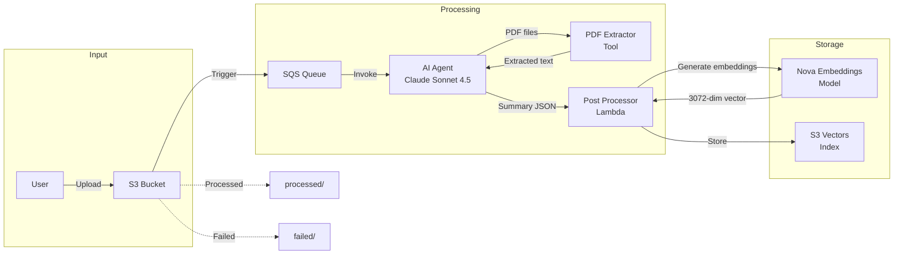

# Document Summarization Pipeline

A serverless AWS solution that accepts documents in multiple formats (txt, markdown, PDF), generates AI-powered summaries using Amazon Bedrock's Claude Sonnet 4.5, creates semantic embeddings using Amazon Nova Multimodal Embeddings, and stores the results in AWS S3 Vectors for efficient semantic search capabilities.

## Architecture

The pipeline leverages the CDK AppMod Catalog Blueprints library, specifically the `AgenticDocumentProcessing` construct, to orchestrate an AI agent that processes documents intelligently.



### Processing Flow

1. Documents are uploaded to an S3 bucket (supports .txt, .md, .pdf)
2. The `QueuedS3Adapter` triggers processing via SQS queue
3. The AI agent (Claude Sonnet 4.5) analyzes the document:
   - For text/markdown files: reads content directly
   - For PDF files: uses the custom `extract_pdf_text` tool to extract text
4. The agent generates a concise summary in JSON format
5. The Post Processor Lambda:
   - Generates embeddings using Amazon Nova Multimodal Embeddings (3072 dimensions)
   - Stores the summary and embeddings in S3 Vectors with original filename as metadata
6. Processed documents are moved to the `processed/` prefix; failures go to `failed/`

## Prerequisites

- Node.js 18.x or later
- AWS CLI configured with appropriate credentials
- AWS CDK CLI (`npm install -g aws-cdk`)

## Project Structure

```
.
├── bin/                          # CDK app entry point
├── lib/                          # CDK stack definitions
│   └── document-summarization-stack.ts  # Main infrastructure stack
├── resources/                    # Lambda function code and assets
│   ├── post_processor.py         # Post-processing Lambda (embeddings + S3 Vectors storage)
│   ├── requirements.txt          # Python dependencies (pypdf, boto3)
│   ├── system_prompt.txt         # Agent system prompt for summarization
│   └── tools/                    # Custom agent tools
│       └── pdf_extractor.py      # PDF text extraction tool using pypdf
├── specs/                        # Feature specifications
├── test/                         # Test files
├── cdk.json                      # CDK configuration
├── package.json                  # Node.js dependencies
└── tsconfig.json                 # TypeScript configuration
```

## Installation

Install dependencies:

```bash
npm install
```

## Build

Compile TypeScript to JavaScript:

```bash
npm run build
```

## Deployment

Deploy the stack to your AWS account:

```bash
cdk deploy
```

## Usage

Upload documents to the created S3 bucket. Supported formats:
- `.txt` - Plain text files
- `.md` - Markdown files
- `.pdf` - PDF documents

The pipeline will automatically process uploaded documents and store summaries with embeddings in S3 Vectors for semantic search.

## Useful Commands

- `npm run build`   - Compile TypeScript to JavaScript
- `npm run watch`   - Watch for changes and compile
- `npm run test`    - Run unit tests
- `cdk deploy`      - Deploy this stack to your default AWS account/region
- `cdk diff`        - Compare deployed stack with current state
- `cdk synth`       - Emit the synthesized CloudFormation template

## Technology Stack

- **Infrastructure as Code**: AWS CDK (TypeScript)
- **AI Models**: 
  - Claude Sonnet 4.5 (cross-region inference to US) for summarization
  - Amazon Nova Multimodal Embeddings (`amazon.nova-2-multimodal-embeddings-v1:0`) for vector generation
- **Storage**: 
  - AWS S3 for document storage (KMS encrypted)
  - AWS S3 Vectors for semantic search (cosine distance, float32)
- **Compute**: AWS Lambda (Python 3.13) for custom processing
- **Orchestration**: CDK AppMod Catalog Blueprints - `AgenticDocumentProcessing` construct
- **Observability**: CloudWatch Logs with structured JSON logging, custom metrics

## Key Components

### Post Processor Lambda
Handles embedding generation and vector storage:
- Invokes Amazon Nova Multimodal Embeddings via Bedrock
- Stores vectors in S3 Vectors index with metadata
- Implements retry logic with exponential backoff
- Structured JSON logging for observability

### PDF Extractor Tool
Custom agent tool for PDF processing:
- Uses `pypdf` library for text extraction
- Handles multi-page PDFs
- Returns structured results with page count and extracted text

### S3 Vectors Configuration
- Dimension: 3072 (Nova embeddings)
- Distance metric: Cosine
- Data type: float32
- Metadata: originalFilename, summary (non-filterable)

## License

This project is licensed under the MIT License.
