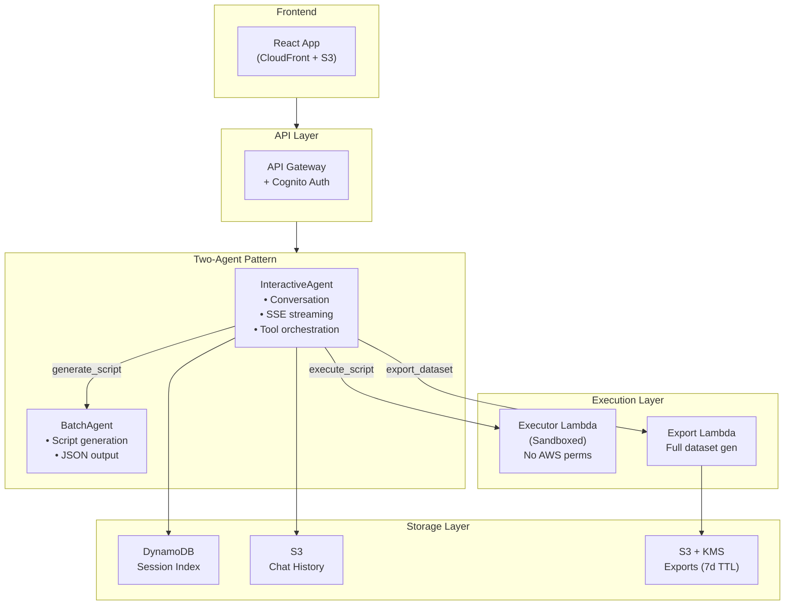
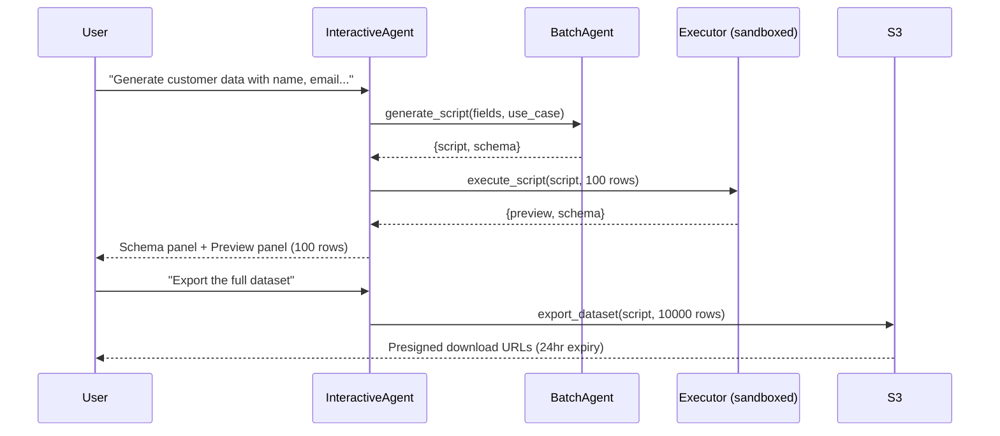

# Synthetic Dataset Generator

An AI-powered application that generates realistic synthetic datasets through natural conversation. Users describe their data requirements, and the agent generates Python scripts using pandas, numpy, and faker.

## Architecture



### Data Flow



## Components

| Component | Purpose |
|-----------|---------|
| **InteractiveAgent** | Real-time chat with Cognito auth, SSE streaming, 3 tools |
| **BatchAgent** | Generates Python DataGenerator scripts via Bedrock |
| **Execution Lambda** | Isolated sandbox - runs scripts with NO AWS permissions |
| **Export Lambda** | Full dataset generation + S3 upload + presigned URLs |
| **History Lambda** | Session list/delete/rename/history via DynamoDB index |
| **Session Index** | DynamoDB table tracking user sessions |
| **Session Lock Table** | DynamoDB table for distributed locking (prevents race conditions) |
| **Frontend** | React app via CloudFront (chat + schema/preview panels) |

## API Endpoints

All endpoints require Cognito authentication via Bearer token.

| Method | Endpoint | Description |
|--------|----------|-------------|
| `POST` | `/chat` | Send a message (SSE streaming response) |
| `GET` | `/sessions` | List all sessions for the authenticated user |
| `DELETE` | `/sessions/{id}` | Delete a specific session |
| `PATCH` | `/sessions/{id}` | Rename a session (body: `{"name": "new-name"}`) |
| `GET` | `/history/{id}` | Get chat history for a specific session |

## Data Flow

1. **Chat**: User → API Gateway → InteractiveAgent → Claude Sonnet → streams response
2. **Generate**: Tool calls BatchAgent → returns Python script + schema
3. **Execute**: Tool calls Execution Lambda → returns 10-row preview
4. **Export**: Tool calls Export Lambda → generates full dataset → S3 → presigned URL

## Multi-Agent Architecture

This example demonstrates a **two-agent pattern** using the framework's agent constructs:

### Why Two Agents?

| Concern | InteractiveAgent | BatchAgent |
|---------|------------------|------------|
| **Purpose** | Conversational UX | Specialized code generation |
| **Interaction** | Real-time streaming to user | Fire-and-forget invocation |
| **Prompt** | Guides conversation, decides when to use tools | Focused on Python script generation |
| **Output** | Streamed text + tool calls | Structured JSON (script + schema) |

### How They Coordinate

```
User: "Generate 1000 customer records with names and emails"
                    │
                    ▼
         ┌─────────────────────┐
         │  InteractiveAgent   │  ← Understands intent, streams acknowledgment
         │  (conversation.txt) │
         └──────────┬──────────┘
                    │ calls generate_script tool
                    ▼
         ┌─────────────────────┐
         │     BatchAgent      │  ← Specialized prompt for Python generation
         │ (script-gen.txt)    │
         └──────────┬──────────┘
                    │ returns {script, schema}
                    ▼
         ┌─────────────────────┐
         │  InteractiveAgent   │  ← Receives result, streams to user
         └─────────────────────┘
```

### Benefits of This Pattern

- **Separation of concerns**: Chat agent handles UX; generation agent handles code quality
- **Specialized prompts**: Each agent has a focused system prompt for its task
- **Reusability**: BatchAgent could be reused by other interfaces (CLI, API)
- **Testability**: Each agent can be tested independently
- **Cost optimization**: BatchAgent only invoked when generation is needed

## Security

- **Execution Lambda is isolated** - no AWS permissions beyond CloudWatch logs
- **Export bucket encrypted** with KMS + 7-day lifecycle
- **Session locking** via DynamoDB to prevent race conditions
- **Cognito auth** on all API endpoints

## Prerequisites

- AWS CLI configured with appropriate credentials
- Node.js >= 18.12.0
- AWS CDK CLI (`npm install -g aws-cdk`)
- An AWS account with Bedrock model access enabled for Claude models

### Enable Bedrock Model Access

1. Open the [Amazon Bedrock console](https://console.aws.amazon.com/bedrock/)
2. Navigate to **Model access** in the left sidebar
3. Click **Manage model access**
4. Enable access for **Anthropic Claude** models
5. Wait for access to be granted (usually immediate)

## Deployment

1. **Install dependencies:**
   ```bash
   cd examples/synthetic-dataset-generator
   npm install
   ```

2. **Bootstrap CDK (if not already done):**
   ```bash
   cdk bootstrap
   ```

3. **Deploy the stack:**
   ```bash
   cdk deploy
   ```

4. **Note the outputs:**
   After deployment, note these CloudFormation outputs:
   - `ChatApiEndpoint` - API URL for chat requests
   - `UserPoolId` - Cognito User Pool ID
   - `UserPoolClientId` - Cognito Client ID

## Usage

### Quick Start (CLI)

```bash
# 1. Create a test user
USER_POOL_ID=$(aws cloudformation describe-stacks --stack-name SyntheticDatasetGeneratorStack \
  --query 'Stacks[0].Outputs[?OutputKey==`UserPoolId`].OutputValue' --output text)

aws cognito-idp admin-create-user --user-pool-id $USER_POOL_ID \
  --username testuser --temporary-password TempPass123! --message-action SUPPRESS

aws cognito-idp admin-set-user-password --user-pool-id $USER_POOL_ID \
  --username testuser --password YourPassword123! --permanent

# 2. Get auth token
CLIENT_ID=$(aws cloudformation describe-stacks --stack-name SyntheticDatasetGeneratorStack \
  --query 'Stacks[0].Outputs[?OutputKey==`UserPoolClientId`].OutputValue' --output text)

TOKEN=$(aws cognito-idp initiate-auth --client-id $CLIENT_ID \
  --auth-flow USER_PASSWORD_AUTH \
  --auth-parameters USERNAME=testuser,PASSWORD=YourPassword123! \
  --query 'AuthenticationResult.IdToken' --output text)

# 3. Chat (SSE streaming)
API_ENDPOINT=$(aws cloudformation describe-stacks --stack-name SyntheticDatasetGeneratorStack \
  --query 'Stacks[0].Outputs[?OutputKey==`ChatApiEndpoint`].OutputValue' --output text)

curl -X POST "$API_ENDPOINT" -H "Authorization: Bearer $TOKEN" \
  -H "Content-Type: application/json" \
  -d '{"message": "Generate 1000 customer records with name, email, and signup_date"}'
```

### Example Conversation

**User:** "I need customer data for testing"

**Agent:** "What will you use this data for? (e.g., testing, ML training, demo)"

**User:** "ML training for fraud detection"

**Agent:** "What fields do you need? Give me a few examples."

**User:** "Customer ID, name, email, transaction amount, timestamp, and whether it's fraudulent"

**Agent:** "Got it - I'll generate a script for fraud detection training data with those 6 fields..."

*[Agent calls generate_script tool and returns Python code]*

## Generated Script Format

All generated scripts follow the DataGenerator class template:

```python
import pandas as pd
import numpy as np
from faker import Faker
import random
from datetime import datetime, timedelta

class DataGenerator:
    def __init__(self, num_rows: int = 10000):
        self.num_rows = num_rows
        self.fake = Faker()
        # Seeds for reproducibility
        random.seed(42)
        np.random.seed(42)
        Faker.seed(42)

    def generate_datasets(self) -> list:
        """Generate synthetic datasets."""
        # Implementation varies based on requirements
        return [pd.DataFrame(data)]

    def generate_schema(self) -> dict:
        """Generate schema documentation."""
        return {"columns": [...]}
```

## Cleanup

To remove all resources:

```bash
cdk destroy
```

## Troubleshooting

### "AccessDeniedException" when calling Bedrock

Ensure Bedrock model access is enabled for Claude models in your AWS account. See Prerequisites above.

### "User does not exist" errors

Create a user in the Cognito User Pool using the commands in the Usage section.

### Streaming not working

Ensure your client supports SSE (Server-Sent Events). The API returns a stream of tokens, not a single JSON response.

## Features

- **Conversational Interface**: Natural language data requirements gathering
- **Script Generation**: AI-generated Python scripts using pandas, numpy, faker
- **Sandboxed Execution**: Isolated Lambda runs scripts with no AWS permissions
- **Live Preview**: 10-row preview displayed in real-time
- **Export**: Full dataset generation with presigned S3 download URLs (7-day TTL)
- **Session Management**: Persistent chat sessions via DynamoDB index
- **Session Operations**: Rename and delete sessions from the UI
- **Distributed Locking**: DynamoDB-based locking prevents race conditions on concurrent requests
