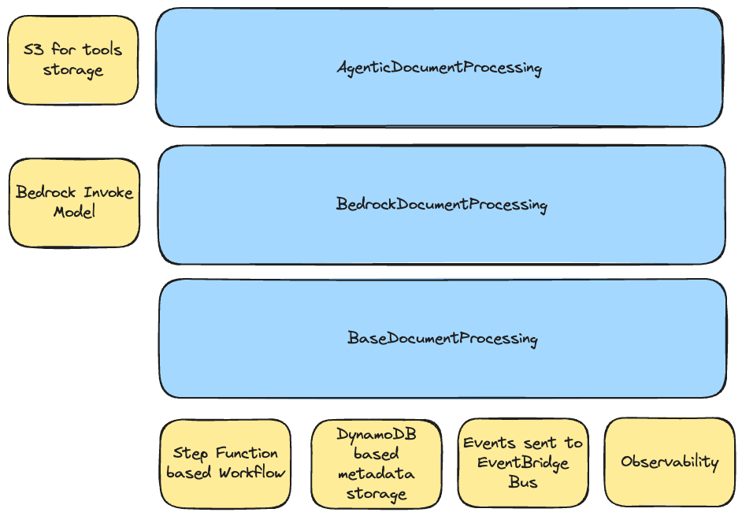
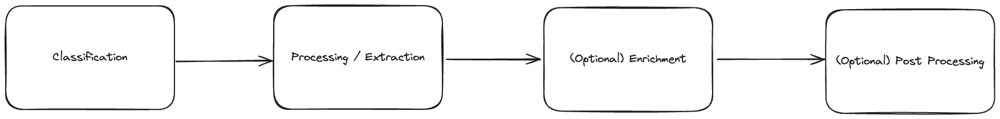

# Document Processing

## Overview
At a high-level this L3 construct uses a layered approach to provide various functionality and enable users to customized at varying layers depending on their requirements. The following diagram demonstrates the high-level architecture:



## Components
The following are the key components of this L3 Construct

### Ingress Adapter
The ingress adapter is an interface that allows you to define where the data source would be coming from. There's a default implementation already that you can use as a reference: [`QueuedS3Adapter`](./adapter/queued-s3-adapter.ts). 

The `QueuedS3Adapter` basically does the following:
- Creates a new S3 Bucket (if one is not provided during instantiation)
- Creates 2 SQS Queues, the primary SQS Queue that would receive events from the S3 Bucket, and the Dead Letter Queue incase of processing failure.
- Creates a Lambda function that will consume from SQS and trigger the Document Processing State Machine.
- Provides State Machine `chain` to handle both success and failure scenarios. In the case of the `QueuedS3Adapter`, the following are the expected behavior:
    - **Success**: move the file to the `processed` prefix and delete from the `raw` prefix.
    - **Failure**: move the file to the `failed` prefix and delete from the `raw` prefix.
- IAM `PolicyStatement` and `KMS` encrypt and decrypt permissions for the classification/processing Lambda functions as well as the State Machine role.

If no Ingress Adapter is provided, the Document Processing workflow would use the `QueuedS3Adapter` as the default implementation. That means that users would use S3 as the point of input for the document processing workflow to trigger.

Supporting other types of ingress (eg. streaming, micro-batching, even on-prem data sources) would require implementing the [`IAdapter`](./adapter/adapter.ts) interface. Once implemented, instantiate the new ingress adapter and pass it to the document processing L3 construct.

### Workflow
At a high-level, regardless which implementation you're using, the core workflow's structure are as follows:



#### Payload Structure

For **S3 based** ingress, the following is an example payload that would be sent to the state machine:

```json
{
    "documentId": "auto-generated document id",
    "contentType": "file",
    "content": {
        "location": "s3",
        "bucket": "s3 bucket name",
        "key": "s3 key including prefix",
        "filename": "filename"
    },
    "eventTime": "s3 event time",
    "eventName": "s3 event name",
    "source": "sqs-consumer"
}
```

For **non-file based** ingress (eg. streaming), the following is an example payload:

```json
{
    "documentId": "auto-generated document id",
    "contentType": "data",
    "content": {
        "data": "<content>"
    },
    "eventTime": "s3 event time",
    "eventName": "s3 event name",
    "source": "sqs-consumer"
}
```

### Events (via EventBridge)
If an EventBridge broker is configured as part of the parameters of the document processing L3 Construct, the deployed workflow would automatically include points where the workflow would send events to the configured event bus.

The following are example structure of the event:

**Successful**
```json
{
    "Detail": {
        "documentId": "sample-invoice-1759811188513",
        "classification": "INVOICE",
        "contentType": "file",
        "content": "{\"location\":\"s3\",\"bucket\":\"bedrockdocumentprocessing-bedrockdocumentprocessin-24sh7hz30zoi\",\"key\":\"raw/sample-invoice.jpg\",\"filename\":\"sample-invoice.jpg\"}"
    },
    "DetailType": "document-processed-successful",
    "EventBusName": "<ARN of the event bus>",
    "Source": "intelligent-document-processing"
}
```

**Failure**
```json
{
    "Detail": {
        "documentId": "sample-invoice-1759811188513",
        "contentType": "file",
        "content": "{\"location\":\"s3\",\"bucket\":\"bedrockdocumentprocessing-bedrockdocumentprocessin-24sh7hz30zoi\",\"key\":\"raw/sample-invoice.jpg\",\"filename\":\"sample-invoice.jpg\"}"
    },
    "DetailType": "document-processing-failed",
    "EventBusName": "<ARN of the event bus>",
    "Source": "intelligent-document-processing"
}
```

## Class Structure

### [`BaseDocumentProcessing`](./base-document-processing.ts)
This is the foundational abstract class for all implementation of the document processing L3 Construct. This takes care of the following:
- Initializes and calls the necessary hooks to properly integrate the Ingress Adapter
- Initializes the DynamoDB metadata table
- Initializes and configures the various Observability related configuration
- Provides the core workflow scaffolding

If you're directly extending this abstract class, you would need to provide concrete implementations of the following:
- `classificationStep()`
    - `ResultPath` should be `$.classificationResult`
- `processingStep()`
    - `ResultPath` should be `$.processingResult`
- `enrichmentStep()`
    - `ResultPath` should be `$.enrichedResult`
- `postProcessingStep()`
    - `ResultPath` should be `$.postProcessedResult`

Each of those functions must return either one of the following:
- [`BedrockInvokeModel`](https://docs.aws.amazon.com/cdk/api/v2/docs/aws-cdk-lib.aws_stepfunctions_tasks.BedrockInvokeModel.html)
- [`LambdaInvoke`](https://docs.aws.amazon.com/cdk/api/v2/docs/aws-cdk-lib.aws_stepfunctions_tasks.LambdaInvoke.html)
- [`StepFunctionsStartExecution`](https://docs.aws.amazon.com/cdk/api/v2/docs/aws-cdk-lib.aws_stepfunctions_tasks.StepFunctionsStartExecution.html)

You can use [`BedrockDocumentProcessing`](./bedrock-document-processing.ts) as an implementation example on how to define your own implementation for all of the steps in the workflow.

### [`BedrockDocumentProcessing`](./bedrock-document-processing.ts)
This implementation uses Amazon Bedrock's [InvokeModel](https://boto3.amazonaws.com/v1/documentation/api/latest/reference/services/bedrock-runtime/client/invoke_model.html) for the classification and processing step. You can customized the following:
- The LLM model to use.
- The prompts for both classification and processing
- Lambda function for enrichment and/or post-processing

### [`AgenticDocumentProcessing`](./agentic-document-processing.ts)
This implementation builds on top of the [`BedrockDocumentProcessing`](./bedrock-document-processing.ts). It reuses the `classificationStep()` that's defined in the parent class and overrides the `processingStep()` to provide agentic functionality to process the document / data. Tools (and its dependencies) can be provided as part of the parameter for this L3 construct further expanding what the agent can do. 