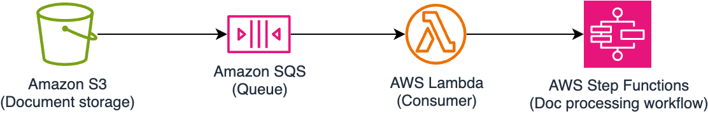
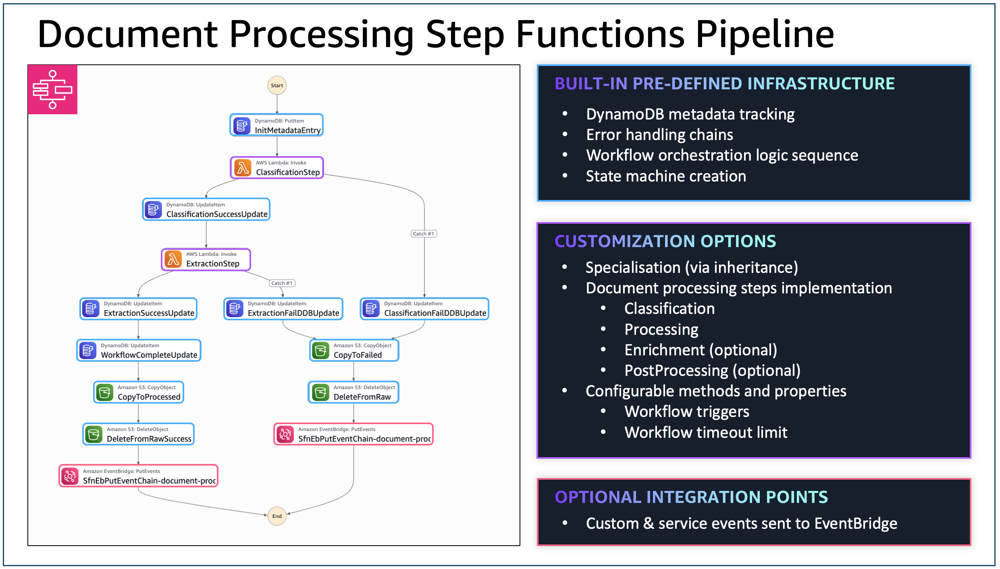

# Document Processing

[](https://github.com/cdklabs/cdk-appmod-catalog-blueprints/tree/main/use-cases/document-processing)
[](https://cdklabs.github.io/cdk-appmod-catalog-blueprints/docs/use-cases/document-processing/)
[](https://cdklabs.github.io/cdk-appmod-catalog-blueprints/docs/example/document-processing/agentic-document-processing/)

## Overview

The Document Processing L3 constructs provides a layered architectural approach for intelligent document processing workflows. The system offers multiple implementation levels to provide various functionality and enable users to customized at varying layers depending on their requirements - from abstract base classes to fully-featured agentic processing with tool integration.


You can leverage the following constructs:
- **BaseDocumentProcessing**: Abstract foundation requiring custom step implementations
- **BedrockDocumentProcessing**: Ready-to-use genAI document processing implementation with Amazon Bedrock 
- **AgenticDocumentProcessing**: Advanced agentic capabilities powered by the [Agents Framework](../framework/agents/) with BatchAgent integration

All implementations share common infrastructure: Step Functions workflow, DynamoDB metadata storage, EventBridge integration, and built-in observability.

## Components
The following are the key components of this L3 Construct:

### Ingress Adapter
The ingress adapter is an interface that allows you to define where the data source would be coming from. There's a default implementation already that you can use as a reference: [`QueuedS3Adapter`](./adapter/queued-s3-adapter.ts). 



The `QueuedS3Adapter` basically does the following:
- Creates a new S3 Bucket (if one is not provided during instantiation)
- Creates 2 SQS Queues, the primary SQS Queue that would receive events from the S3 Bucket, and the Dead Letter Queue incase of processing failure.
- Creates a Lambda function that will consume from SQS and trigger the Document Processing State Machine.
- Provides State Machine `chain` to handle both success and failure scenarios. In the case of the `QueuedS3Adapter`, the following are the expected behavior:
    - **Success**: move the file to the `processed` prefix and delete from the `raw` prefix.
    - **Failure**: move the file to the `failed` prefix and delete from the `raw` prefix.
- IAM `PolicyStatement` and `KMS` encrypt and decrypt permissions for the classification/processing Lambda functions as well as the State Machine role.

If no Ingress Adapter is provided, the Document Processing workflow would use the `QueuedS3Adapter` as the default implementation. That means that users would use S3 as the point of input for the document processing workflow to trigger.

Supporting other types of ingress (eg. streaming, micro-batching, even on-prem data sources) would require implementing the [`IAdapter`](https://github.com/cdklabs/cdk-appmod-catalog-blueprints/blob/main/use-cases/document-processing/adapter/adapter.ts) interface. Once implemented, instantiate the new ingress adapter and pass it to the document processing L3 construct.

### Workflow
At a high-level, regardless which implementation you're using, the core workflow's structure are as follows:


- Classification: Determines document type/category for routing decisions
- Processing / Extraction: Extracts and processes information from the document
- Enrichment: Enhances extracted data with additional context or validation
- Post Processing: Final processing for formatting output or triggering downstream systems

Here is an example of the workflow and customisability points:



#### Payload Structure

For **S3 based** ingress, the following is an example payload that would be sent to the state machine:

```json
{
    "documentId": "auto-generated document id",
    "contentType": "file",
    "content": {
        "location": "s3",
        "bucket": "s3 bucket name",
        "key": "s3 key including prefix",
        "filename": "filename"
    },
    "eventTime": "s3 event time",
    "eventName": "s3 event name",
    "source": "sqs-consumer"
}
```

For **non-file based** ingress (eg. streaming), the following is an example payload:

```json
{
    "documentId": "auto-generated document id",
    "contentType": "data",
    "content": {
        "data": "<content>"
    },
    "eventTime": "s3 event time",
    "eventName": "s3 event name",
    "source": "sqs-consumer"
}
```

### Events (via EventBridge)
If an EventBridge broker is configured as part of the parameters of the document processing L3 Construct, the deployed workflow would automatically include points where the workflow would send events to the configured event bus.

The following are example structure of the event:

**Successful**
```json
{
    "Detail": {
        "documentId": "sample-invoice-1759811188513",
        "classification": "INVOICE",
        "contentType": "file",
        "content": "{\"location\":\"s3\",\"bucket\":\"bedrockdocumentprocessing-bedrockdocumentprocessin-24sh7hz30zoi\",\"key\":\"raw/sample-invoice.jpg\",\"filename\":\"sample-invoice.jpg\"}"
    },
    "DetailType": "document-processed-successful",
    "EventBusName": "<ARN of the event bus>",
    "Source": "intelligent-document-processing"
}
```

**Failure**
```json
{
    "Detail": {
        "documentId": "sample-invoice-1759811188513",
        "contentType": "file",
        "content": "{\"location\":\"s3\",\"bucket\":\"bedrockdocumentprocessing-bedrockdocumentprocessin-24sh7hz30zoi\",\"key\":\"raw/sample-invoice.jpg\",\"filename\":\"sample-invoice.jpg\"}"
    },
    "DetailType": "document-processing-failed",
    "EventBusName": "<ARN of the event bus>",
    "Source": "intelligent-document-processing"
}
```

## [`BaseDocumentProcessing`](https://github.com/cdklabs/cdk-appmod-catalog-blueprints/blob/main/use-cases/document-processing/base-document-processing.ts) Construct

The [`BaseDocumentProcessing`](https://github.com/cdklabs/cdk-appmod-catalog-blueprints/blob/main/use-cases/document-processing/base-document-processing.ts) construct is the foundational abstract class for all document processing implementations. It provides complete serverless document processing infrastructure and takes care of the following:
- Initializes and calls the necessary hooks to properly integrate the Ingress Adapter
- Initializes the DynamoDB metadata table
- Initializes and configures the various Observability related configuration
- Provides the core workflow scaffolding

### Implementation Requirements
If you're directly extending this abstract class, you must provide concrete implementations of the following:
- **`classificationStep()`**: Document type classification (required)
  - `ResultPath` should be `$.classificationResult`
- **`processingStep()`**: Data extraction and processing (required)
  - `ResultPath` should be `$.processingResult`
- **`enrichmentStep()`**: Optional data enrichment
  - `ResultPath` should be `$.enrichedResult`
- **`postProcessingStep()`**: Optional final processing
  - `ResultPath` should be `$.postProcessedResult`

Each function must return one of the following:
- [`BedrockInvokeModel`](https://docs.aws.amazon.com/cdk/api/v2/docs/aws-cdk-lib.aws_stepfunctions_tasks.BedrockInvokeModel.html)
- [`LambdaInvoke`](https://docs.aws.amazon.com/cdk/api/v2/docs/aws-cdk-lib.aws_stepfunctions_tasks.LambdaInvoke.html)
- [`StepFunctionsStartExecution`](https://docs.aws.amazon.com/cdk/api/v2/docs/aws-cdk-lib.aws_stepfunctions_tasks.StepFunctionsStartExecution.html)

### Configuration Options
- **Ingress Adapter**: Custom trigger mechanism (default: `QueuedS3Adapter`)
- **Workflow Timeout**: Maximum execution time (default: 30 minutes)
- **Network**: Optional VPC deployment with subnet selection
- **Encryption Key**: Custom KMS key or auto-generated
- **EventBridge Broker**: Optional event publishing for integration
- **Observability**: Enable logging, tracing, and metrics

## [`BedrockDocumentProcessing`](https://github.com/cdklabs/cdk-appmod-catalog-blueprints/blob/main/use-cases/document-processing/bedrock-document-processing.ts) Construct

The [`BedrockDocumentProcessing`](https://github.com/cdklabs/cdk-appmod-catalog-blueprints/blob/main/use-cases/document-processing/bedrock-document-processing.ts) construct **extends BaseDocumentProcessing** and uses Amazon Bedrock's [InvokeModel](https://boto3.amazonaws.com/v1/documentation/api/latest/reference/services/bedrock-runtime/client/invoke_model.html) for the classification and processing steps.

### Key Features
- **Inherits**: All base infrastructure (S3, SQS, DynamoDB, Step Functions)
- **Implements**: Classification and processing steps using Bedrock models
- **Adds**: Cross-region inference, custom prompts, Lambda integration

### Configuration Options
You can customize the following:
- **Classification Model**: Bedrock model for document classification (default: Claude 3.7 Sonnet)
- **Processing Model**: Bedrock model for data extraction (default: Claude 3.7 Sonnet)
- **Custom Prompts**: Override default classification and processing prompts
- **Cross-Region Inference**: Enable inference profiles for high availability
- **Step Timeouts**: Individual step timeout configuration (default: 5 minutes)
- **Lambda Functions**: Optional enrichment and post-processing functions

### Example Implementations
- [Bedrock Document Processing](https://github.com/cdklabs/cdk-appmod-catalog-blueprints/tree/main/examples/document-processing/bedrock-document-processing)

## [`AgenticDocumentProcessing`](https://github.com/cdklabs/cdk-appmod-catalog-blueprints/blob/main/use-cases/document-processing/agentic-document-processing.ts) Construct

The [`AgenticDocumentProcessing`](https://github.com/cdklabs/cdk-appmod-catalog-blueprints/blob/main/use-cases/document-processing/agentic-document-processing.ts) construct **extends BedrockDocumentProcessing** to provide advanced agentic capabilities using the [Agents Framework](../framework/agents/).

### Key Features
- **Inherits**: All Bedrock functionality (models, prompts, cross-region inference)
- **Reuses**: Classification step from parent class unchanged
- **Overrides**: Processing step with BatchAgent from the Agents Framework
- **Integrates**: Full tool ecosystem with dynamic loading and execution

The processing step is now powered by a `BatchAgent` that can leverage custom tools, system prompts, and advanced reasoning capabilities.

### Configuration Options
Instead of direct Bedrock model configuration, you now provide `processingAgentParameters`:

```typescript
interface AgenticDocumentProcessingProps extends BedrockDocumentProcessingProps {
  readonly processingAgentParameters: BatchAgentProps;
}
```

**Agent Configuration:**
- **Agent Name**: Unique identifier for the processing agent
- **System Prompt**: S3 Asset containing agent instructions
- **Tools**: Array of S3 Assets with Python tool implementations
- **Lambda Layers**: Additional dependencies for tool execution
- **Processing Prompt**: Specific task instructions for the agent
- **Expect JSON**: Enable automatic JSON response parsing

### Example Implementations
- [Agentic Document Processing](https://github.com/cdklabs/cdk-appmod-catalog-blueprints/tree/main/examples/document-processing/agentic-document-processing)

### Example Implementations
- [Agentic Document Processing](https://github.com/cdklabs/cdk-appmod-catalog-blueprints/tree/main/examples/document-processing/agentic-document-processing) 
- [Full-Stack Insurance Claims Processing](https://github.com/cdklabs/cdk-appmod-catalog-blueprints/tree/main/examples/document-processing/doc-processing-fullstack-webapp)