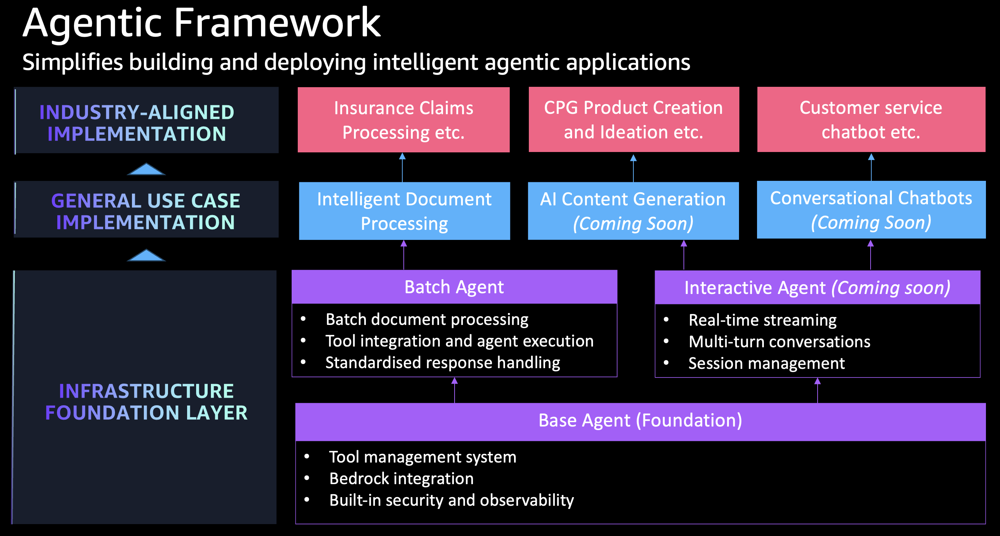

# Agentic AI Framework

[](https://github.com/cdklabs/cdk-appmod-catalog-blueprints/tree/main/use-cases/framework/agents)
[](https://cdklabs.github.io/cdk-appmod-catalog-blueprints/docs/use-cases/framework/agents/)
[](https://cdklabs.github.io/cdk-appmod-catalog-blueprints/docs/examples/document-processing/agentic-document-processing/)

## Overview

The Agentic AI Framework is a composable enterprise framework for building intelligent AI agents with Amazon Bedrock that can be mixed and matched across diverse use cases - from document processing and conversational AI to data analysis and automated decision-making workflows.

Build sophisticated AI agents that go beyond simple text generation using this modular framework from AppMod Catalog Blueprints. Create intelligent agents for any use case by mixing and matching reusable components across different business domains and industries.



You can leverage the following constructs:
- **BaseAgent**: Abstract foundation requiring custom agent implementations
- **BatchAgent**: Ready-to-use agent for batch processing with Bedrock integration
- **InteractiveAgent**: Real-time conversational AI with SSE streaming, session management, and Cognito authentication

All implementations share common infrastructure from `BaseAgent` and integrate with the [Strands agent framework](https://github.com/awslabs/strands-agents) for tool execution and model interaction.

## Composable Architecture

**Mix & Match Components**
- **BaseAgent**: Foundation infrastructure that works across all use cases
- **BatchAgent**: Ready-to-use for document processing, data analysis, content generation
- **InteractiveAgent**: Ready-to-use for chatbots, customer service, real-time conversations
- **Tool Library**: Reusable capabilities that work across different agent types

**Multi-Use Case Support**

The same framework components power diverse applications:
- **Insurance Claims**: Document classification → data extraction → validation → approval workflows
- **Customer Service**: Query understanding → knowledge retrieval → response generation → escalation handling  
- **Content Operations**: Research → writing → fact-checking → publishing workflows
- **Data Analytics**: Data ingestion → analysis → insight generation → report creation
- **Manufacturing**: Quality control → defect analysis → predictive maintenance → process optimization

**Composability Benefits**
- **Reusable Infrastructure**: Deploy the same BaseAgent foundation across all your AI initiatives with consistent security, monitoring, and compliance
- **Flexible Scaling**: Start with BatchAgent for immediate value, add InteractiveAgent for customer-facing applications, combine multiple agents for complex workflows
- **Rapid Customization**: Swap AI models based on use case requirements, modify prompts and workflows without changing infrastructure, add new tools as business needs evolve

## Components

The following are the key components of this L3 Construct:

### Agent Definition
The agent definition encapsulates the core configuration that influences agent behavior:

```typescript
interface AgentDefinitionProps {
  // Bedrock model configuration
  readonly bedrockModel: BedrockModelProps;
  
  // System prompt stored as S3 asset
  readonly systemPrompt: Asset;
  
  // Optional tools for agent capabilities
  readonly tools?: Asset[];
  
  // Dependencies for tools
  readonly lambdaLayers?: LayerVersion[];
  
  // Additional IAM permissions for tools
  readonly additionalPolicyStatementsForTools?: PolicyStatement[];
}
```

### Tool Integration
Agents can be enhanced with custom tools stored as Python files in S3:

```typescript
const tools = [
  new Asset(this, 'DownloadPolicyTool', {
    path: './tools/download_policy.py'
  }),
  new Asset(this, 'DataAnalysisTool', {
    path: './tools/data_analysis.py'
  })
];
```

Tools are automatically loaded by the agent runtime and can include:
- File processing utilities
- API integrations
- Data analysis functions
- Specialized domain logic

### Infrastructure Features
- **Encryption**: KMS encryption for environment variables and data at rest
- **Networking**: Optional VPC deployment with subnet selection
- **Observability**: AWS Lambda Powertools integration for metrics, tracing, and logging
- **IAM Security**: Least-privilege access with automatic permission generation
- **Scalability**: Configurable memory allocation and timeout settings


## [`BaseAgent`](https://github.com/cdklabs/cdk-appmod-catalog-blueprints/blob/main/use-cases/framework/agents/base-agent.ts) Construct

The [`BaseAgent`](https://github.com/cdklabs/cdk-appmod-catalog-blueprints/blob/main/use-cases/framework/agents/base-agent.ts) construct is the foundational abstract class for all agent implementations. It provides complete serverless agent infrastructure and takes care of the following:

- Initializes IAM roles with appropriate permissions for Bedrock and tools
- Configures KMS encryption for secure environment variable storage
- Sets up observability with Lambda Powertools integration
- Manages tool asset permissions and S3 access
- Provides VPC networking support when required

### Implementation Requirements
If you're directly extending this abstract class, you must provide concrete implementations of:
- **`agentFunction`**: The Lambda function that executes the agent logic

### Configuration Options
- **Agent Name**: Unique identifier for the agent
- **Agent Definition**: Core configuration including model, prompts, and tools
- **Network**: Optional VPC deployment with subnet selection
- **Encryption Key**: Custom KMS key or auto-generated
- **Observability**: Enable logging, tracing, and metrics
- **Removal Policy**: Resource cleanup behavior (default: DESTROY)

## [`BatchAgent`](https://github.com/cdklabs/cdk-appmod-catalog-blueprints/blob/main/use-cases/framework/agents/batch-agent.ts) Construct

The [`BatchAgent`](https://github.com/cdklabs/cdk-appmod-catalog-blueprints/blob/main/use-cases/framework/agents/batch-agent.ts) construct **extends BaseAgent** and provides a ready-to-use implementation for batch processing scenarios.

### Key Features
- **Inherits**: All base infrastructure (IAM, KMS, observability)
- **Implements**: Complete Lambda function with Strands agent framework
- **Adds**: Batch processing capabilities with configurable prompts
- **Includes**: JSON extraction and response formatting

### Configuration Options
You can customize the following:
- **Prompt**: Processing instructions for the agent
- **Expect JSON**: Enable automatic JSON extraction from responses
- **Memory Size**: Lambda memory allocation (default: 1024MB)
- **Timeout**: Execution timeout (default: 10 minutes)
- **Architecture**: Lambda architecture (default: X86_64)

### Example Usage

```typescript
import { BatchAgent } from '@cdklabs/cdk-appmod-catalog-blueprints';
import { Asset } from 'aws-cdk-lib/aws-s3-assets';

const agent = new BatchAgent(this, 'DocumentAnalysisAgent', {
  agentName: 'DocumentAnalysisAgent',
  agentDefinition: {
    bedrockModel: {
      useCrossRegionInference: true
    },
    systemPrompt: new Asset(this, 'SystemPrompt', {
      path: './prompts/document_analysis.txt'
    }),
    tools: [
      new Asset(this, 'PDFTool', {
        path: './tools/pdf_processor.py'
      }),
      new Asset(this, 'OCRTool', {
        path: './tools/ocr_processor.py'
      })
    ]
  },
  prompt: `
    Analyze the provided document and extract key information.
    Use the available tools to process different document formats.
    Return results in JSON format with extracted data and confidence scores.
  `,
  expectJson: true,
  enableObservability: true
});
```

### Tool Development
Tools are Python files that extend agent capabilities:

```python
# tools/pdf_processor.py
from strands import tool

@tool
def extract_pdf_text(file_path: str) -> str:
    """Extract text content from PDF files."""
    # Implementation here
    return extracted_text

@tool  
def get_pdf_metadata(file_path: str) -> dict:
    """Extract metadata from PDF files."""
    # Implementation here
    return metadata
```

### Event Payload Structure
The agent expects input in the following format:

```json
{
  "contentType": "file",
  "content": {
    "bucket": "my-bucket",
    "key": "documents/report.pdf",
    "location": "s3"
  },
  "classificationResult": {
    "documentClassification": "compliance_report"
  }
}
```

### Response Format
With `expectJson: true`, responses are automatically parsed:

```json
{
  "result": {
    "compliance_status": "compliant",
    "issues_found": [],
    "confidence_score": 0.95,
    "recommendations": [
      "Review section 3.2 for clarity"
    ]
  }
}
```

## [`InteractiveAgent`](https://github.com/cdklabs/cdk-appmod-catalog-blueprints/blob/main/use-cases/framework/agents/interactive-agent.ts) Construct

The `InteractiveAgent` construct **extends BaseAgent** to provide real-time conversational AI with SSE streaming, session management, and authentication.

### Key Features
- **Inherits**: All base infrastructure (IAM role, KMS encryption, tool management, observability)
- **Implements**: Lambda function with Lambda Web Adapter + FastAPI for Python response streaming
- **Adds**: API Gateway REST API with response streaming, S3 session management, sliding window context, Cognito authentication
- **Strategy Interfaces**: Pluggable adapters for communication, sessions, context, and authentication

### Architecture

```
Client (fetch + ReadableStream)
    ↓ POST /chat (Authorization: Bearer JWT)
API Gateway REST API (responseTransferMode: STREAM)
    ↓ InvokeWithResponseStream
Lambda (Python + Lambda Web Adapter + FastAPI)
    ↓ strands.Agent streaming
Amazon Bedrock (Claude)
```

The Lambda function runs a FastAPI application behind Lambda Web Adapter. When a chat request arrives:

1. API Gateway validates the JWT via native Cognito authorizer
2. API Gateway invokes Lambda using `InvokeWithResponseStream`
3. Lambda Web Adapter forwards the HTTP request to FastAPI on `localhost:8080`
4. FastAPI loads session history from S3, applies context windowing, creates a `strands.Agent`, and streams SSE events as the agent generates tokens
5. SSE chunks stream back through Lambda Web Adapter → API Gateway → Client

### Components

#### StreamingHttpAdapter (Default Communication Adapter)

Creates an API Gateway REST API with response streaming enabled. Supports 15-minute timeout, native Cognito JWT validation, CORS, and configurable throttling.

```typescript
const adapter = new StreamingHttpAdapter({
  stageName: 'prod',
  throttle: { rateLimit: 100, burstLimit: 200 },
});
```

#### S3SessionManager (Default Session Store)

Persists conversation state to S3 with automatic expiration via lifecycle policies. Each HTTP request loads/saves session state, enabling multi-turn conversations over stateless HTTP.

```typescript
const sessionStore = new S3SessionManager(this, 'SessionStore', {
  sessionTTL: Duration.hours(48),
  encryptionKey: myKmsKey,
});
```

#### SlidingWindowConversationManager (Default Context Strategy)

Maintains a fixed-size window of recent messages, automatically discarding older messages. Configurable window size (default: 20 messages).

```typescript
const contextStrategy = new SlidingWindowConversationManager({ windowSize: 50 });
```

#### NullConversationManager

Disables conversation history. Each message is processed independently.

#### CognitoAuthenticator (Default Authenticator)

Integrates with Amazon Cognito User Pools. API Gateway validates JWT tokens natively using the `COGNITO_USER_POOLS` authorizer type — no custom Lambda authorizer needed.

```typescript
const authenticator = new CognitoAuthenticator({
  removalPolicy: RemovalPolicy.RETAIN,
});
```

#### NoAuthenticator

Disables authentication entirely. Only use for development and testing.

### Configuration Options

| Property | Type | Default | Description |
|----------|------|---------|-------------|
| `communicationAdapter` | `ICommunicationAdapter` | `StreamingHttpAdapter` | Communication mechanism |
| `sessionStore` | `ISessionStore` | `S3SessionManager` | Session persistence (`undefined` for stateless) |
| `sessionBucket` | `IBucket` | Auto-created | Custom S3 bucket for sessions |
| `sessionTTL` | `Duration` | 24 hours | Session expiration time |
| `contextStrategy` | `IContextStrategy` | `SlidingWindow` size 20 | Context management strategy |
| `messageHistoryLimit` | `number` | 20 | Max messages in context window |
| `authenticator` | `IAuthenticator` | `CognitoAuthenticator` | Authentication mechanism |
| `memorySize` | `number` | 1024 MB | Lambda memory allocation |
| `timeout` | `Duration` | 15 minutes | Lambda timeout |
| `architecture` | `Architecture` | X86_64 | Lambda architecture |
| `reservedConcurrentExecutions` | `number` | `undefined` | Reserved Lambda concurrency |
| All `BaseAgentProps` | — | — | Inherited from BaseAgent |

### Outputs

```typescript
agent.apiEndpoint;      // REST API endpoint URL (POST /chat)
agent.adapter;          // ICommunicationAdapter instance
agent.sessionStore;     // ISessionStore instance
agent.sessionBucket;    // S3 bucket for sessions
agent.contextStrategy;  // IContextStrategy instance
agent.authenticator;    // IAuthenticator instance (access userPool, userPoolClient)
agent.agentFunction;    // Lambda function
agent.agentRole;        // IAM role (inherited from BaseAgent)
agent.encryptionKey;    // KMS key (inherited from BaseAgent)
```

### Usage Examples

#### Minimal Configuration

```typescript
import { Asset } from 'aws-cdk-lib/aws-s3-assets';
import { InteractiveAgent } from '@cdklabs/cdk-appmod-catalog-blueprints';

const systemPrompt = new Asset(this, 'SystemPrompt', {
  path: './prompts/chatbot_system_prompt.txt',
});

const agent = new InteractiveAgent(this, 'ChatAgent', {
  agentName: 'CustomerSupportBot',
  agentDefinition: {
    bedrockModel: { useCrossRegionInference: true },
    systemPrompt,
  },
});

// REST API endpoint for client connections
console.log('API Endpoint:', agent.apiEndpoint);
```

#### Full Configuration

```typescript
const agent = new InteractiveAgent(this, 'ChatAgent', {
  agentName: 'CustomerSupportBot',
  agentDefinition: {
    bedrockModel: {
      fmModelId: FoundationModelIdentifier.ANTHROPIC_CLAUDE_3_HAIKU_20240307_V1_0,
    },
    systemPrompt,
    tools: [
      new Asset(this, 'KBTool', { path: './tools/knowledge_base_search.py' }),
    ],
  },
  communicationAdapter: new StreamingHttpAdapter({
    stageName: 'prod',
    throttle: { rateLimit: 1000, burstLimit: 2000 },
  }),
  sessionTTL: Duration.hours(24),
  contextStrategy: new SlidingWindowConversationManager({ windowSize: 50 }),
  authenticator: new CognitoAuthenticator(),
  memorySize: 2048,
  timeout: Duration.minutes(15),
  enableObservability: true,
  metricNamespace: 'my-app',
  metricServiceName: 'chatbot',
});
```

#### SSE Event Format

```
event: metadata
data: {"session_id": "uuid-string"}

data: {"text": "Hello"}
data: {"text": ", how can I help?"}

event: done
data: {}
```

### Example Implementations
- [Customer Support Chatbot](../../../examples/chatbot/customer-service-chatbot/) — Full-stack chatbot with React frontend, Cognito auth, and SSE streaming


## Knowledge Base Integration

Agents can be enhanced with knowledge base capabilities for Retrieval-Augmented Generation (RAG). This enables agents to query configured knowledge bases during task execution, retrieving relevant context to improve response quality.

### Basic Knowledge Base Configuration

```typescript
import { BedrockKnowledgeBase, BatchAgent } from '@cdklabs/cdk-appmod-catalog-blueprints';

// Create knowledge base reference
const productDocs = new BedrockKnowledgeBase(this, 'ProductDocs', {
  name: 'product-documentation',
  description: 'Product documentation and FAQs. Use for product feature questions.',
  knowledgeBaseId: 'ABCD1234',
});

// Create agent with knowledge base
const agent = new BatchAgent(this, 'SupportAgent', {
  agentName: 'CustomerSupportAgent',
  agentDefinition: {
    bedrockModel: { useCrossRegionInference: true },
    systemPrompt: new Asset(this, 'SystemPrompt', {
      path: './prompts/support_agent.txt'
    }),
    knowledgeBases: [productDocs],
  },
  prompt: 'Answer the customer question using available knowledge bases.',
  enableObservability: true,
});
```

### Multiple Knowledge Bases

Configure multiple knowledge bases for different information sources:

```typescript
const productDocs = new BedrockKnowledgeBase(this, 'ProductDocs', {
  name: 'product-docs',
  description: 'Product documentation and user guides',
  knowledgeBaseId: 'KB_PRODUCT',
});

const policyDocs = new BedrockKnowledgeBase(this, 'PolicyDocs', {
  name: 'policy-docs',
  description: 'Company policies and compliance documents',
  knowledgeBaseId: 'KB_POLICY',
});

const agent = new BatchAgent(this, 'Agent', {
  agentDefinition: {
    knowledgeBases: [productDocs, policyDocs],
    // ... other props
  },
});
```

### Retrieval Tool Usage

When knowledge bases are configured, a `retrieve_from_knowledge_base` tool is automatically available to the agent:

```python
# The agent can call this tool automatically
retrieve_from_knowledge_base(
    query="How do I reset my password?",
    knowledge_base_id="product-docs"  # Optional: query specific KB
)
```

The tool returns structured results:

```json
{
  "success": true,
  "results": [
    {
      "content": "To reset your password, navigate to Settings > Security...",
      "source": { "type": "s3", "uri": "s3://docs/password-guide.pdf" },
      "score": 0.95,
      "knowledgeBaseName": "product-docs"
    }
  ],
  "metadata": {
    "totalResults": 5,
    "queryLatencyMs": 234,
    "knowledgeBasesQueried": ["KB_PRODUCT"]
  }
}
```

### Advanced Configuration

```typescript
const kb = new BedrockKnowledgeBase(this, 'AdvancedKB', {
  name: 'secure-docs',
  description: 'Sensitive documentation with access control',
  knowledgeBaseId: 'KB_SECURE',
  retrieval: {
    numberOfResults: 10,  // Return more results (default: 5)
  },
  acl: {
    enabled: true,        // Enable identity-aware filtering
    metadataField: 'team' // Filter by team metadata
  },
  guardrail: {
    guardrailId: 'my-guardrail',
    guardrailVersion: '1'
  },
});
```

For detailed documentation on knowledge base configuration, ACL, guardrails, and custom implementations, see the [Knowledge Base README](./knowledge-base/README.md).

## Security & Best Practices

IAM Permissions
- Agents automatically receive least-privilege access to required services
- Bedrock model permissions are generated based on model configuration
- Tool-specific permissions can be added via `additionalPolicyStatementsForTools`
- S3 access is granted only to tool assets and required buckets

Encryption
- Environment variables are encrypted using KMS
- Custom encryption keys can be provided or auto-generated
- Tool assets are encrypted at rest in S3

Observability
- AWS Lambda Powertools integration for structured logging
- X-Ray tracing for performance monitoring
- CloudWatch metrics for operational insights
- Configurable log group data protection
- AWS Bedrock AgentCore observability for agent-specific insights

### AgentCore Observability

AWS Bedrock AgentCore provides agent-specific observability that complements Lambda Powertools by capturing agent-level metrics and traces. When you enable observability on your agent, both systems work together to provide complete visibility into your AI agent's behavior and performance.

#### What is AgentCore Observability?

AgentCore observability automatically collects and publishes metrics about your agent's behavior and decision-making process:

- **Agent Invocations**: Number of times the agent is invoked and success/failure rates
- **Reasoning Steps**: How the agent processes requests and makes decisions
- **Tool Usage**: Which tools the agent calls, how often, and their success rates
- **Token Consumption**: Number of tokens used per invocation for cost tracking
- **Agent Latency**: Time taken for agent operations and tool executions
- **Error Rates**: Failed invocations categorized by error type

These metrics provide deep insights into agent behavior that go beyond standard Lambda function metrics, helping you understand how your AI agent reasons, which tools it prefers, and where optimization opportunities exist.

#### How to Enable

AgentCore observability is enabled with the same flag as Lambda Powertools - no additional configuration required:

```typescript
const agent = new BatchAgent(this, 'MyAgent', {
  agentName: 'my-agent',
  enableObservability: true,  // Enables both Lambda Powertools AND AgentCore
  metricServiceName: 'my-service',
  metricNamespace: 'MyApp',
  agentDefinition: {
    bedrockModel: {
      useCrossRegionInference: true
    },
    systemPrompt: new Asset(this, 'SystemPrompt', {
      path: './prompts/system_prompt.txt'
    }),
    tools: [
      new Asset(this, 'AnalysisTool', {
        path: './tools/analysis.py'
      })
    ]
  },
  prompt: 'Analyze the provided data and generate insights.',
  expectJson: true
});
```

When `enableObservability: true`:
- **Lambda Powertools** provides function-level observability (logs, traces, metrics)
- **AgentCore** provides agent-level observability (invocations, reasoning, tools, tokens)
- Both systems use the same service name and namespace for correlation
- All configuration happens automatically - no manual setup required

#### What Gets Configured Automatically

**Environment Variables** (set automatically by the framework):
- `AGENT_OBSERVABILITY_ENABLED='true'`: Enables AgentCore observability
- `OTEL_RESOURCE_ATTRIBUTES`: Service identification for OpenTelemetry (includes service name and log group)
- `OTEL_EXPORTER_OTLP_LOGS_HEADERS`: Agent identification headers for trace correlation
- `AWS_LAMBDA_EXEC_WRAPPER='/opt/otel-instrument'`: Enables ADOT wrapper for automatic instrumentation

**IAM Permissions** (granted automatically to the agent role):
- **CloudWatch Logs**: `logs:CreateLogGroup`, `logs:CreateLogStream`, `logs:PutLogEvents` for trace data
- **X-Ray**: `xray:PutTraceSegments`, `xray:PutTelemetryRecords` for distributed tracing

**Lambda Layers** (added automatically):
- **ADOT (AWS Distro for OpenTelemetry) Lambda Layer**: Provides OpenTelemetry instrumentation for Python

All of this configuration is handled by the framework when you set `enableObservability: true` - you don't need to configure anything manually.

#### Querying Metrics in CloudWatch

AgentCore metrics are published to CloudWatch under your configured namespace. You can query them using CloudWatch Logs Insights:

**Agent Invocation Count**:
```
fields @timestamp, @message
| filter @message like /agent_invocation/
| stats count() by bin(5m)
```

**Token Usage Analysis**:
```
fields @timestamp, @message
| filter @message like /token_usage/
| parse @message /tokens_used: (?<tokens>\d+)/
| stats sum(tokens) as total_tokens by bin(1h)
```

**Tool Usage Frequency**:
```
fields @timestamp, @message
| filter @message like /tool_call/
| parse @message /tool_name: "(?<tool>[^"]+)"/
| stats count() by tool
```

**Agent Latency Percentiles**:
```
fields @timestamp, @message
| filter @message like /agent_latency/
| parse @message /latency_ms: (?<latency>\d+)/
| stats avg(latency), pct(latency, 50), pct(latency, 95), pct(latency, 99) by bin(5m)
```

**Error Rate by Type**:
```
fields @timestamp, @message
| filter @message like /agent_error/
| parse @message /error_type: "(?<error_type>[^"]+)"/
| stats count() by error_type
```

#### Complementary Observability Systems

Both Lambda Powertools and AgentCore observability work together to provide complete visibility:

| Aspect | Lambda Powertools | AgentCore Observability |
|--------|-------------------|-------------------------|
| **Scope** | Lambda function execution | Agent reasoning and behavior |
| **Logs** | Function logs, structured logging | Agent traces, reasoning steps, tool calls |
| **Metrics** | Function metrics (duration, memory, errors), custom metrics | Agent invocations, token usage, tool usage, reasoning latency |
| **Traces** | Function execution traces, cold starts | Agent decision-making traces, tool execution flows |
| **Use Case** | Debug function issues, optimize performance | Understand agent behavior, optimize prompts, track costs |
| **Granularity** | Request/response level | Agent reasoning step level |

Both systems publish to CloudWatch and use the same service name/namespace, making it easy to correlate function-level and agent-level insights in a single dashboard.

#### Example: Monitoring Agent Performance

```typescript
// Enable observability for production monitoring
const fraudDetectionAgent = new BatchAgent(this, 'FraudDetectionAgent', {
  agentName: 'fraud-detection',
  enableObservability: true,
  metricServiceName: 'fraud-detection',
  metricNamespace: 'FraudDetection',
  agentDefinition: {
    bedrockModel: {
      useCrossRegionInference: true
    },
    systemPrompt: new Asset(this, 'SystemPrompt', {
      path: './prompts/fraud_detection.txt'
    }),
    tools: [
      new Asset(this, 'RiskAnalysisTool', {
        path: './tools/risk_analysis.py'
      }),
      new Asset(this, 'DatabaseLookupTool', {
        path: './tools/database_lookup.py'
      })
    ]
  },
  prompt: 'Analyze the document for fraud indicators.',
  expectJson: true
});

// After deployment, query CloudWatch:
// 1. View Lambda function logs (Lambda Powertools) - function-level insights
// 2. View agent reasoning traces (AgentCore) - agent-level insights
// 3. Correlate by service name: "fraud-detection"
// 4. Track token usage for cost optimization
// 5. Monitor tool usage patterns to optimize agent behavior
```

#### Best Practices

1. **Always enable in production**: Observability is crucial for understanding agent behavior, debugging issues, and optimizing costs
2. **Use consistent naming**: Use the same service name and namespace across all agents in an application for easier correlation
3. **Monitor token usage**: Track token consumption to optimize costs and identify inefficient prompts
4. **Analyze tool usage**: Understand which tools are most frequently called to optimize tool implementations and agent prompts
5. **Set up alarms**: Create CloudWatch alarms for high error rates, excessive latency, or unusual token consumption
6. **Review reasoning traces**: Regularly review agent reasoning steps to identify opportunities for prompt optimization
7. **Correlate metrics**: Use the same service name to correlate Lambda Powertools and AgentCore metrics in CloudWatch dashboards
8. **Track trends over time**: Monitor agent behavior trends to identify degradation or improvement in performance

#### Troubleshooting

**Metrics not appearing in CloudWatch?**
- Verify `enableObservability: true` is set on your agent
- Check that IAM permissions are granted (CloudWatch Logs, X-Ray) - these are added automatically by the framework
- Verify ADOT Lambda Layer is attached to the Lambda function
- Check Lambda function logs for OTEL initialization errors
- Ensure the agent has been invoked at least once (metrics appear after first invocation)

**High token consumption?**
- Review agent reasoning traces in CloudWatch to identify verbose reasoning steps
- Optimize system prompt to reduce unnecessary reasoning
- Consider caching frequently used tool results to avoid redundant LLM calls
- Check if the agent is making unnecessary tool calls
- Review the `expectJson` setting - JSON extraction may require additional tokens

**Agent latency issues?**
- Check tool execution time in traces - slow tools impact overall latency
- Review reasoning step count - excessive reasoning increases latency
- Consider optimizing tool implementations for faster execution
- Check if cross-region inference is enabled for better availability
- Monitor cold start times and consider provisioned concurrency for latency-sensitive applications

**Missing trace data?**
- Verify X-Ray tracing is enabled (automatic with `enableObservability: true`)
- Check that the ADOT Lambda Layer is properly attached
- Ensure the Lambda function has X-Ray permissions (granted automatically)
- Review CloudWatch Logs for OTEL exporter errors

**Tool usage not tracked?**
- Verify tools are properly decorated with `@tool` decorator in Python
- Check that tool calls are completing successfully (errors may not be tracked)
- Review agent logs to confirm tools are being invoked
- Ensure tool implementations return structured responses

For more information on AWS Bedrock AgentCore observability, see the [AWS documentation](https://docs.aws.amazon.com/bedrock-agentcore/latest/devguide/observability-configure.html).

Network Security
- Optional VPC deployment for network isolation
- Configurable subnet selection for different security zones
- Security group management for controlled access

## Example Implementations
- [Agentic Document Processing](https://github.com/cdklabs/cdk-appmod-catalog-blueprints/tree/main/examples/document-processing/agentic-document-processing)
- [Full-Stack Insurance Claims Processing](https://github.com/cdklabs/cdk-appmod-catalog-blueprints/tree/main/examples/document-processing/doc-processing-fullstack-webapp)

## Advanced Patterns
**Multi-Agent Orchestration**

```typescript
const classificationAgent = new BatchAgent(this, 'ClassificationAgent', {
  // Configuration for document classification
});

const processingAgent = new BatchAgent(this, 'ProcessingAgent', {
  // Configuration for document processing
});

// Use Step Functions to orchestrate multiple agents
```

**Custom Tool Libraries**
Organize tools into reusable libraries:

```typescript
const toolLibrary = [
  new Asset(this, 'FileTools', { path: './tools/file_utils.py' }),
  new Asset(this, 'DataTools', { path: './tools/data_utils.py' }),
  new Asset(this, 'APITools', { path: './tools/api_utils.py' })
];

// Reuse across multiple agents
const agent1 = new BatchAgent(this, 'Agent1', {
  agentDefinition: { tools: toolLibrary }
});
```

**Environment-Specific Configuration**
Configure agents differently per environment:

```typescript
const isProduction = this.node.tryGetContext('environment') === 'production';

const agent = new BatchAgent(this, 'Agent', {
  agentDefinition: {
    bedrockModel: {
      useCrossRegionInference: isProduction
    }
  },
  enableObservability: isProduction
});
```
