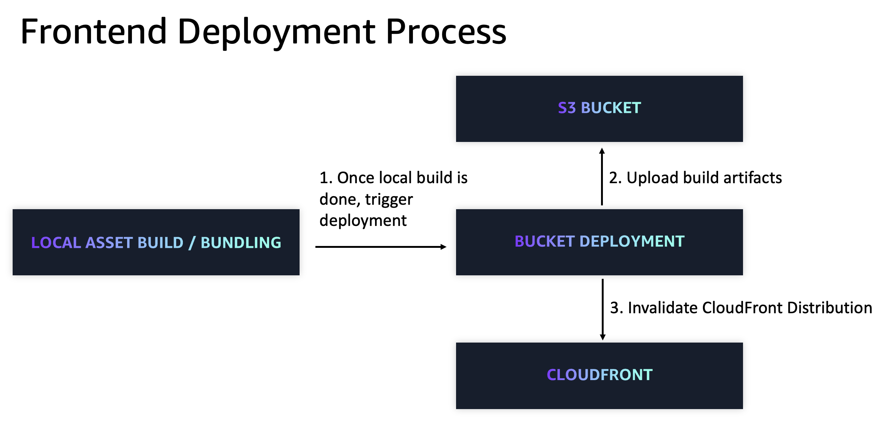

# Web Application

## Overview

The Web Application L3 construct provides a comprehensive solution for deploying static Web Application with global content delivery and enterprise-grade security. The system offers a streamlined approach to hosting modern Web Application, from simple static sites to complex Single Page Applications (SPAs).

The construct handles the complete deployment pipeline: building your application, uploading assets to secure storage, and distributing content globally through a Content Distrbution Network (CDN) with automatic HTTPS and security headers.



The **frontend** construct comprises complete static website hosting with CloudFront CDN and S3 backend.

## Components

The following are the key components of this L3 Construct:

### Storage Layer
The storage layer uses Amazon S3 as the backend for static assets:
- **S3 Bucket**: Encrypted storage with security best practices and public access blocked
- **Bucket Deployment**: Automated upload of built assets from local source to S3
- **Asset Management**: Handles HTML, CSS, JavaScript, images, and other static files

### Content Delivery Network
CloudFront provides global content delivery with performance optimization:
- **Global Distribution**: Edge locations worldwide for fast content delivery
- **Caching Strategy**: Intelligent caching with compression and optimization
- **Security Functions**: CloudFront functions for security headers and HTTPS enforcement
- **Custom Domains**: Optional custom domain support with SSL certificate integration

### Build Pipeline
Automated build and deployment process:
- **Source Processing**: Reads from local directory containing frontend source code
- **Build Execution**: Runs custom build commands (npm, yarn, webpack, etc.)
- **Asset Optimization**: Handles minification, bundling, and asset optimization
- **Deployment**: Uploads built artifacts to S3 and invalidates CloudFront cache

### Single Page Application Support
Built-in support for modern SPA frameworks:
- **Routing**: Handles client-side routing with 404/403 → index.html redirects
- **Error Pages**: Configurable error page handling for SPA-friendly behavior
- **History API**: Supports HTML5 History API for clean URLs

## [`Frontend`](https://github.com/cdklabs/cdk-appmod-catalog-blueprints/blob/main/use-cases/webapp/frontend-construct.ts) Construct

The [`Frontend`](https://github.com/cdklabs/cdk-appmod-catalog-blueprints/blob/main/use-cases/webapp/frontend-construct.ts) construct provides:
- Complete static website hosting infrastructure
- Automated build and deployment pipeline
- Global content delivery with CloudFront
- Security best practices and HTTPS enforcement
- Optional custom domain and SSL certificate support

### Key Features
- **Source Path**: Local directory containing frontend source code
- **Build Commands**: Custom build commands (npm install, npm run build, etc.)
- **Custom Domain**: Optional domain name with SSL certificate
- **Error Responses**: Configurable error page handling (defaults to SPA-friendly)
- **Removal Policy**: Resource cleanup behavior for different environments
- **Observability**: Enable logging and tracing for monitoring

### Usage Example
```typescript
import { Frontend } from '@cdklabs/appmod-catalog-blueprints';

// Basic usage
new Frontend(this, 'MyApp', {
  sourcePath: './frontend',
  buildCommands: ['npm install', 'npm run build']
});

// With custom domain
new Frontend(this, 'MyAppWithDomain', {
  sourcePath: './frontend',
  buildCommands: ['npm install', 'npm run build'],
  customDomain: {
    domainName: 'app.example.com',
    certificate: myCertificate
  }
});

// With custom error handling
new Frontend(this, 'MyCustomApp', {
  sourcePath: './frontend',
  buildCommands: ['yarn install', 'yarn build'],
  errorResponses: [
    {
      httpStatus: 404,
      responseHttpStatus: 200,
      responsePagePath: '/index.html'
    }
  ]
});
```

### Configuration Options
- **sourcePath**: Path to frontend source code directory
- **buildCommands**: Array of build commands to execute
- **customDomain**: Optional custom domain configuration
- **errorResponses**: Custom error page handling
- **removalPolicy**: Resource cleanup behavior
- **observability**: Enable monitoring and logging